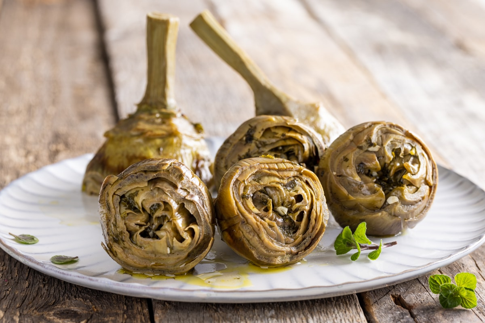

# Carciofi alla Romana

*Rome's braised artichokes: trimmed Roman artichokes stuffed with garlic, mint and parsley, slow-braised stem-up in olive oil, water and white wine till silky-tender. The iconic Roman spring vegetable, eaten as antipasto, with crusty bread soaking up the herb-infused oil.*

**Serves:** 4

**Prep Time:** 30 minutes

**Cook Time:** 40 minutes

## Overview
Carciofi alla Romana is the iconic spring artichoke dish of Rome and one of the most beloved Italian vegetable preparations: Roman artichokes (Carciofi Romani, the large round purple-green variety; substitute with regular globe artichokes outside Italy) trimmed of outer leaves and tough chokes, stuffed with a fragrant mixture of finely chopped garlic, fresh mint, parsley and salt, then slow-braised stem-up in a wide deep pot with extra virgin olive oil, water and white wine till silky-tender. Served as an antipasto with crusty bread for sopping up the herb-infused oil. Roman artichokes peak February to April; the dish turns up on every Roman trattoria menu through spring. The mint and parsley together are the traditional Roman touch, not one or the other. The artichokes braise stem-up so the hearts absorb the herb-oil. The braising oil is part of the dish; serve some of it on the side for bread-dipping.

## Ingredients

- 4 large Roman artichokes (Carciofi Romani; or 4 large globe artichokes)
- 2 lemons (juice from both; half a lemon for rubbing trimmed surfaces)

### Stuffing
- 1 large bunch fresh mint (about 30 g; chopped)
- 1 large bunch fresh parsley (about 30 g; chopped)
- 12 garlic cloves (very finely chopped)
- 1 ½ teaspoons fine sea salt
- 1 teaspoon ground black pepper

### Braising
- 150 ml extra virgin olive oil
- 200 ml dry white wine
- 200 ml water
- 2 bay leaves
- 1 teaspoon fine sea salt
- ½ teaspoon ground black pepper

### To finish
- Extra virgin olive oil for drizzling
- Lemon wedges
- Crusty bread

## Method

### Stage 1 - Trim the artichokes
1. Squeeze juice of 2 lemons into a wide bowl of cold water.
2. Trim the artichoke stems to 5 cm; peel the outer skin off the stems.
3. Tear off the tough outer leaves till you reach the pale tender ones.
4. Cut off the top third of each artichoke (the tough leaf tips).
5. Open the leaves slightly; scoop out the hairy choke with a teaspoon.
6. Rub all cut surfaces with the lemon half (prevents browning).
7. Drop into the lemon water as you go.

### Stage 2 - Make the stuffing
1. Combine the chopped mint, parsley, garlic, salt and pepper.
2. Mix together.

### Stage 3 - Stuff
1. Lift each artichoke from the water; drain briefly.
2. Pack the herb-garlic mixture into the centre of each artichoke (where the choke was) and between the leaves.

### Stage 4 - Braise
1. Arrange the stuffed artichokes stem-up in a wide deep pot (or Dutch oven) that fits them snugly.
2. Pour the olive oil, white wine and water around them (not over).
3. Add the bay leaves, salt and pepper.
4. Cover with the lid.
5. Cook over low heat for 35-40 minutes till the artichokes are silky-tender (a knife should slide easily into the heart).

### Stage 5 - Serve
1. Lift the artichokes out (carefully) onto serving plates, stems up.
2. Spoon some of the braising liquid over.
3. Drizzle with extra olive oil.
4. Lemon wedges and crusty bread alongside.

## Notes
- **Roman artichokes if possible:** large round purple-green; substitute with globe.
- **Mint AND parsley:** Roman traditional.
- **Stem-up braising:** the heart absorbs the flavours.
- **Generous olive oil:** part of the dish.
- **Eat the heart and the soft tender leaves:** scoop and bite.

## Variations
- **Carciofi alla Giudia (Jewish-Roman style):** twice-fried whole artichokes till crispy; the related but distinct Jewish-Roman classic.
- **With anchovy:** add 4 anchovy fillets to the herb stuffing; gives umami.
- **With pecorino:** add grated Pecorino Romano to the stuffing; less traditional but works.
- **Smaller artichokes:** use baby artichokes; cook 25 minutes; eat whole.

## Serving
- As antipasto with bread for dipping the oil. Italian white wine (Frascati). Simple salad.

## Storage
- Keeps refrigerated 3 days in their braising liquid.
- Serve at room temperature the next day.
- Don't freeze.
