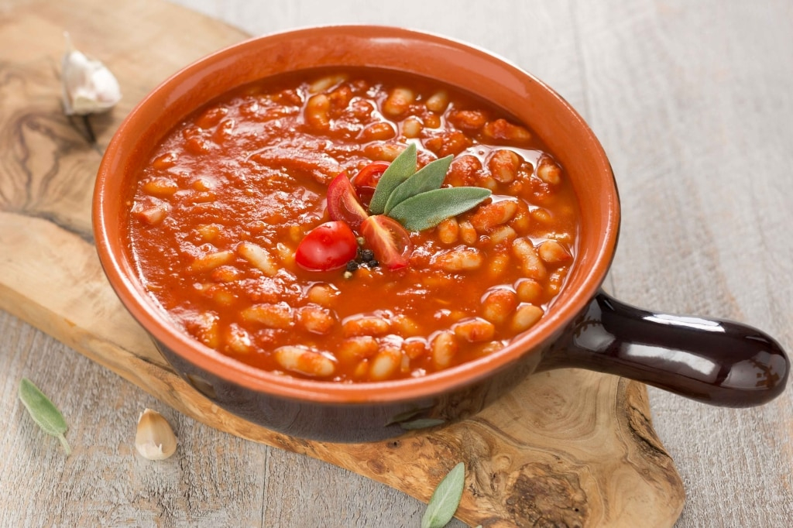

# Fagioli all'Uccelletto

*Tuscany's cannellini beans in tomato-sage: cooked cannellini beans slow-simmered with garlic, fresh sage, tomato and a generous amount of olive oil till the beans absorb the flavours and the tomato thickens to a glossy coating. The Tuscan everyday bean side, the traditional accompaniment to grilled meats and roast chicken.*

**Serves:** 4-6

**Prep Time:** 10 minutes (plus overnight bean soaking if dried)

**Cook Time:** 30 minutes

## Overview
Fagioli all'uccelletto (literally "beans in the style of little birds", the name refers to the way game birds are traditionally cooked in Tuscany with similar aromatics) is one of Tuscany's most iconic vegetable side dishes and an absolute staple of Tuscan home cooking: cooked cannellini beans (the traditional Tuscan white bean; either soaked-and-cooked-from-dried or canned drained) slow-simmered in a base of crushed garlic, fresh sage leaves, chopped tomato, dried red pepper flakes and a generous amount of extra virgin olive oil, till the beans absorb the flavours and the tomato breaks down into a glossy coating. The dish takes 30 minutes once the beans are cooked; it's the traditional Tuscan side that turns up alongside grilled meats, roast chicken, sausages, or as part of an antipasto. Cannellini are the traditional Tuscan bean; borlotti is the alternative. Fresh sage is essential; dried doesn't substitute. Olive oil is generous, the Tuscan signature.

## Ingredients

- 600 g cooked cannellini beans (or 2 tins drained); or 250 g dried beans soaked overnight and pre-cooked
- 6 tablespoons extra virgin olive oil
- 8 garlic cloves (crushed; some whole, some sliced)
- 12-16 fresh sage leaves
- 1 teaspoon red pepper flakes (or 1 small fresh chilli, chopped)
- 1 tin (400 g) chopped tomatoes; or 4 fresh tomatoes (chopped)
- 1 ½ teaspoons fine sea salt
- 1 teaspoon ground black pepper
- 1 teaspoon dried oregano (optional)

### To finish
- Extra olive oil
- Fresh sage leaves
- Coarse black pepper

## Method

### Stage 1 - Sauté garlic and sage
1. Heat the olive oil in a wide saucepan over medium heat.
2. Add the crushed garlic and sage leaves; cook 90 seconds till the garlic is fragrant and the sage crisps slightly.
3. Add the red pepper flakes.

### Stage 2 - Add tomato
1. Add the chopped tomatoes.
2. Cook 8 minutes till the tomato breaks down and the sauce thickens.

### Stage 3 - Add beans
1. Add the cooked cannellini beans.
2. Add the salt, pepper and oregano.
3. Stir to combine.

### Stage 4 - Simmer
1. Reduce heat to low; cover slightly ajar.
2. Cook 15-20 minutes; the beans should absorb the tomato flavour and the sauce should thicken.
3. Add a splash of water if too thick.
4. Mash a few beans against the side to thicken the broth.

### Stage 5 - Finish
1. Take off the heat.
2. Taste; adjust salt.

### Stage 6 - Serve
1. Spoon into a serving bowl.
2. Drizzle with extra olive oil.
3. Top with fresh sage leaves and coarse pepper.

## Notes
- **Cannellini beans traditional:** Tuscan standard.
- **Fresh sage essential:** dried doesn't work.
- **Generous olive oil:** Tuscan signature.
- **Don't mash too many:** keep some bean texture.

## Variations
- **With pork sausage:** add 200 g of crumbled cooked Italian pork sausage; gives a heartier version.
- **With anchovy:** add 4 anchovy fillets with the garlic; gives umami.
- **Without tomato (white version):** skip the tomato; cook beans with garlic, sage and olive oil only.
- **With pancetta:** add 100 g of diced pancetta at the start; gives smoky depth.

## Serving
- Alongside grilled meats, roast chicken, sausages. With crusty Italian bread, simple salad. Tuscan red wine.

## Storage
- Keeps refrigerated 5 days; flavour deepens.
- Reheat in a covered pan.
- Freezes 3 months.
