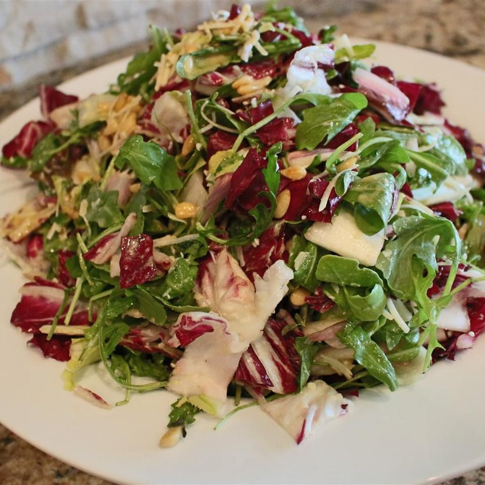

# Insalata Tricolore

*The Italian flag on a plate: thick slices of ripe tomato, slabs of mozzarella di bufala, whole basil leaves and a slick of olive oil.*

**Serves:** 4 (as a starter or side)

**Prep Time:** 10 minutes

**Cook Time:** 0 minutes

## Overview
The dish is an assembly, not a recipe. The four ingredients (tomato, mozzarella, basil, olive oil) all need to be the best you can afford, that's the whole technique. Tomatoes at peak ripeness, sliced 1 cm thick; mozzarella di bufala torn or sliced fresh from the brine; large whole basil leaves; cold-pressed extra-virgin olive oil. Layered on a plate alternating tomato slices with mozzarella, basil leaves tucked between, salt and pepper, finished with olive oil. Eaten with crusty bread.

## Ingredients

- 4 ripe medium tomatoes (about 600 g, ideally a mix of colours - beef, plum, cherry on the vine - the best you can find)
- 250 g mozzarella di bufala (1 large ball, in its brine - NOT cooking mozzarella, NOT pre-grated)
- 1 large bunch fresh basil (about 30 g, leaves whole)
- 4 tablespoons first-cold-press extra-virgin olive oil (use the best in your cupboard - this is its showcase)
- 1 teaspoon flaky sea salt (Maldon or similar)
- ½ teaspoon coarsely cracked black pepper
- Crusty bread to serve

### Optional
- ½ teaspoon dried oregano (the herb is not traditional in classic tricolore but common in southern variations)
- 1 tablespoon aged balsamic vinegar (drizzled at the end - not authentic to tricolore but widely tolerated; thick aged balsamic only, not balsamic-style)

## Method

### Stage 1 - Bring everything to room temperature
1. Mozzarella from the fridge needs 30 minutes at room temperature to soften - cold mozzarella is rubbery and tasteless.
1. Tomatoes also benefit from room-temperature serving; their volatile aromatics are dulled by refrigeration. (Ideally tomatoes shouldn't see the fridge at all.)

### Stage 2 - Slice
1. Tomatoes: slice into 1 cm thick rounds, discarding the very top and bottom slices. If using mixed sizes, halve cherry tomatoes.
1. Mozzarella: lift from the brine; pat dry briefly with a tea towel; slice into 1 cm slabs (or tear by hand into rough chunks).
1. Basil: pick the leaves whole - don't chop.

### Stage 3 - Plate
1. On a wide flat platter, arrange overlapping slices alternating tomato and mozzarella in a row, fan or circle pattern (the tricolore visual).
1. Tuck a few basil leaves between each pairing.
1. Scatter a couple more leaves on top for height.

### Stage 4 - Dress
1. Drizzle olive oil generously across - about 4 tablespoons total, in a thin even stream.
1. Sprinkle flaky salt over the tomatoes (the salt draws out their juices, which mingle with the oil and become part of the dressing).
1. Crack black pepper across.
1. If using: scatter dried oregano, or drizzle balsamic in a final spiral.

### Stage 5 - Serve immediately
1. Eat within 10 minutes - the salt starts breaking down the tomato structure quickly, releasing more juice than you want sitting on the plate.
1. Provide good bread to mop the tomato juices and olive oil pooled at the bottom of the platter.

## Notes
- **The four ingredients are the dish:** Don't substitute fior di latte for buffalo mozzarella unless you must; the buffalo version has a creaminess and lactic tang that fior di latte lacks. Don't use dried basil - you'd skip it instead. Don't use olive oil from a plastic bottle; this is the moment for a good Italian or Spanish DOP.
- **No vinegar, no balsamic-glaze:** Traditional tricolore is olive oil only. Balsamic vinegar (especially the thick syrup-like commercial "balsamic glaze") obscures the flavours of the four good ingredients. If you must use balsamic, aged true balsamico tradizionale only, applied sparingly.
- **Room temperature, not chilled:** Refrigerator-cold tomatoes are flavourless. The dish is at its best at the temperature of a Mediterranean summer kitchen - about 22°C / 71°F.

## Storage
- Tricolore doesn't store. Make it; eat it within 30 minutes.
- The components keep separately for a day in the fridge if you absolutely must.
