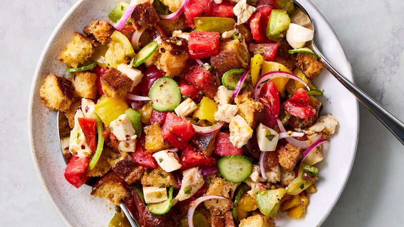

# Panzanella

*Tuscany's summer salad: torn day-old bread soaked in red wine vinegar and oil, tossed with ripe tomatoes, cucumber, onion and basil.*

**Serves:** 4 (as a starter or side)

**Prep Time:** 20 minutes

**Total Time:** 50 minutes (with the essential 30-minute rest)

## Overview
Day-old crusty bread is torn into rough pieces and briefly moistened with water-and-vinegar - just enough to soften without making mush. Ripe tomatoes are deseeded and cubed; juice is reserved for the dressing. Cucumber is peeled in stripes, deseeded and sliced. Red onion slices soak briefly in cold water to mellow. A dressing of red wine vinegar, good olive oil, the tomato juice, garlic and salt is whisked. Everything tosses together in a wide bowl; rests 30 minutes at room temperature so the bread drinks in the juices; finished with torn basil and a final glug of olive oil at serving.

## Ingredients

- 400 g day-old crusty country bread (sourdough, pugliese, or any rustic loaf - NOT fresh, NOT toasted)
- 4 tablespoons cold water (to moisten)
- 1 tablespoon red wine vinegar (to mix with the water)

### Vegetables
- 700 g ripe summer tomatoes (the best you can find - mixed colours / shapes / sizes is ideal)
- 1 large cucumber (peeled in alternating stripes, deseeded, sliced 5 mm)
- 1 small red onion (sliced thin)
- Cold water + 1 tablespoon vinegar (for soaking the onion)

### Dressing
- 5 tablespoons good extra-virgin olive oil
- 3 tablespoons red wine vinegar
- 2 garlic cloves (crushed to a paste with ½ teaspoon salt)
- The juice the tomatoes released when chopped (about 100 ml)
- ½ teaspoon caster sugar (balances acidity if tomatoes are sharp)
- 1 teaspoon salt (to taste)
- ½ teaspoon black pepper

### To finish
- 1 large bunch fresh basil (about 30 g, leaves torn)
- 2 tablespoons capers (rinsed and drained, optional)
- A handful of black olives (Taggiasche or Kalamata, pitted, optional)
- Extra-virgin olive oil to drizzle
- Flaky sea salt

## Method

### Stage 1 - Bread
1. Tear the bread into rough 3-4 cm chunks (or cut with a serrated knife). Crusts in.
1. Whisk the 4 tablespoons water with the 1 tablespoon vinegar in a small bowl.
1. Sprinkle the bread chunks with this mixture - don't drench, just dampen each piece.
1. Toss with hands; rest 10 minutes.
1. The bread should be softening but not mush. If still very stiff, sprinkle a little more water.

### Stage 2 - Tomatoes
1. Halve the tomatoes; squeeze out the seeds and juice into a sieve set over a bowl.
1. Reserve the strained juice (~100 ml).
1. Roughly chop the deseeded tomato flesh into 2-3 cm pieces.

### Stage 3 - Cucumber and onion
1. Cucumber: peel in alternating stripes (for visual interest), halve lengthwise, scoop seeds with a teaspoon, slice 5 mm thick.
1. Onion: slice as thinly as you can manage. Place in a small bowl with cold water and 1 tablespoon vinegar; soak 10 minutes (mellows the harsh raw bite). Drain.

### Stage 4 - Dressing
1. In a small bowl, whisk olive oil, red wine vinegar, garlic-salt paste, the reserved tomato juice, sugar (if using), salt and pepper.
1. Taste; balance - the dressing should be sharp and bright.

### Stage 5 - Combine
1. In a wide bowl, combine the moistened bread, tomatoes, cucumber and drained onion.
1. Pour the dressing over.
1. Add capers and olives if using.
1. Toss thoroughly with your hands or two big spoons - squish the tomatoes slightly as you toss so they release more juice into the bread.

### Stage 6 - Rest
1. Cover; let stand at room temperature 30 minutes.
1. The bread drinks in the juices and dressing; the flavours marry.
1. Toss again at the 15-minute mark to redistribute.

### Stage 7 - Finish and serve
1. Tear in the basil leaves (don't chop - tearing keeps the colour and aroma).
1. Drizzle a generous final glug of extra-virgin olive oil.
1. Sprinkle with flaky sea salt.
1. Serve at room temperature. Don't refrigerate; it dulls the tomatoes.

## Notes
- **Stale bread is non-negotiable:** Fresh bread becomes paste. Toasted bread stays crisp and doesn't drink the dressing. Two-day-old crusty bread, slightly stiff, is what panzanella needs. If you only have fresh bread, dry it: tear into pieces, spread on a tray, leave at room temperature overnight (or 1 hour in a 100°C oven).
- **Tomatoes matter more than anything:** This is a dish for late summer when tomatoes are at their peak. Out-of-season supermarket tomatoes give a sad panzanella. If your tomatoes aren't fragrant when you cut into them, save panzanella for another month.
- **30-minute rest is mandatory:** Eating panzanella in the first 10 minutes is wrong - the bread is still hard chunks and the dressing hasn't married. After 30 minutes the bread is softly chewy, the tomatoes are wept-out, the dressing is everywhere. Eat within 2 hours after that; beyond, the bread turns to mush.

## Storage
- Best within 2 hours of assembly.
- Refrigerated leftovers are still edible but the texture is gone; eat the next day cold as a tomato-bread mash.
- The undressed components (bread chunks, chopped tomato, prepped cucumber and onion, dressing) keep separately 24 hours and assemble in 5 minutes.
