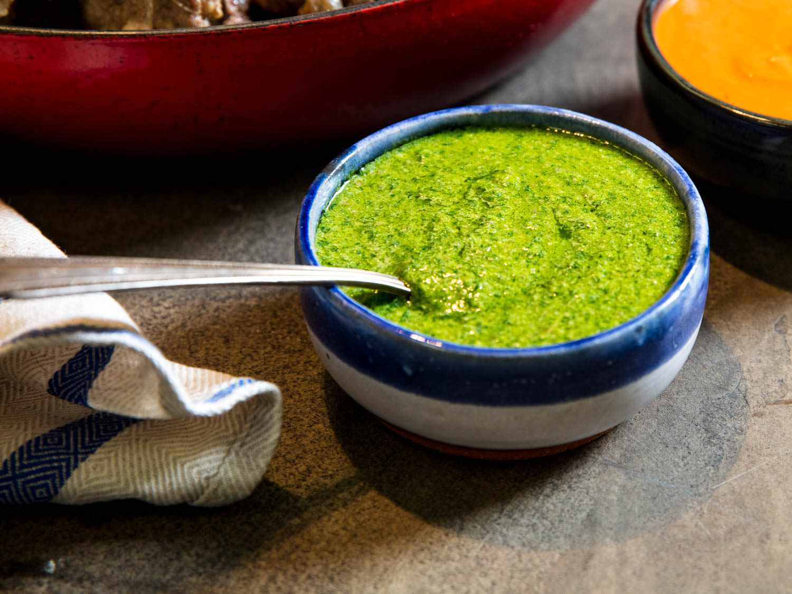

# Salsa Verde

*The Italian green sauce: parsley, capers, anchovy, garlic and olive oil pounded or chopped into a vivid, herbaceous condiment. The proper accompaniment to bollito misto, poached fish and roast meats.*

**Serves:** 6 (makes about 200 ml)

**Prep Time:** 15 minutes

**Cook Time:** 0 minutes

## Overview
Italian salsa verde is one of those condiments that turns a plain dish into a feast. It is the traditional accompaniment to bollito misto (the great Piedmontese boiled-meat platter), but it also works under poached fish, alongside grilled lamb, spooned over hard-boiled eggs, mixed into potato salad, or stirred through a bowl of beans. The sauce is sharp, salty, herby and unapologetically green.

The recipe is closer to a chopped salsa than to a smooth sauce. Traditionally pounded in a mortar; the modern method is fine-chopping with a sharp knife, which keeps the texture lively and the colour bright. Avoid a food processor; it turns the parsley into a paste and the flavour goes muddy.

A note on the anchovies: they do not make the sauce taste of fish. Two or three little fillets, mashed to nothing in the oil, give a deep savoury background that makes everything else taste better. Skip them and the sauce loses its centre.

## Ingredients
- 1 large bunch flat-leaf parsley (about 80 g leaves)
- 2 tbsp capers (drained; salt-packed are best, rinsed)
- 4 anchovy fillets (oil-packed)
- 2 garlic cloves
- 1 tbsp Dijon mustard
- 2 tbsp red wine vinegar
- 150 ml good extra-virgin olive oil
- Pinch of fine salt (taste first; anchovies and capers are salty)
- Pinch of black pepper

## Method

### Stage 1 - Chop the solids
1. Pick the parsley leaves from the stalks (a few tender stalks are fine; thick ones go bitter).
1. Chop the parsley leaves finely with a sharp knife. Aim for an even mince, not a paste.
1. Chop the capers finely.
1. Chop the anchovies until they are reduced almost to a paste.
1. Mince the garlic to a fine paste with a pinch of salt (the salt helps the garlic break down).

### Stage 2 - Combine
1. Tip everything into a bowl: parsley, capers, anchovies, garlic, mustard.
1. Whisk in the red wine vinegar.
1. Pour in the olive oil gradually, stirring with a fork (do not whisk hard; the sauce should be loose and chunky, not emulsified). The oil should pool slightly around the chopped solids; it should not coat them entirely.
1. Taste. Adjust salt and pepper. The sauce should be sharp from the vinegar, salty from the capers and anchovies, herbaceous from the parsley, with the olive oil holding it all together.

## Notes
- **Chop, do not blend.** A food processor turns parsley into baby food. The point of salsa verde is the texture: discernible bits of parsley, distinct capers, the occasional bigger fleck. Knife only.
- **Use good olive oil.** This is a raw sauce; the oil is the dominant flavour after the parsley. A peppery Tuscan or fruity Ligurian extra-virgin is what the sauce wants. Cheap oil tastes flat in this dish.
- **Salt-packed capers > vinegar-packed.** Salt-packed have a cleaner flavour; rinse and pat dry before chopping. Vinegar-packed are acceptable; rinse to remove the vinegar.
- **Make ahead but not too far ahead.** The sauce sits well for an hour at room temperature, when the flavours mature. After about four hours the parsley darkens and the brightness fades. Best the same day; a day-old salsa verde is still good but visibly tireder.

## Variations
- **With mint:** add half a small bunch of fresh mint leaves, finely chopped, alongside the parsley. Particularly good with lamb.
- **With breadcrumbs:** stir in 2 tbsp fine breadcrumbs to thicken slightly. A Tuscan touch that bulks the sauce out for a heartier dish.
- **With hard-boiled egg:** chop one hard-boiled egg fine and stir through. Pushes the sauce toward a salsa rustica.
- **With tarragon:** swap a small handful of the parsley for fresh tarragon. Beautiful with poached fish; do not use with red meat.

## Serving
- **The classic match:** **bollito misto** (a Piedmontese platter of poached beef, ox tongue, capon, calf's head and zampone). The salsa cuts the richness of the meats.
- **Poached salmon** or any white fish, with a spoonful alongside.
- **Roast lamb**, particularly the leg, served at the table for spooning.
- **Hard-boiled eggs**, halved, with a teaspoon on top each.
- **Potato salad**, stirred through warm boiled potatoes with no other dressing.
- **White beans**, especially cannellini, with a spoonful and a drizzle of olive oil.

- Do not confuse with [Mexican salsa verde](../../mexican/salsa-verde.md), which is a completely different sauce (tomatillo-based, smoother, no anchovy).

## Storage
- Best the day it is made.
- Refrigerates 3 days in a sealed jar with a thin layer of olive oil on top. The parsley darkens but the flavour holds.
- Freezes 2 months in small portions; texture suffers slightly on thaw.
