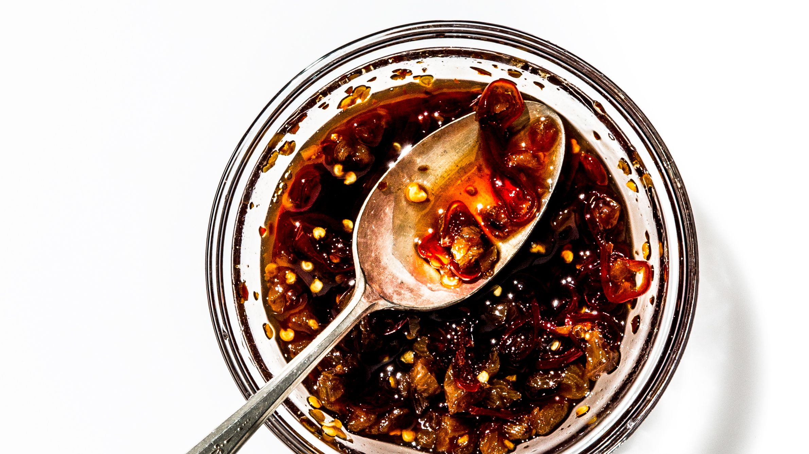

# Agrodolce

*Italy's sweet-sour sauce: a syrup of vinegar, sugar, garlic, onion and aromatics reduced to a glossy glaze. The Italian "sweet-and-sour" - used to dress fish, vegetables (especially eggplant in caponata), meat dishes and roasted onions. Sicilian roots, used across the country.*

**Serves:** Makes about 200 ml

**Prep Time:** 10 minutes

**Cook Time:** 15 minutes

## Overview
Agrodolce (literally "sour-sweet"; agro = sour, dolce = sweet) is Italy's foundational sweet-sour sauce and one of the most distinctive Italian flavour profiles: a glossy syrup made from white-wine vinegar (or red wine; or sherry), caster sugar (or honey), sliced onion or shallot, crushed garlic, a pinch of red pepper flakes, sometimes raisins or pine nuts in the Sicilian style, bay leaves and salt, all reduced together till the sugar dissolves and the mixture turns glossy. The dish has roots in Sicily (caponata uses an agrodolce base; the Arab influence in Sicilian cooking shows in the sweet-sour combination) but is used across Italy. As a sauce or glaze, agrodolce drizzles beautifully over grilled fish, roasted vegetables (especially aubergine), pork, duck and roasted onions. The traditional starting ratio is equal sugar to vinegar by volume, adjusted to taste. The sauce wants to coat the back of a spoon; under-reduced it tastes harsh, over-reduced it crystallises.

## Ingredients

- 200 ml white wine vinegar (or red wine vinegar; or sherry vinegar)
- 100 g caster sugar (or 100 g honey)
- 1 medium red onion (or 4 shallots; finely sliced)
- 6 garlic cloves (crushed)
- 3 tablespoons olive oil
- 2 bay leaves
- 1 teaspoon red pepper flakes
- ½ teaspoon fine sea salt
- ½ teaspoon ground black pepper

### Optional Sicilian additions
- 50 g raisins or sultanas
- 50 g toasted pine nuts (added at end)
- 1 tablespoon chopped capers
- 1 small bunch fresh mint

## Method

### Stage 1 - Sauté aromatics
1. Heat the olive oil in a wide saucepan over medium heat.
2. Add the sliced onion; cook 6-7 minutes till soft and starting to caramelise.
3. Add the crushed garlic; cook 30 seconds.
4. Add the red pepper flakes.

### Stage 2 - Add vinegar and sugar
1. Pour in the vinegar.
2. Add the sugar (or honey), bay leaves, salt and pepper.
3. Bring to a simmer.

### Stage 3 - Reduce
1. Cook 10-15 minutes till the sauce reduces by half and becomes glossy.
2. The syrup should coat the back of a spoon.

### Stage 4 - Add Sicilian additions
1. If using raisins, add them; cook 2 minutes more (they plump).
2. If using pine nuts, capers, mint - stir in at the end.

### Stage 5 - Cool slightly
1. Take off the heat.
2. Cool to warm or room temperature.

### Stage 6 - Use
1. Drizzle over grilled fish, roasted vegetables, grilled meats.
2. Use as a base for caponata (with sautéed eggplant, capers, olives).
3. Brush over pork or duck during the last 5 minutes of roasting.

## Notes
- **Equal sugar to vinegar:** traditional starting ratio.
- **Reduce till glossy:** test on a spoon.
- **Adjust to taste:** add more sugar for sweeter; more vinegar for tarter.
- **Best warm or room temperature:** cold congeals slightly.

## Variations
**With balsamic:** swap white wine vinegar for balsamic; richer; more "modern Italian".
**With honey:** swap sugar for honey; gives a different sweetness.
**Caponata-style:** combine with sautéed eggplant cubes, capers, olives, basil - Sicilian eggplant condiment.
**Mosto-cotto version:** use Italian mosto cotto (cooked grape must) instead of sugar; deeper sweetness, less traditional agrodolce.

## Serving
Drizzle over fish, vegetables, meats. Brush as glaze. Use as a caponata base. With cheese boards. Italian red wine.

## Storage
- Keeps refrigerated 1 month in a sealed jar.
- Don't freeze; the syrup separates.
- Rewarm gently to use.
