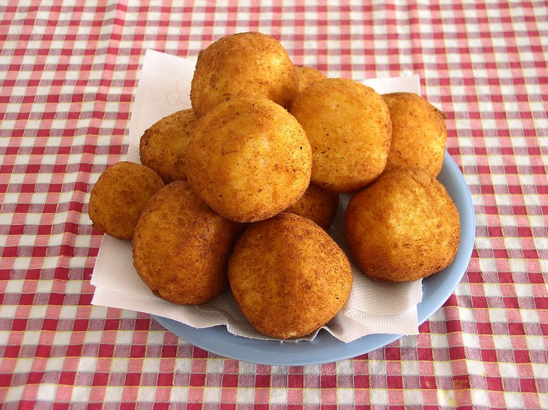

# Arancini

*Sicily's golden rice balls: cold risotto wrapped around meat ragù or mozzarella, breaded and deep-fried till crisp outside, soft within.*

**Serves:** 4 (makes 8 arancini)

**Prep Time:** 30 minutes (plus overnight rice chilling)

**Cook Time:** 15 minutes

## Overview
Sicily's most legendary street food: cold risotto shaped around a hidden centre, breaded, fried gold, and eaten standing up. The traditional version uses saffron Milanese-style rice, but plain works too; the cold rice gets bound with grated parmesan and beaten egg until it holds shape. You drop a spoonful of meat ragu or a cube of mozzarella into the middle of each ball, mould the rice around it with wet hands into something the size of an orange (or a cone, if you're going for the Catania shape), then roll first in flour, then beaten egg, then fine breadcrumbs. Into 180°C oil for four to six minutes until the crust is deep amber and crackling. Eat them warm enough to feel the heat through the paper, with a wedge of lemon and a glass of something cold; the melted mozzarella string-pulls when you bite.

## Ingredients

### Rice base (or use 500 g cold leftover risotto)
- 300 g arborio rice
- 1 litre hot chicken stock (or vegetable stock)
- 1 large pinch saffron threads (soaked in 2 tablespoons hot water)
- 50 g unsalted butter
- 1 onion (small, finely diced)
- 100 ml dry white wine
- 60 g parmesan cheese (finely grated)
- 1 teaspoon salt
- ½ teaspoon black pepper

### To shape (added to cold rice)
- 1 egg (large, beaten, to bind the cold rice)
- 30 g extra parmesan cheese (grated)

### Filling (choose one or do half-and-half)
#### Meat Ragù option
 - 200 g Ragù (Bolognese-style, see [Ragu](../ragu.md)) 

 #### Mozzarella option
- 150 g low-moisture mozzarella (cut into 1 ½ cm cubes, one cube per arancino)

### Coating
- 100 g plain flour
- 2 eggs (large, beaten with 1 tablespoon water)
- 200 g fine dried breadcrumbs (panko gives extra crunch; fine breadcrumbs are more traditional)

### For frying
- 1 litre vegetable oil (or sunflower)

### To serve
- Lemon wedges
- Marinara (or a herby tomato sauce, optional)
- Crispy radicchio salad

## Method

### Stage 1 - Make the saffron risotto (skip if using leftover)
1. Heat the stock in a small pan; stir in the saffron and its water; keep at a low simmer.
1. Melt half the butter (25 g) in a heavy lidded pot over medium heat; add diced onion; cook 6 minutes until soft.
1. Add the rice; stir 2 minutes to toast.
1. Pour in the white wine; stir until absorbed.
1. Add saffron-stock 1 ladle at a time, stirring until each addition is absorbed before adding the next. Continue 18 minutes until the rice is just al dente.
1. Off heat; beat in the remaining butter and the 60 g parmesan vigorously to mantecare.
1. Season with salt and pepper.
1. Spread the risotto thinly on a tray; cool to room temperature; refrigerate at least 4 hours, ideally overnight. Cold rice is essential, warm rice won't hold shape.

### Stage 2 - Prep the filling
1. **Ragù version**: warm the ragù gently; stir in the peas; cool fully to a thick spoonable consistency.
1. **Mozzarella version**: cube the mozzarella; pat dry with kitchen paper (excess moisture causes blow-outs during frying).

### Stage 3 - Shape
1. Tip the cold rice into a wide bowl; mix in the beaten egg and 30 g extra parmesan thoroughly.
1. Set up three shallow plates: flour, beaten egg, breadcrumbs.
1. Wet your hands. Take a handful of rice (about 80 g per ball, egg-sized) and flatten into a disc on your palm.
1. Place 1 tablespoon of cold ragù (or 1 cube of mozzarella) in the centre.
1. Fold the rice up and over to enclose the filling completely; gently squeeze and roll into a tight ball, ensuring no filling shows at any seam.
1. Set on a tray. Repeat for all 8 balls.

### Stage 4 - Bread
1. Roll each ball first in flour (shake off excess), then dip in egg (let drip), then roll in breadcrumbs, pressing gently so the crumbs stick all over.
1. For a thicker, crispier crust: dip back into egg and breadcrumbs a second time.

### Stage 5 - Rest the breaded balls
1. Refrigerate the breaded balls 15 minutes (helps the crust adhere during frying).

### Stage 6 - Fry
1. Heat oil to 180°C in a deep heavy pan with at least 4 cm of oil depth.
1. Fry 2-3 balls at a time, 4-6 minutes, turning, until deep golden brown all over.
1. Lift onto a paper-lined plate.
1. Don't crowd, too many drop the oil temperature and the rice steams instead of frying.

### Stage 7 - Serve
1. Rest 3 minutes before serving (the inside is volcanic).
1. Eat warm, with a lemon wedge to squeeze over and (optional) a small bowl of tomato sauce for dipping.

## Notes
- **Rice MUST be cold:** Warm or room-temperature rice will not hold its shape. Make the risotto a day ahead, OR spread thinly on a tray and chill at least 4 hours.
- **No filling visible at the seam:** Any exposed filling (especially mozzarella) leaks into the oil during frying and creates a deflated arancino. Inspect each ball before breading.
- **Catania cones vs Palermo balls:** Catania shapes arancini into cones (representing Mount Etna); Palermo makes them round (representing oranges). Both are correct. The recipe works for either shape.
- **Risotto al salto trick:** Yesterday's leftover risotto, with no filling, can be pressed flat and pan-fried into a crispy disc instead of formed into balls, a quicker option when you have less time.

## Storage
- Fried arancini are best within 30 minutes.
- Cooled fried arancini refrigerate 2 days; reheat at 190°C 8 minutes (microwave makes them soggy).
- Unfried breaded balls freeze 2 months on a tray; fry from frozen at 170°C for 8 minutes.
