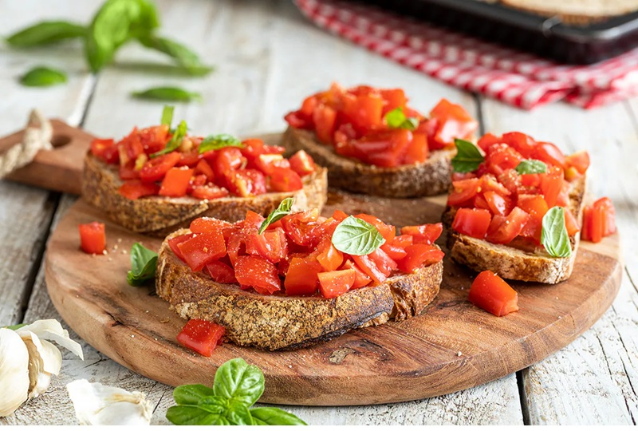

# Bruschetta al Pomodoro

*The Italian summer antipasto: country bread grilled hard, rubbed with raw garlic, drizzled with oil and piled with macerated tomato.*

**Serves:** 4 (8 bruschetta)

**Prep Time:** 15 minutes (plus 30 min tomato rest)

**Cook Time:** 5 minutes

## Overview
The bruschetta everyone else apes, made properly. You cube ripe tomatoes (and they have to actually be ripe, this is not the time for January supermarket fruit) and toss with salt, olive oil, torn basil and a splash of red wine vinegar; they sit for half an hour while the salt draws out juice and the flavours mingle. Country-style bread slices 2 cm thick and grills, dry-pans or broils until both sides are deeply gold with charred bits at the edges. While the toast is still warm you rub it hard with a raw garlic clove; the rough surface acts like a grater, leaving garlic oil in every pore. A drizzle of good olive oil, a spoonful of the macerated tomato mixture, salt to taste, and eat it within the minute before the toast goes soggy underneath.

## Ingredients

### Tomato topping
- 600 g ripe tomatoes (mixed sizes/colours - beef, plum, vine, cherry; the riper the better)
- 4 garlic cloves (2 crushed for the topping, 2 whole for rubbing the bread)
- 1 teaspoon fine salt
- 3 tablespoons extra-virgin olive oil
- 1 tablespoon red wine vinegar
- 1 small bunch fresh basil (about 20 g, leaves torn)
- ½ teaspoon black pepper

### Bread and finish
- 8 thick slices crusty country bread (sourdough, pugliese or any rustic loaf - about 2 cm thick)
- 4-5 tablespoons extra-virgin olive oil (for drizzling - good oil only)
- 1 teaspoon flaky sea salt
- Black pepper

### Optional additions
- 50 g shaved parmesan cheese (or pecorino)
- 1 teaspoon dried oregano
- A pinch of chilli flakes

## Method

### Stage 1 - Macerate the tomatoes
1. Halve tomatoes; squeeze out most of the seeds and watery juice (saves the bruschetta from going soggy quickly).
1. Cube the deseeded tomato flesh into 1 cm pieces.
1. In a bowl, combine cubed tomatoes, 2 crushed garlic cloves, fine salt, 3 tablespoons olive oil, red wine vinegar and torn basil.
1. Toss gently; rest 30 minutes at room temperature.
1. Taste; adjust salt and vinegar.

### Stage 2 - Toast the bread
1. **Best**: grill over hot charcoal 2 minutes per side until charred at the edges.
1. **Stovetop**: heat a heavy ridged griddle or non-stick frying pan over high heat; place bread slices on, press with a spatula; toast 2 minutes per side until deep gold with charred lines.
1. **Oven broiler**: place slices on a tray under a hot grill (broiler), 4 minutes per side.

### Stage 3 - Garlic rub
1. While the bread is still hot from the grill, take a peeled whole garlic clove and rub one side of each slice firmly - the rough surface acts as a grater and the garlic essence rubs in.
1. One whole clove will do about 4 slices before it disintegrates.

### Stage 4 - Olive oil drizzle
1. While the bread is still warm, drizzle each slice with a generous spoonful of extra-virgin olive oil on the garlic-rubbed side.
1. The bread should glisten but not pool.

### Stage 5 - Top
1. Spoon the macerated tomatoes onto each slice - about 2 heaped tablespoons per slice.
1. Drizzle a tiny bit of the tomato-and-oil juice from the bowl over each topped slice.
1. Finish with a pinch of flaky sea salt, a grind of black pepper, and a few more basil leaves.
1. Optional: shave parmesan or pecorino on top.

### Stage 6 - Serve immediately
1. Eat within 60 seconds of topping - beyond that, the bread starts to soften under the wet topping.
1. Provide napkins.

## Notes
- **Bread is the dish:** Use good crusty bread. Soft white sliced bread is not bruschetta. The crust on a thick slice of sourdough or rustic country loaf is what makes the dish work - it provides the bite that contrasts with the soft wet tomato topping.
- **Toast hard, then top:** Pre-topped pre-rested bruschetta is wrong; the bread softens by the time it gets to the table. Toast first, top at the last possible moment.
- **Don't skip the garlic rub:** It's a small step that transforms the bread. The toast-rub-drizzle sequence is the foundation; the topping is just garnish.

## Storage
- Don't store. Make at the moment of serving.
- The macerated tomato topping refrigerates 24 hours (and is excellent the next day on fresh bread).
- Pre-toasted bread keeps at room temperature 1 day in a paper bag; re-warm in the oven 2 minutes before topping.
