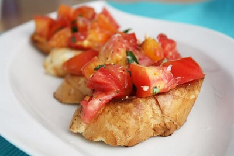

# Bruschetta Platter (Tomato and Roasted Pepper)

*Bruschetta originated in Tuscany as a simple way to use day-old bread. This antipasto classic showcases the Italian philosophy of combining quality ingredients with minimal fuss. The contrast between crispy toast and vibrant, fresh toppings makes it a beloved starter across the Mediterranean.*

**Serves:** 4 - 6

**Prep Time:** 15 minutes

## Overview
Two bruschette on one platter for an antipasto with two reasons to keep coming back: charred peppers slipped out of their blackened skins and dressed with parsley and oil, alongside ripe tomatoes diced with basil and lemon. The bread is the constant: thick slices of crusty Italian loaf grilled hard until both sides are dark gold and rubbed with a raw garlic clove while still warm. Each topping goes on its own slice and the platter alternates colours like the Italian flag at the table. Make the peppers ahead, the tomato mixture an hour before, and assemble at the last moment so the bread stays crisp. Served with a chilled Vermentino or Prosecco.

## Ingredients

### Pepper Topping
- 1 yellow pepper
- 1 red pepper
- 1 green pepper
- Oil for roasting

### Tomato and basil topping
- 2 ripe tomatoes
- 15 grams basil (freshly chopped)
- 1 tablespoon extra virgin olive oil
- Black pepper

### Bruschetta
- 12 slices crusty Italian bread
- 2 garlic cloves (halved)
- 80 ml extra virgin olive oil
- 1 tablespoon flat leaf parsley (chopped)
- Salt and freshly ground black pepper

## Method

### Stage 1 - Roast Peppers
1. Preheat the oven to 200°C.
1. Cut the tops off the peppers and remove the seeds and pith. Rub oil over the peppers and place in the oven.
1. Cook until the skins are blackened, then remove and seal in plastic food bags to sweat.
1. Once cooled, pull the skin off with your fingers and slice into strips.

### Stage 2 - Prepare Tomato and Basil Topping
1. Halve the tomatoes and discard the seeds.
1. Finely chop the tomatoes and place in a bowl with the chopped basil.
1. Season with freshly ground black pepper and pour over the olive oil.

### Stage 3 - Toast and Assemble
1. Toast the bread slices and, while still hot, rub gently with the cut side of a garlic clove.
1. Drizzle with olive oil and season with salt and pepper.
1. Arrange the roasted pepper topping on half of the bread slices and sprinkle with parsley.
1. Arrange the tomato and basil topping on the remaining bread slices.
1. Serve immediately.

## Notes
- **Roasting peppers:** Sealing them in bags while hot allows steam to loosen the skin, making it easier to remove. Don't discard the juice, it's flavourful.
- **Bread selection:** Use a high-quality crusty Italian bread (ciabatta or focaccia work well). Day-old bread actually holds up better to toasting.
- **Advance preparation:** Peppers and tomato topping can be made several hours ahead; assemble just before serving for maximum crispness.
- **Oil quality:** Use excellent extra virgin olive oil, it's a key flavour element in this simple dish.

## Variations
**Mushroom and Garlic:** Sauté sliced mushrooms with garlic and thyme; top bruschetta with arugula underneath.
**Whipped Ricotta Base:** Spread warm bruschetta with whipped ricotta mixed with lemon zest before adding toppings.
**Balsamic Glaze:** Drizzle finished bruschetta with aged balsamic reduction for sweetness and depth.

## Serving
Serve with: A chilled glass of prosecco or white wine
Garnish with: Fresh basil leaves and extra virgin olive oil drizzle

## Storage
- Best served immediately for optimal bread crispness
- Toppings can be prepared 4-6 hours ahead and refrigerated separately
- Assembled bruschetta do not keep well; bread becomes soggy
- Not recommended for freezing
