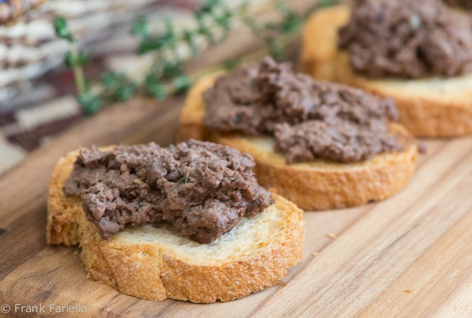

# Crostini di Fegatini

*Tuscany's defining antipasto: small slices of crusty bread topped with a smooth-rough pâté of chicken livers cooked with onion, anchovies, capers, sage and Vin Santo (or dry Marsala), spread warm onto the toasts at the table. Earthy, savoury, slightly sweet from the wine; deeply Tuscan and served at every wedding and Sunday lunch across the region. The pâté is rustic - not silken French pâté but coarsely textured, with bits of onion and caper visible.*

**Serves:** 6 (makes about 24 crostini)

**Prep Time:** 15 minutes

**Cook Time:** 25 minutes

## Overview
Onion softens in olive oil with chopped anchovies. Trimmed chicken livers join and brown briefly. Vin Santo (sweet Tuscan dessert wine, or dry Marsala / brandy as substitute) deglazes; capers stir in; the mixture simmers 8 minutes covered until the livers are tender. Pulsed (not pureed) in a food processor with a knob of cold butter and fresh sage to a coarse spreadable paste. Warm, the paté spreads onto small toasts; eaten as antipasto with prosecco or a glass of Chianti.

## Ingredients

### Livers
- 350 g chicken livers (the freshest you can get, ideally from a butcher rather than supermarket)
- 250 ml whole milk (for soaking)

### Cooking
- 3 tablespoons olive oil
- 30 g unsalted butter (for cooking)
- 1 large onion (finely diced)
- 4 anchovy fillets in oil (chopped)
- 2 tablespoons capers (drained, rinsed)
- 6 fresh sage leaves
- 80 ml Vin Santo (or dry Marsala, brandy, or dry white wine + 1 teaspoon sugar)
- 1 tablespoon red wine vinegar
- 1 bay leaf
- ½ teaspoon salt (to taste)
- ½ teaspoon black pepper

### To finish
- 30 g cold unsalted butter (cubed, for the food processor)
- 1 small bunch fresh flat-leaf parsley (chopped)
- Extra-virgin olive oil to drizzle

### Crostini
- 1 baguette or ciabatta (sliced 1 cm thick - about 24 slices)
- 3 tablespoons olive oil (for brushing)
- 1 garlic clove (peeled, whole, for rubbing)

## Method

### Stage 1 - Prep the livers
1. Trim livers: remove any green-tinged bile spots, white connective tissue, and obvious veins. Cut large livers in half so all are roughly equal size.
1. Soak in milk for 20 minutes (mellows the strong iron flavour; optional but recommended).
1. Drain; pat dry on kitchen paper.

### Stage 2 - Soften the aromatics
1. Heat olive oil and 30 g butter in a wide pan over medium heat.
1. Add the diced onion; cook 10-12 minutes, stirring occasionally, until very soft and just gold (slow softening is what builds the pâté's body).
1. Add the chopped anchovies; cook 2 minutes, mashing them into the onion (they should dissolve).
1. Add the sage leaves; cook 1 minute.

### Stage 3 - Cook the livers
1. Increase heat to medium-high; add the livers in a single layer.
1. Cook 4 minutes, turning occasionally, until they're sealed and just pink at the centre (don't overcook - they'll continue cooking in Stage 4).

### Stage 4 - Deglaze and simmer
1. Pour in the Vin Santo; let it bubble vigorously for 30 seconds, scraping the base.
1. Add the capers, vinegar and bay leaf.
1. Season with salt and pepper.
1. Cover; reduce heat to low; simmer 6-8 minutes until the livers are cooked through but still rosy at the centre and the liquid is reduced to about 4 tablespoons.

### Stage 5 - Process
1. Discard the bay leaf.
1. Tip the contents of the pan into a food processor - including any liquid.
1. Add the 30 g cold cubed butter and a small handful of fresh parsley.
1. Pulse 6-10 times to a coarse-textured spread (NOT smooth pâté - Tuscan style is rustic and chunky).
1. Taste; adjust salt and pepper.

### Stage 6 - Toast the bread
1. Heat oven to 200°C (180°C fan).
1. Arrange bread slices on a baking tray.
1. Brush both sides with olive oil.
1. Toast 8-10 minutes, turning halfway, until golden and crisp.
1. While still warm, rub one side of each slice with the whole garlic clove (gently - just enough for aroma).

### Stage 7 - Assemble
1. Spread a generous spoon of warm liver pâté onto each crostino.
1. Drizzle with extra-virgin olive oil.
1. Scatter with fresh parsley or extra capers.

### Stage 8 - Serve
1. Eat warm or at room temperature.
1. Excellent with a glass of Chianti, Vino Nobile or a chilled Vin Santo if served as dessert-time antipasto.

## Notes
- **Don't overcook the livers:** Overcooked livers give a grainy, dry pâté. Rosy at the centre when you process is right; they finish from the residual heat. Tuscan crostini di fegatini should be silky-rich, not chalky.
- **Anchovies and capers dissolve:** Anchovies are not a fishy presence in the finished spread - they melt into umami background. Capers add brightness and tiny bursts of salt.
- **Rustic, not smooth:** A food processor pulsed 6-10 times gives the right texture. A blender or longer processing makes French-pâté-smooth - different dish.

## Storage
- Refrigerate 4 days in a sealed jar with a thin film of olive oil over the top (which seals the surface).
- Freezes 2 months. Defrost in the fridge overnight.
- Serve at room temperature or gently warmed.
