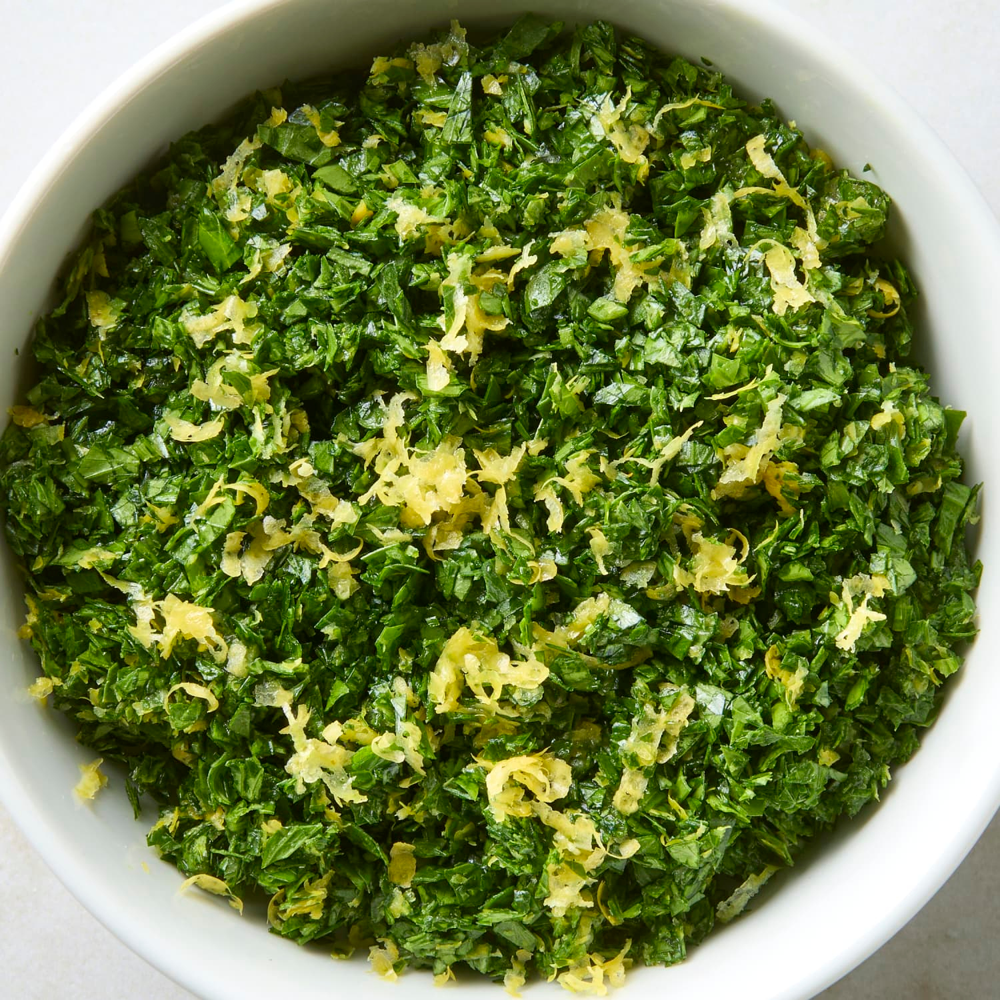

# Gremolata

*Milan's citrus-herb topping: finely grated lemon zest, finely chopped garlic and chopped fresh parsley, mixed together and scattered over rich dishes like a flavour-bomb. The Milanese signature finishing touch, primarily known as the topping for osso buco but excellent on grilled fish, roasted vegetables and creamy soups.*

**Serves:** Makes about 60 ml

**Prep Time:** 5 minutes

**Cook Time:** 0 minutes

## Overview
Gremolata (or "gremolada" in Milanese dialect) is one of Italian cooking's most iconic and simple finishing touches: a vivid combination of finely grated lemon zest, very finely chopped garlic and finely chopped fresh flat-leaf parsley, mixed together at the last minute and scattered over rich dishes as a flavour-bomb finish. Best known as the traditional topping for osso buco (the Milanese braised veal shank), gremolata also works brilliantly on grilled fish, roasted vegetables, creamy soups, risotto, grilled meats, pasta, anywhere a bright citrus-garlic-herb lift is wanted. The dish is essentially three ingredients: zest, garlic, parsley. The simplicity is the point. Lemon zest only, never juice; just the yellow, avoiding the bitter white pith. The garlic finely chopped, not crushed or minced, into small but visible pieces. Mixed just before serving; both the garlic and the zest dry out and fade within a couple of hours.

## Ingredients

- Zest of 2 large lemons (finely grated; or use a microplane)
- 4 garlic cloves (very finely chopped)
- 1 large bunch fresh flat-leaf parsley (about 30 g; finely chopped, stems removed)

### Optional additions
- Zest of 1 orange (gives a sweet citrus dimension; sometimes used for fish gremolata)
- 1 tablespoon fresh chopped mint (alternative herb variation)
- 1 anchovy fillet, very finely chopped (gives umami; Sicilian variation)
- 1 small handful fresh basil (chopped, summer variation)

## Method

### Stage 1 - Prep the citrus
1. Wash the lemons.
2. Grate just the yellow zest (avoid the bitter white pith) into a small bowl.

### Stage 2 - Prep garlic and parsley
1. Very finely chop the peeled garlic cloves.
2. Wash the parsley; pat dry; remove tough stems; finely chop.

### Stage 3 - Combine
1. In the bowl with the lemon zest, add the chopped garlic and chopped parsley.
2. Toss together with a fork (or chop briefly on a board to combine).
3. The mixture should be a vivid green-yellow combination.

### Stage 4 - Use immediately
1. Scatter generously over the dish just before serving.

## Notes
- **Zest only, no pith:** the white pith is bitter.
- **Finely chop garlic:** small but visible pieces.
- **Make just before serving:** flavour fades after a couple of hours.
- **Don't use a food processor:** wet pulp instead of fluffy mixture.

## Variations
**With orange zest:** add zest of 1 orange for a sweeter citrus note.
**With anchovy (Sicilian variation):** add 1 finely chopped anchovy.
**With mint:** swap parsley for mint; gives a brighter cleaner version.
**Persillade (French version):** skip the lemon zest; just parsley + garlic; French equivalent.

## Serving
On osso buco (the traditional use), on grilled fish, on roasted vegetables, on creamy soups, on grilled meats, on risotto. Anywhere a bright finish is wanted.

## Storage
- Best made fresh.
- Keeps refrigerated 2 days; flavour fades.
- Don't freeze.
