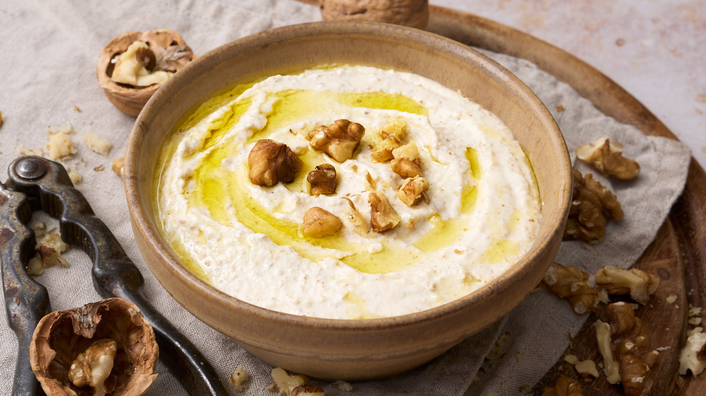

# Salsa di Noci

*Liguria's walnut sauce: blanched walnuts blitzed with garlic, bread soaked in milk, olive oil, Parmesan and a touch of marjoram into a creamy pale sauce. The Ligurian alternative to pesto - the Genoese coast's walnut answer, traditionally served with pansoti or stuffed pasta.*

**Serves:** Makes about 400 ml

**Prep Time:** 20 minutes

**Cook Time:** 0 minutes

## Overview
Salsa di noci is Liguria's iconic walnut sauce and the lesser-known cousin of pesto Genovese - both are Genoese-Ligurian sauces but salsa di noci uses walnuts instead of basil and pine nuts: shelled walnuts (preferably fresh new-crop), briefly blanched in hot water to soften and peel the bitter skins, then blitzed with crushed garlic, day-old bread soaked in milk (the panada - gives the proper creamy texture), extra virgin olive oil, grated Parmesan and a touch of fresh marjoram (the canonical Ligurian herb) into a creamy pale-coloured sauce. Traditionally served with pansoti (the Ligurian stuffed pasta filled with herbs and ricotta) or any stuffed pasta; also excellent over plain pasta, drizzled on grilled vegetables, or used as a dip for crudités. Blanch and peel the walnuts; the bitter skin gives an off taste, and blanching loosens it for easy peeling. The bread-and-milk panada gives the proper creamy texture. Fresh marjoram (the canonical Ligurian herb, similar to oregano but milder and sweeter) is essential.

## Ingredients

- 200 g shelled walnuts (preferably fresh)
- 100 g day-old white bread (crust removed)
- 150 ml whole milk (for soaking)
- 6 garlic cloves
- 50 g grated Parmesan
- 150 ml extra virgin olive oil (plus more if needed)
- 2 tablespoons fresh marjoram leaves (or substitute with oregano + a pinch of mint)
- 1 teaspoon fine sea salt
- ½ teaspoon ground black pepper
- 1 tablespoon fresh lemon juice (optional; brightens)

## Method

### Stage 1 - Blanch and peel walnuts
1. Bring water to a boil; add walnuts.
2. Blanch 5 minutes.
3. Drain; cool slightly.
4. Rub the walnuts in a clean tea towel to peel off the bitter skins (some will peel easily; for stubborn ones, peel by hand). Don't worry about perfection.

### Stage 2 - Soak the bread
1. Tear the bread into chunks; place in a bowl.
2. Pour milk over; let stand 5 minutes till bread is fully saturated.
3. Squeeze out excess milk.

### Stage 3 - Blend
1. Place the peeled walnuts, squeezed bread, garlic, Parmesan, marjoram, salt and pepper in a food processor.
2. Pulse 4-5 times to combine.
3. With the motor running, slowly pour in the olive oil till you have a smooth creamy sauce.
4. Add the lemon juice (if using).

### Stage 4 - Adjust
1. Add more olive oil if too thick (the sauce should be like double cream consistency).
2. Add a tablespoon of warm water or milk to thin if needed.
3. Taste; adjust salt.

### Stage 5 - Rest
1. Transfer to a serving bowl.
2. Rest 30 minutes for flavours to marry.

### Stage 6 - Use
1. Toss with cooked pasta (add a splash of pasta water to loosen).
2. Drizzle over grilled vegetables.
3. Use as a dip for crudités.
4. Spoon over poached fish.

## Notes
- **Blanch and peel:** removes bitterness.
- **Bread-and-milk panada:** essential for proper texture.
- **Marjoram for proper Ligurian profile:** oregano + mint as approximation.
- **Pour oil slowly:** creates emulsion.
- **Adjust consistency to use:** thicker for dip, thinner for pasta.

## Variations
**With ricotta:** add 100 g of fresh ricotta; gives an even creamier version.
**With cream:** add 50 ml double cream instead of milk for the soak; richer.
**Almond version (salsa di mandorle):** swap walnuts for blanched almonds; Sicilian variation.
**With pine nuts:** add 50 g of toasted pine nuts; less canonical but excellent.

## Serving
With pansoti (the canonical Ligurian pasta), or any stuffed pasta. Over grilled vegetables. As a dip with crudités or bread. Ligurian white wine.

## Storage
- Keeps refrigerated 5 days with a thin layer of olive oil on top.
- Don't freeze; the texture suffers.
- The flavour deepens after 24 hours.
