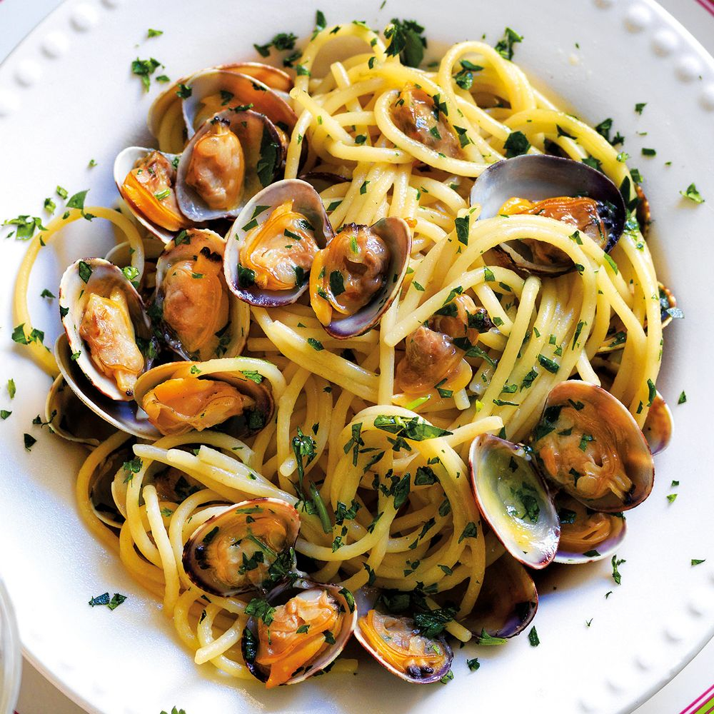

# Spaghetti alle Vongole

*Naples' spaghetti with clams: spaghetti tossed with fresh clams in their shells steamed open in white wine, garlic, olive oil, fresh parsley and a touch of red pepper flakes. The Campanian coastal classic - minimalism in service of clam-and-pasta perfection.*

**Serves:** 4

**Prep Time:** 15 minutes (plus 30 minutes clam purging)

**Cook Time:** 15 minutes

## Overview
Spaghetti alle vongole is Naples' iconic pasta-with-clams dish and one of Italy's most beloved seafood pastas: fresh clams in their shells (the canonical Italian clam is the "vongole veraci" - the small clam of the Mediterranean; substitute with Manila clams or littleneck clams outside Italy) purged of grit in salted water, then steamed open in a wide pan with extra virgin olive oil, lots of crushed garlic, fresh parsley and a touch of red pepper flakes; spaghetti cooked al dente in heavily salted water is added straight into the pan with the clams along with a splash of pasta cooking water (which emulsifies with the olive oil and clam liquor to form a glossy sauce), tossed briefly to combine, and finished with more fresh parsley. The dish can be either "in bianco" (white; without tomato) or "in rosso" (red; with cherry tomatoes); this recipe gives the white version which is considered the canonical Naples preparation. Three details define proper spaghetti alle vongole. First, fresh clams in shells. Don't use canned or shucked; the shells release the clam liquor that becomes the sauce. Second, no cheese. Italian rule: no cheese on seafood pasta. Don't be tempted to add Parmesan. Third, cook the pasta al dente. Slightly under-cooked; it finishes cooking in the pan with the clams and emulsifies into the sauce.

## Ingredients

### Clams
- 1.5 kg fresh small clams in shells (vongole, Manila clams, or littleneck; cleaned)
- 1 tablespoon salt (for purging water)

### Pasta
- 500 g spaghetti
- 4 tablespoons salt (for pasta water)

### Cooking
- 100 ml extra virgin olive oil
- 10 garlic cloves (sliced)
- 1 teaspoon red pepper flakes (or 1 small fresh chilli, chopped)
- 200 ml dry white wine
- 1 large bunch fresh flat-leaf parsley (about 30 g; finely chopped, reserve some for finishing)
- ½ teaspoon ground black pepper

### To finish
- Extra virgin olive oil for drizzling
- Lemon wedges
- Extra chopped parsley

## Method

### Stage 1 - Purge the clams
1. Place clams in a wide bowl of cold water with the salt.
2. Soak 30 minutes (they purge sand).
3. Drain and rinse.

### Stage 2 - Start the pasta
1. Bring a large pot of water to a rolling boil; add the 4 tablespoons of salt.
2. Add the spaghetti; cook 1 minute less than packet instruction (so it's al dente).

### Stage 3 - Start the clams (while pasta cooks)
1. Heat the olive oil in a very wide heavy pan over medium-high heat.
2. Add the sliced garlic and red pepper flakes; cook 30 seconds till just golden.
3. Add the white wine; let bubble 30 seconds.
4. Add the clams; cover with the lid.
5. Cook 3-5 minutes till the clams open.

### Stage 4 - Combine
1. Discard any clams that didn't open.
2. When the pasta is al dente, drain (reserve 200 ml pasta water).
3. Add the drained pasta directly to the clam pan.
4. Add 100 ml pasta water; toss vigorously for 1 minute till the sauce emulsifies into a glossy coating.
5. If too dry, add more pasta water.
6. Stir in most of the chopped parsley and black pepper.

### Stage 5 - Serve
1. Tip into warm pasta bowls.
2. Make sure each portion gets clams.
3. Scatter remaining parsley.
4. Drizzle extra virgin olive oil.
5. Lemon wedges on the side.

## Notes
- **Fresh clams in shells:** essential.
- **No cheese:** Italian rule.
- **Al dente pasta finishes in the pan.**
- **Reserve pasta water:** essential for emulsion.
- **Discard unopened clams.**

## Variations
**With cherry tomatoes (in rosso):** add 200 g halved cherry tomatoes after the wine; gives the red version.
**With mussels:** swap clams for mussels; same technique.
**With shrimp:** add 200 g peeled raw shrimp to the pan with the clams; turns into a mixed seafood pasta.
**Spicier:** double the red pepper flakes.

## Serving
In warm pasta bowls with lemon. Italian white wine (Greco di Tufo, Falanghina, Verdicchio). Crusty bread.

## Storage
- Best eaten immediately; clams don't reheat well.
- Don't refrigerate.
