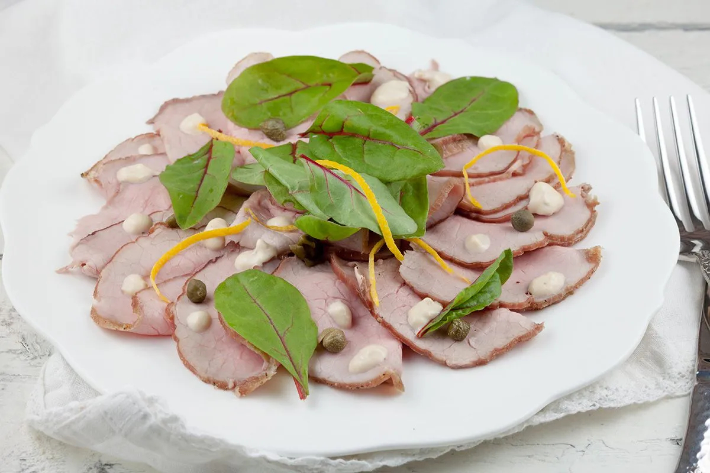

# Vitello Tonnato

*Piedmont's cold veal with tuna sauce: thinly sliced cold poached veal, sauced with a creamy tuna-mayonnaise-caper-anchovy emulsion, garnished with capers, lemon and parsley. The Piemontese summer antipasto, ribbons of pink veal under pale tuna sauce - counter-intuitive, classic, deeply Italian.*

**Serves:** 6 (as antipasto) or 4 (as light main)

**Prep Time:** 30 minutes (plus poaching + chilling)

**Cook Time:** 1 hour 30 minutes (the veal)

## Overview
Vitello tonnato is the iconic cold antipasto of Piedmont, in northwestern Italy, and one of the most distinctive dishes in Italian cooking: thinly sliced cold poached veal arranged on a plate and napped with a creamy sauce made from canned tuna in oil, mayonnaise (or egg-yolk-based aioli), capers, anchovies, lemon juice and the poached veal's cooking liquid. The combination sounds counter-intuitive (cold veal with tuna sauce?) but tastes brilliantly Italian: the sauce is creamy and briny with a tuna-bonito undertone, the veal mild and tender, the capers bright bursts. Served as an antipasto in summer, or as a light main with bread and salad. The dish was supposedly invented in the late 19th century in Piedmont as a way to use the leftover poaching liquid from veal Sunday dinners. The veal must be cooked to medium with a slightly pink centre and chilled thoroughly. The tuna must be Italian-style in olive oil (yellowfin ideally); tuna in water gives a thin flavour. Slice the veal paper-thin.

## Ingredients

### Veal
- 800 g veal eye round (or veal loin; or top round)
- 1 large onion (halved)
- 2 carrots (halved)
- 2 celery stalks
- 6 garlic cloves
- 4 bay leaves
- 1 tablespoon whole black peppercorns
- 200 ml dry white wine
- 1 ½ litres water
- 1 ½ teaspoons fine sea salt

### Tuna sauce
- 200 g good Italian tuna in olive oil (drained; canned yellowfin or albacore)
- 4 anchovy fillets (drained)
- 3 tablespoons capers (drained; small ones)
- 200 g good mayonnaise (Italian quality; or homemade)
- 4 tablespoons reserved poaching liquid (cooled)
- 4 tablespoons fresh lemon juice
- 4 tablespoons extra virgin olive oil
- 1 teaspoon Dijon mustard
- ½ teaspoon ground white pepper
- 1 teaspoon fine sea salt (taste; tuna is salty)

### To finish
- 2 tablespoons capers (drained; for garnish)
- 1 small bunch fresh flat-leaf parsley (chopped)
- 1 small lemon (sliced into thin rounds)
- Extra virgin olive oil for drizzling

### To serve
- Crusty Italian bread (focaccia, ciabatta, or grissini)
- Simple green salad

## Method

### Stage 1 - Poach the veal (do this the day before)
1. Place the veal in a heavy pot; add the onion, carrots, celery, garlic, bay leaves, peppercorns, white wine, water and salt.
2. Bring to a low simmer; skim any foam.
3. Cook gently 1 to 1.5 hours (don't boil hard) till the internal temperature reaches 60°C / 140°F (medium; slightly pink centre).
4. Lift the veal out; cool completely.
5. Wrap tightly in cling film; refrigerate at least 4 hours, preferably overnight.
6. Reserve 200 ml of the poaching liquid; refrigerate.

### Stage 2 - Make the tuna sauce
1. In a food processor (or blender), combine the drained tuna, anchovies, capers, mayonnaise, 4 tablespoons of poaching liquid, lemon juice, olive oil, mustard and white pepper.
2. Blitz to a smooth creamy sauce; the consistency should be like a thick pourable cream.
3. Taste; adjust salt and lemon.

### Stage 3 - Slice the veal
1. Take the chilled veal out of the fridge.
2. Use a very sharp knife (or a meat slicer) to slice paper-thin (3 mm) cross-cuts.
3. Arrange the slices on a wide serving platter, slightly overlapping.

### Stage 4 - Sauce and garnish
1. Spoon the tuna sauce generously over the veal slices; cover most of the meat.
2. Scatter capers and chopped parsley.
3. Add thin lemon slices.
4. Drizzle with extra olive oil.

### Stage 5 - Rest and serve
1. Let stand 15 minutes at room temperature before serving (the cold dulls the flavours; slight room-temperature warming brings them out).
2. Serve with crusty bread and a simple salad.

## Notes
- **Don't overcook the veal:** medium, slightly pink centre.
- **Italian tuna in olive oil:** essential.
- **Slice paper-thin:** essential for proper experience.
- **Make ahead:** the veal MUST be chilled before slicing.
- **Bring to slight room temperature before serving:** improves flavour.

## Variations
**Modern minimalist:** less sauce, more attention to veal quality and presentation.
**Without mayonnaise (purist):** make a true egg-yolk-based emulsion instead of using shop-bought mayo.
**With pork (maiale tonnato):** swap veal for pork loin; cook the same way; less canonical but excellent.
**With chicken (pollo tonnato):** modern variation using chicken breast; lighter version.

## Serving
On a wide platter as antipasto. Italian white wine (Gavi di Gavi, Arneis from Piedmont). Crusty bread. Simple green salad.

## Storage
- The sliced veal with sauce keeps refrigerated 2 days; flavour deepens.
- The unsauced veal keeps refrigerated 4 days.
- The tuna sauce keeps refrigerated 5 days.
- Don't freeze; the texture suffers.
