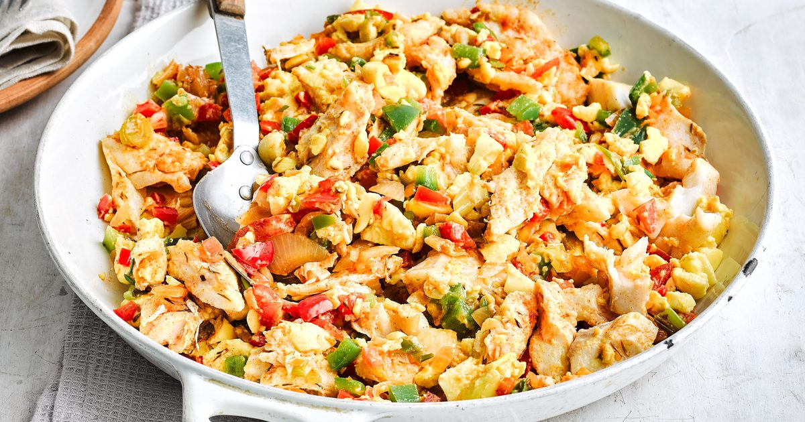

# Ackee and Saltfish

*Jamaica's national dish: salt cod hydrated and sautéed with sweet ackee fruit, scotch bonnet, onion, sweet pepper and thyme. Eat with fried plantain or bammy, traditionally for Sunday breakfast.*

**Serves:** 4

**Prep Time:** 20 minutes (plus 12+ hours soaking the saltfish)

**Cook Time:** 25 minutes

## Overview
Ackee and saltfish is Jamaica's national dish: an unlikely-looking combination of West African fruit and Caribbean preserved cod that has been eaten on the island since the 18th century. The ackee is a yellow pod that opens when ripe; the edible aril inside (soft, slightly nutty, slightly creamy yellow flesh) was brought to Jamaica from West Africa in the 1770s. The salt cod arrived via the Atlantic salt-fish trade. The two together are spectacular: the soft ackee has a texture and colour reminiscent of scrambled eggs, the saltfish gives savoury depth, and a backdrop of sautéed onion, sweet pepper, Scotch bonnet and thyme ties everything to the rest of Jamaican cooking. Traditionally a breakfast plate served with fried plantain, boiled green banana, fried dumplings or bammy (cassava flatbread). Tinned ackee (Grace, Linstead Market) is the realistic ingredient outside the Caribbean; the fresh fruit is mildly toxic if eaten unripe.

## Ingredients

### Saltfish prep
- 250 g boneless salt cod (saltfish)
- Water for soaking

### The dish
- 1 large tin ackee (about 540 g, drained gently, do not break the lobes)
- 1 medium onion (finely sliced)
- 1 red bell pepper (deseeded, sliced into thin strips)
- 4 spring onions (whites and greens separated, finely sliced)
- 3 garlic cloves (minced)
- ½ scotch bonnet pepper (deseeded, finely chopped, adjust for heat)
- 4 sprigs fresh thyme (or 1 tsp dried)
- 2 large tomatoes (deseeded and chopped)
- 2 tbsp neutral oil
- 1 tsp paprika
- ½ tsp black pepper (no salt; the saltfish provides it)
- Pinch of allspice (pimento)

## Method

### Stage 1 - Soak the saltfish (the night before)
1. Place the salt cod in a large bowl. Cover with cold water by at least 5 cm.
1. Refrigerate at least 12 hours, changing the water 2-3 times during the soak. Taste a small sliver to test, it should still have a savoury saltiness but should not be aggressively salty.
1. If you have less time: bring the saltfish and water to a boil, simmer 10 minutes, drain, repeat once with fresh water. Faster but slightly mealier in texture.

### Stage 2 - Cook and flake the saltfish
1. Drain the soaked saltfish. Place in a pan with fresh cold water to cover.
1. Bring to a gentle boil and simmer 10 minutes, until the fish flakes easily with a fork.
1. Drain and cool slightly.
1. Flake the fish into small pieces with your fingers, discarding any bones or skin.

### Stage 3 - Build the sofrito
1. Heat the oil in a wide heavy pan or skillet over medium heat.
1. Add the sliced onion and red pepper. Cook 5-6 minutes, until soft and just turning gold at the edges.
1. Stir in the garlic, scotch bonnet, the whites of the spring onions, thyme sprigs and allspice. Cook 1 minute, until aromatic.
1. Add the chopped tomatoes. Cook 3-4 minutes, until the tomatoes break down into a thick sofrito.

### Stage 4 - Add the saltfish
1. Stir the flaked saltfish into the sofrito. Cook 2 minutes, breaking it through the mixture so each strand gets coated in the sauce.
1. Sprinkle in the paprika and black pepper. Stir.

### Stage 5 - Add the ackee
1. Drain the tinned ackee very carefully, the lobes break easily. Tip the ackee gently into the pan.
1. Fold the ackee through the saltfish and sofrito with a spoon, lifting from underneath rather than stirring. The ackee should warm through and pick up some colour from the sauce, but the lobes should stay mostly intact. Cook 3-4 minutes only.
1. Off the heat. Scatter the spring-onion greens over the top.
1. Taste; the dish should taste salty (from the fish), warm with chilli heat, herbaceous from the thyme and allspice. Add black pepper if needed.

### Stage 6 - Serve
1. Plate with one or more of: fried plantain, boiled green banana, fried dumplings (johnny cakes), bammy or hard dough bread.

## Notes
- **Soak the saltfish properly.** Twelve hours minimum, two or three water changes. Under-soaked saltfish is unpleasantly briny; over-soaked tastes of nothing. Taste a sliver before cooking.
- **Tinned ackee is fragile.** Drain over a strainer, never tip-and-shake. The lobes break easily and a broken-up ackee looks like scrambled mash rather than the proper distinct yellow pieces.
- **Fold the ackee in; do not stir.** The dish wants the ackee to hold its shape. Lifting from underneath with a spoon preserves the structure.
- **Scotch bonnet is non-negotiable.** Habanero is the closest substitute; jalapeño is too mild. The fruity, perfumed heat is structural to the dish.
- **Allspice (pimento) is the Jamaican signature.** A pinch is enough to define the dish; more and it dominates.
- **No added salt.** The saltfish does all the salting. Taste before considering more.

## Variations
- **With sweet pepper instead of red:** green bell pepper gives a slightly more vegetal background. Common in island cooking.
- **With coconut cream:** stir 2 tbsp coconut cream into the sofrito before adding the ackee for a richer, slightly sweet version.
- **Vegan / vegetarian:** swap the saltfish for 200 g sliced firm tofu marinated in 2 tbsp soy sauce + 1 tbsp white miso + 1 tsp paprika for 30 minutes, then sautéed until golden before joining the sofrito. The "saltfish" replacement is a real island-vegan adaptation.

## Serving
The Sunday breakfast plate: ackee and saltfish, fried plantain, boiled green banana, fried dumplings, a wedge of avocado on the side, a mug of strong coffee or bush tea. As lunch or dinner, the same set with hard dough bread instead of dumplings.

## Storage
- Refrigerates 2 days. Reheat gently; the ackee softens further on reheating.
- Does not freeze well; the ackee texture suffers entirely on thaw.
- Leftover ackee and saltfish makes an excellent breakfast sandwich filling in hard dough or a fried dumpling.
