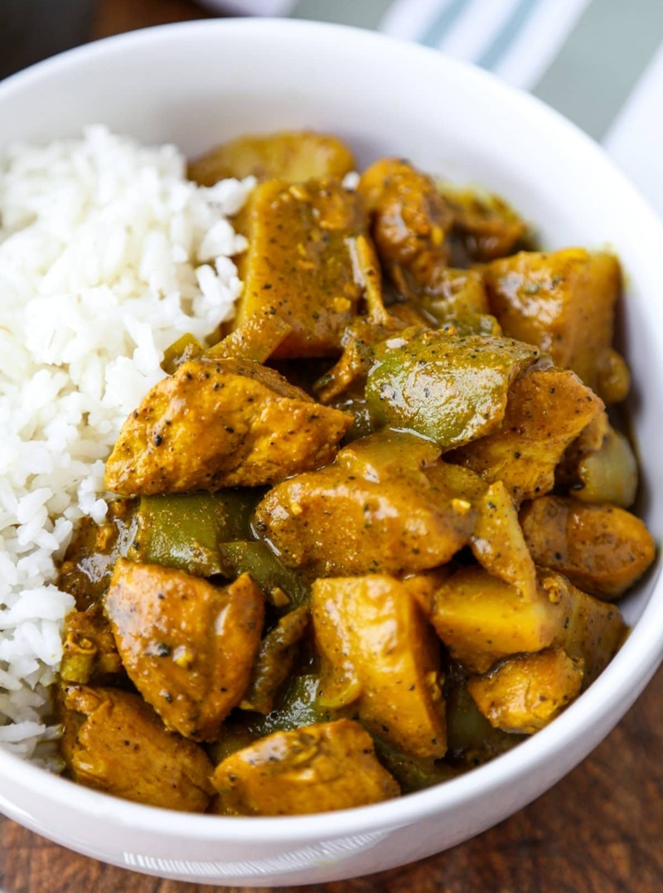

# Authentic Jamaican Curry Chicken

*Jamaica's burnt-curry chicken: curry powder bloomed in hot oil till it darkens, with bone-in chicken simmered in a long covered stew with Scotch bonnet.*

**Serves:** 4

**Prep Time:** 20 minutes (plus 1 hour marinating)

**Cook Time:** 1 hour 10 minutes

## Overview
Jamaican curry sits in its own corner of the global curry map: heavier on turmeric and allspice than Indian Madras, lighter on cumin, and built on a technique called "burning the curry" that gives the dish its character. The technique is exactly what it sounds like, dry curry powder hits hot oil and is stirred for 30 seconds until it darkens from yellow to deep gold and smells like toasted spice. That move concentrates the flavours and removes any raw edge. The finished stew is bright yellow stained slightly orange, savoury and aromatic rather than searingly hot, with thyme and a whole pierced Scotch bonnet scenting the gravy without flooring it. Smell: bloomed curry powder, allspice, browned chicken fat. Not difficult, but requires confidence in the 30-second bloom (under-do it and the dish is flat; over-do it and you have to start over). A Sunday-dinner staple across Jamaica and the diaspora, served over white rice with the gravy spooned generously over.

## Ingredients

- 4-5 chicken drumsticks
- 4-5 boneless skinless chicken thighs
- 4 tablespoons Jamaican curry powder (divided)
- 1 teaspoon ground allspice
- 1 teaspoon salt
- 1 teaspoon ginger paste
- ½ teaspoon garlic powder
- ½ teaspoon ground coriander
- 2 tablespoons Worcestershire sauce
- 2-3 tablespoons vegetable oil
- 1 green bell pepper (large, sliced)
- 1 yellow onion (medium, chopped)
- 4 spring onions (chopped)
- 4 garlic cloves (minced)
- 6 sprigs fresh thyme
- 1 Scotch bonnet (whole, pierced once)
- 480 ml low-sodium chicken stock
- 2 carrots (medium, chopped)
- 1 russet potato (large, peeled and chopped)
- White rice, to serve
- Spring onions, to garnish

## Method

### Stage 1 - Marinate
1. Season the chicken with **half** the curry powder (2 tablespoons), the allspice, salt, ginger paste, garlic powder, coriander and Worcestershire.
1. Massage thoroughly.
1. Refrigerate at least 1 hour, overnight ideal.

### Stage 2 - Burn the curry
1. Heat the oil in a heavy pot over medium-high until shimmering.
1. Add the **remaining** 2 tablespoons of curry powder.
1. Stir constantly for 30 seconds until the curry is deeply golden and fragrant - this is "burning the curry" but it must not actually burn.

### Stage 3 - Brown the chicken
1. Working in batches, add the chicken pieces.
1. Brown 2-3 minutes per side without disturbing.
1. Set browned pieces aside.

### Stage 4 - First stew
1. Return all the chicken to the pot.
1. Add the bell pepper, onion, scallions, garlic, thyme sprigs and the whole pierced Scotch bonnet.
1. Pour in the stock; bring to a simmer.
1. Cover; reduce to medium-low; simmer 35 minutes.

### Stage 5 - Second stew
1. Flip the chicken pieces.
1. Add the chopped carrots and potatoes.
1. Cover; continue simmering 30 minutes until the vegetables are fork-tender.

### Stage 6 - Finish
1. Remove from heat; discard the thyme sprigs and Scotch bonnet.
1. Taste; adjust salt.
1. Serve immediately over white rice with pan juices.
1. Scatter sliced spring onions.

## Notes
- **"Burning" the curry:** the spice doesn't actually burn; it blooms in hot oil until the aroma changes from raw to roasted. Watch the colour - it should darken from yellow to brown over 30 seconds. Any blackening = too far.
- **Dark meat for juiciness:** breasts dry out in the long stew. Stick with thighs and drumsticks.
- **Whole pierced Scotch bonnet:** delivers flavour and gentle heat without bursting. If it bursts, the dish becomes very hot - fish it out earlier if you're worried.

## Storage
- Keeps 2-3 days refrigerated; reheats well and deepens overnight.
- Freezes 2 months without the rice.
