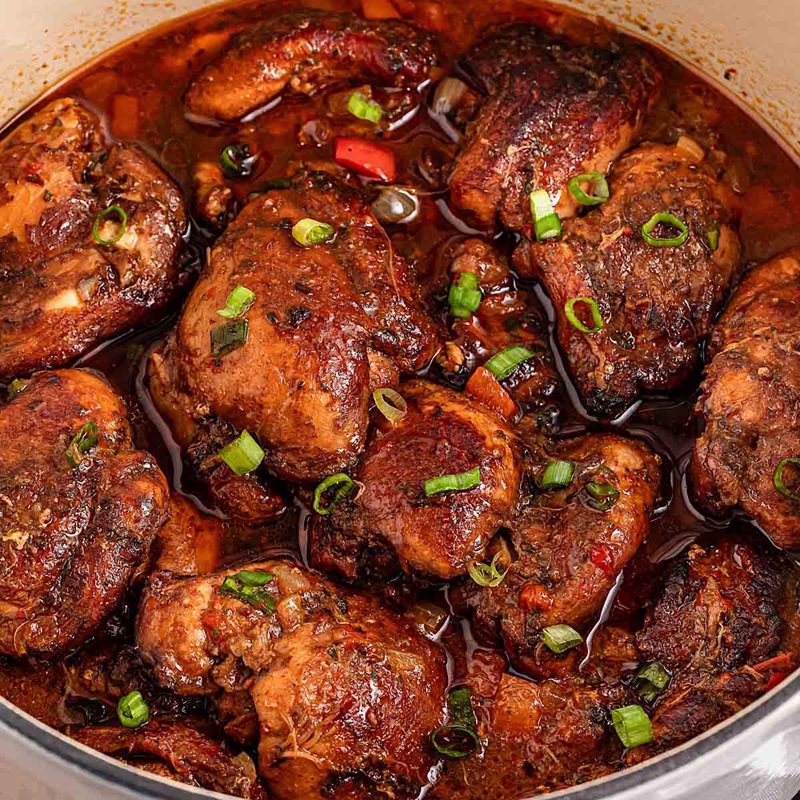

# Brown Stew Chicken

*Jamaica's Sunday standard: chicken marinated overnight in seasoning, browned hard, then braised low in stock and tomato till the gravy turns dark mahogany.*

**Serves:** 4

**Prep Time:** 30 minutes (plus 2 hours marinating, ideally overnight)

**Cook Time:** 2 hours

## Overview
The Sunday-lunch counterpart to goat curry across Jamaica; not curry-driven but built on a deep mahogany gravy that gets its colour from caramelised brown sugar and a few teaspoons of bottled "browning sauce" (Grace is the traditional brand, a concentrated burnt-sugar syrup that's a kitchen staple in every Jamaican household). The chicken is bone-in, marinated overnight in a wet rub of onion, bell pepper, scallions, allspice, ginger and thyme, then browned hard and slow-braised until the meat slips off the bone. Flavour is savoury and slightly sweet with a deep thyme back-note and a whisper of Scotch bonnet heat from the whole pierced fruit in the pot. The gravy is what you actually want; thick, dark, sweet-savoury, glossy with rendered chicken fat, the kind of gravy you'd happily eat over plain rice as its own meal. Smell is browning sugar, thyme, and the unmistakable allspice signature. Patient cooking but easy: marinate the day before, then 30 minutes of active prep and 2 hours of unattended braise. The pairing with [[rice-and-peas]] is non-negotiable across Jamaican households.

## Ingredients

### Marinade
- ½ medium yellow onion (chopped)
- 1 bell pepper (large, chopped)
- 4 spring onions (chopped)
- 6 garlic cloves (minced) or 1 tablespoon garlic paste
- 1 tablespoon brown sugar
- 1 teaspoon smoked paprika
- ½ teaspoon ground allspice
- ½ teaspoon ground ginger
- salt
- pepper

### Chicken
- 8-9 chicken pieces (legs + boneless skinless thighs)
- 3 teaspoons browning sauce
- 3 tablespoons vegetable oil

### Braise
- 2 carrots (medium, chopped)
- 1 can (240 ml) tomato sauce
- 4-6 sprigs fresh thyme
- 2 bay leaves
- 1 Scotch bonnet (whole, pierced once)
- 720 ml chicken stock

## Method

### Stage 1 - Marinate
1. Combine the onion, bell pepper, scallions, garlic, brown sugar, paprika, allspice, ginger, salt and pepper in a wide bowl.
1. Pat the chicken dry; add to the bowl.
1. Add the browning sauce; massage thoroughly into every piece.
1. Cover; refrigerate at least 2 hours, overnight much better.

### Stage 2 - Brown
1. Lift the chicken out of the marinade; reserve the marinade.
1. Heat the oil in a large heavy pot over medium-high until shimmering.
1. Working in batches without crowding, sear the pieces 2-3 minutes per side until deeply browned.
1. Transfer to a clean plate.

### Stage 3 - Build the stew
1. Reduce heat to medium. Add the reserved marinade to the same pot.
1. Scrape up the caramelised bits; cook 2-3 minutes.
1. Return the browned chicken with any resting juices.
1. Add the carrots, tomato sauce, thyme, bay leaves, whole pierced Scotch bonnet and stock.
1. Stir to combine.

### Stage 4 - Braise
1. Cover; reduce to medium-low.
1. Simmer 1 ½-2 hours until the chicken is meltingly tender and falling from the bone.

### Stage 5 - Finish
1. Discard the thyme sprigs, bay leaves and Scotch bonnet.
1. If the gravy is too thin, increase heat to medium-high and simmer uncovered 5 minutes.
1. Taste; adjust seasoning.
1. Serve in shallow bowls with rice and peas, plantain, or steamed cabbage.

## Notes
- **Browning sauce is the colour:** Grace-brand Browning is the gold standard. The dark mahogany of the gravy comes from it. Without it the dish reads as a chicken stew, not specifically brown stew.
- **Pierce the Scotch bonnet, don't break it:** the whole pierced bonnet delivers fragrance and gentle heat into the gravy without releasing capsaicin overload. If it bursts, the dish gets very hot.
- **Marinate longer for deeper flavour:** overnight is the difference between "good" and "Jamaican grandmother nodding her approval".

## Storage
- Keeps 3-4 days refrigerated; reheats wonderfully and deepens overnight.
- Freezes 2 months. Thaw overnight; reheat with a splash of stock.
