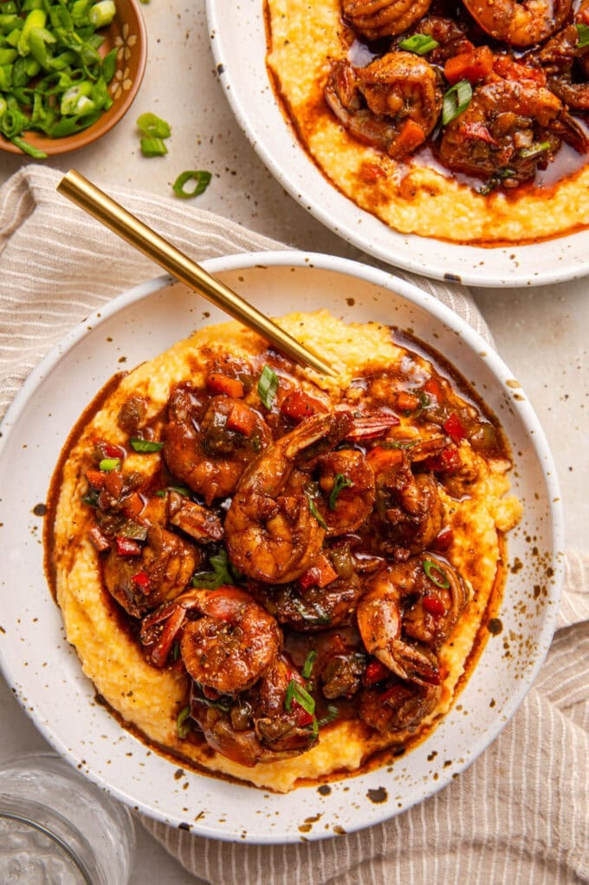

# Brown Stew Shrimp and Sweet Potato Grits

*A Caribbean-Southern fusion: jumbo shrimp in a brown-stew sauce with peppers and Scotch bonnet, spooned over sweet potato grits enriched with gouda.*

**Serves:** 4

**Prep Time:** 15 minutes

**Cook Time:** 45 minutes

## Overview
A Caribbean-Southern crossover that works because both traditions cook in a similar register: butter, peppers, alliums, slow heat, savoury depth. The brown stew base on top of the dish is Jamaican, bell peppers, carrot, Scotch bonnet, ginger, browning sauce, that mahogany-coloured gravy with the unmistakable allspice-and-thyme signature, and the bed underneath is from Lowcountry Charleston, where sweet potato grits enriched with butter, half-and-half and gouda are a long-running modern Southern restaurant standard. The shrimp themselves are quick-cooked and sweet, picking up the brown stew sauce. Two textures stacked: silky-rich grits, brothy stew on top with bite from the diced peppers and carrot. Smell is sweet-onion-and-browning-sugar over the corn-sweet base of the grits. Not difficult but it's two pans running at once, so timing matters; the grits hold on a low warm setting while the shrimp cook quickly. A modern fusion rather than a traditional dish, popularised by Black American chefs in the 2010s exploring the points of overlap between Lowcountry and Caribbean cookery.

## Ingredients

### Sweet potato grits
- 800 ml water (plus more as needed)
- 240 ml chicken broth
- Salt to taste
- 1 ½ cups grits (not instant)
- ½ cup sweet potato purée (or pumpkin purée)
- 2 tablespoons butter
- 120 ml half-and-half (or single cream)
- 100 g shredded gouda (or sharp cheddar)
- ¼ teaspoon white pepper

### Brown stew shrimp
- 450 g (1 lb) jumbo shrimp (peeled, deveined)
- 1 tablespoon olive oil
- 1 teaspoon smoked paprika
- 1 teaspoon ground allspice
- 1 teaspoon onion powder
- 1 teaspoon garlic powder
- salt
- pepper

### Sauce
- 4 tablespoons unsalted butter
- ½ green bell pepper (finely diced)
- ½ red bell pepper (finely diced)
- ½ small yellow onion (finely diced)
- 1 carrot (large, finely diced)
- 1 Scotch bonnet (deseeded and chopped)
- 1 tablespoon garlic paste
- 2 teaspoons ginger paste
- 2 teaspoons browning sauce (Grace brand)
- 240 ml chicken broth
- ¼ cup sliced spring onions (plus more to garnish)

## Method

### Stage 1 - Grits
1. Bring water, chicken broth and salt to the boil in a large saucepan.
1. Gradually whisk in the grits, breaking up clumps.
1. Reduce to low; cover; simmer 30 minutes, stirring often.
1. Stir in the sweet potato purée, butter, half-and-half, cheese and white pepper.
1. Taste; adjust salt. Keep warm on the lowest heat. Add water if too stiff.

### Stage 2 - Season the shrimp
1. Pat the shrimp dry.
1. Toss with oil, paprika, allspice, onion and garlic powder, salt and pepper.
1. Rest at room temperature 30 minutes.

### Stage 3 - Brown stew base
1. Melt the 4 tablespoons of butter in a large skillet over medium heat.
1. Add the bell peppers, onion, carrot and Scotch bonnet; sauté 6-7 minutes until tender.
1. Stir in the garlic paste and ginger paste; cook 1 minute until fragrant.
1. Add the browning sauce; stir to combine. The mix darkens.

### Stage 4 - Simmer the shrimp
1. Add the seasoned shrimp, chicken broth and scallions.
1. Cover; simmer 6-7 minutes, stirring occasionally, until the shrimp are opaque.

### Stage 5 - Plate
1. Divide the grits between bowls.
1. Spoon the brown stew shrimp and sauce over the top.
1. Scatter more scallions.
1. Serve immediately.

## Notes
- **Browning sauce is the colour and flavour:** Grace-brand Browning gives the dish its mahogany finish. Kitchen Bouquet is a workable substitute.
- **Don't overcook the shrimp:** 7 minutes covered is plenty for jumbo shrimp. They go rubbery fast past that point.
- **Sweet potato purée:** roast a sweet potato, scoop and purée, freeze in portions. Tinned pumpkin works as a substitute.

## Storage
- Both elements keep 3-4 days refrigerated. Don't freeze (grits go grainy).
- Reheat the grits with a splash of broth or milk; the shrimp gently in the sauce.
