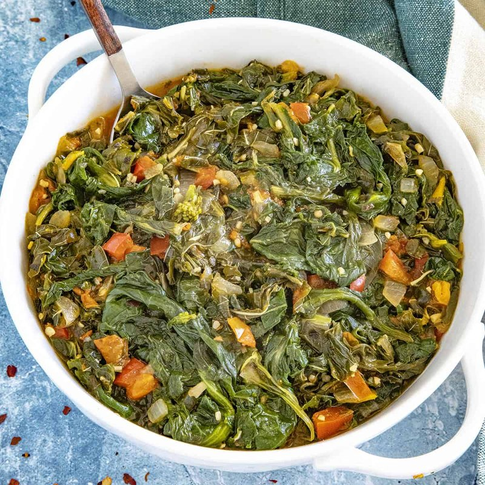

# Callaloo

*Jamaica's everyday greens dish: callaloo (or spinach as a stand-in) wilted with onion, garlic, scotch bonnet, thyme and tomato. The greens collapse into a soft, glossy mound; the scotch bonnet does its work without being eaten. Eats as a side, a breakfast with hard-dough bread, or piled over rice.*

**Serves:** 4

**Prep Time:** 10 minutes

**Cook Time:** 15 minutes

## Overview
Every Jamaican kitchen has its version of callaloo, the everyday green that turns up beside ackee and saltfish at breakfast, beside fried fish at lunch, or piled over rice and peas at dinner. You soften onion and garlic in coconut oil, drop in chopped tomato and let it collapse into a rough sauce, then pile in the leafy greens by the handful so each batch wilts before the next goes on top. A whole unpierced Scotch bonnet sits on top scenting the pot without lighting it on fire; thyme stems share the steam, and a splash of water keeps everything moving. You're done when the leaves are glossy and tender but still vivid green; long-cooked callaloo turns grey and bitter, so the moment they collapse, you're there. Fish out the chilli and the bare thyme, taste, season. Eat it with hard-dough bread for breakfast, alongside fried fish at lunch, or banked against a mound of rice and peas with brown stew chicken.

## Ingredients

- 500 g fresh callaloo (or 500 g spinach + 200 g chard if callaloo unavailable; chopped)
- 3 tablespoons coconut oil (or vegetable oil)
- 1 onion (medium, sliced)
- 4 garlic cloves (crushed)
- 4 spring onions (sliced)
- 2 tomatoes (medium, chopped)
- 4 sprigs fresh thyme
- 1 scotch bonnet chilli (whole, unpierced) or sliced for more heat
- ½ teaspoon ground black pepper
- 1 teaspoon salt
- 100 ml water

## Method

### Stage 1 - Aromatics
1. Heat the oil in a wide pan over medium heat.
1. Cook the onion 4 minutes until softening.
1. Add the garlic and spring onions; cook 1 minute.
1. Add the tomatoes; cook 3-4 minutes until breaking down.

### Stage 2 - Greens
1. Pile in the callaloo or spinach in batches, letting each handful wilt before adding more.
1. Add the thyme, the whole scotch bonnet, salt and pepper.
1. Pour in the water.

### Stage 3 - Steam
1. Cover; cook 6-8 minutes (less for spinach, more for callaloo) until the greens are tender and bright.
1. Uncover; cook 2 more minutes to drive off any excess liquid, the dish should be moist but not soupy.

### Stage 4 - Finish
1. Fish out the scotch bonnet and thyme stems.
1. Taste; adjust salt and pepper.

### Stage 5 - Serve
1. Pile onto a plate; eat with rice and peas, hard-dough bread, or as a side to fried fish or curried vegetables.

## Notes
- **Callaloo plant:** The leaves of taro or amaranth, depending on the Caribbean island. UK supermarkets sometimes stock tinned callaloo (which works) or fresh at Caribbean grocers. Spinach is the easiest substitute; chard adds a closer texture.
- **Scotch bonnet whole:** The pepper perfumes the pot without setting it on fire. Pierce or slice it only if you want heat that bites.
- **Don't overcook:** Long-cooked greens go grey-green and bitter. The whole point is bright, soft, glossy.

## Storage
- Keeps 3 days refrigerated; reheats well.
