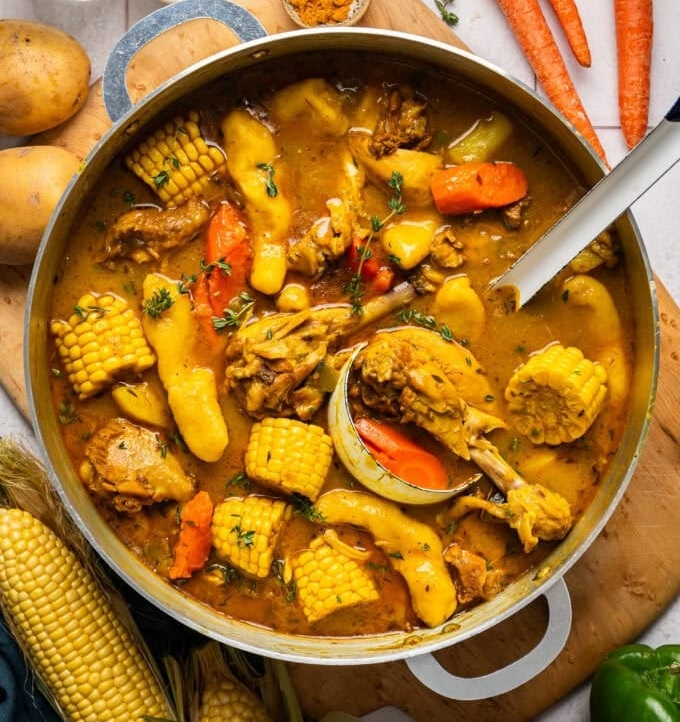

# Caribbean Chicken Soup

*West Indian Saturday-soup: a one-pot meal of curry-and-allspice-seasoned chicken parts, pumpkin-broth-thickened with carrots, corn rounds, potatoes and small hand-rolled dumplings. Coconut milk smooths the base. Eaten year-round in Caribbean households - "no specific season needed".*

**Serves:** 8

**Prep Time:** 15 minutes (plus 30 minutes seasoning)

**Cook Time:** 1 hour 50 minutes

## Overview
Saturday-soup in Trinidad, Guyana and Jamaica is a category rather than a single recipe; the structure is always the same (curry-and-allspice-seasoned chicken, root vegetables, hand-rolled dumplings, a thickened broth), and the specifics vary household by household. This is the Jamaican lean: pumpkin in the broth as the thickening agent (Grace pumpkin soup mix is the household shortcut), coconut milk for richness, allspice and thyme for the Caribbean signature, and a single pot that's a complete meal. The dumplings are the soul, small hand-rolled cornmeal-and-flour batons that go in last and cook in the broth, slightly bouncy, slightly chewy, picking up the surrounding flavour. The broth is golden-orange from pumpkin and curry, rich without being heavy, with corn-on-the-cob rounds and chunks of Yukon Gold potato giving substance. Smell when you lift the lid is curry, allspice and sweet pumpkin. Easy if you've made stews before, with two hours of mostly-passive simmering. Eaten year-round in Caribbean households as the dependable one-pot meal; nominally a Saturday dish but no Caribbean grandmother would refuse you a bowl on a Tuesday.

## Ingredients

### Chicken and seasoning
- 1.4 kg (3 lbs) chicken pieces (drumsticks + boneless thighs)
- 1 tablespoon Jamaican curry powder
- 1 tablespoon Adobo seasoning
- 1 tablespoon Sazon seasoning
- 1 teaspoon ground allspice
- 80 ml green seasoning (or sofrito)
- Salt and pepper

### Base
- 2 tablespoons olive oil
- 1 large yellow onion (chopped)
- 1 green bell pepper (chopped)
- 60 ml sliced spring onions
- 6-8 sprigs fresh thyme
- 1 tablespoon garlic paste
- 2.4 litres (10 cups) chicken broth

### Vegetables and broth
- 1 packet Grace pumpkin-flavour soup mix (or 200 ml pumpkin purée + 1 stock cube)
- 4 carrots (sliced on the bias)
- 2 ears corn (sliced into thick rounds)
- 2-3 Yukon Gold potatoes (peeled, quartered)
- 1 can (400 ml) full-fat coconut milk

### Dumplings
- 1 ¼ cup plain flour
- ⅓ cup fine yellow cornmeal
- 1 tablespoon caster sugar
- 1 teaspoon salt
- ⅔ cup water

### Optional
- Cornstarch slurry (1 tablespoon cornstarch + 1 tablespoon water)

## Method

### Stage 1 - Season the chicken
1. Pat the chicken dry. Remove the skin from drumsticks (peel back with paper towel).
1. Toss with curry, adobo, sazon, allspice, green seasoning, salt and pepper.
1. Cover; refrigerate at least 30 minutes.

### Stage 2 - Build the base
1. Heat oil in a large Dutch oven over medium heat.
1. Add onion, bell pepper, spring onions and thyme. Sauté 5-6 minutes until tender.
1. Stir in garlic paste; cook 1 minute.

### Stage 3 - Brown and braise
1. Add the seasoned chicken; toss with the aromatics.
1. Cook 4-5 minutes until browned.
1. Pour in the broth; bring to a gentle boil; reduce to medium-low.
1. Cover with the lid slightly ajar; simmer 1 hour until the chicken is tender.

### Stage 4 - Vegetables
1. Sift the pumpkin soup mix into the pot through a fine sieve; discard the noodle pieces, keep the flavour powder.
1. Add the carrots, corn rounds, potatoes and coconut milk.
1. Stir; cover; cook 20-25 minutes.

### Stage 5 - Dumplings
1. Whisk together the flour, cornmeal, sugar and salt.
1. Pour in the water; mix by hand until a cohesive dough forms.
1. Roll into 2 cm balls, then into small logs / batons.
1. Drop into the soup; cook 10-12 minutes until the dumplings and vegetables are tender.
1. Discard the thyme sprigs.

### Stage 6 - Finish
1. Optionally stir in the cornstarch slurry for a thicker broth.
1. Taste; adjust salt.
1. Ladle into deep bowls.

## Notes
- **Pumpkin soup mix is the secret:** the powdered base from the packet thickens and flavours; the noodles get sieved out. If unavailable, use pumpkin purée + a Maggi cube.
- **Dumplings are the texture:** small batons that hold shape. Skip them and the soup is missing its heart.

## Storage
- Keeps 4 days refrigerated; reheats beautifully.
- Freezes 3 months. Thaw overnight.
