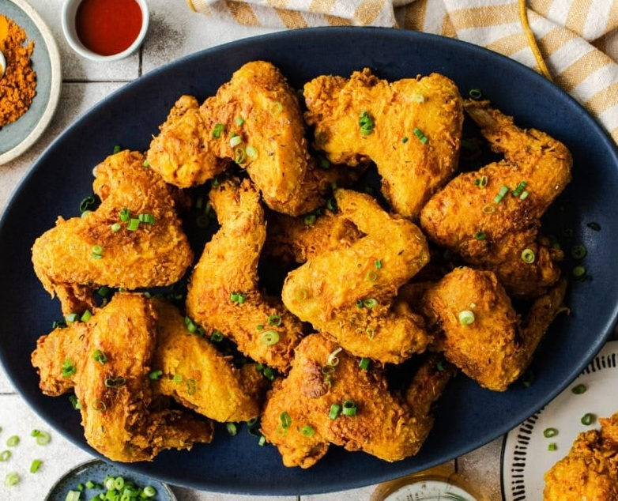

# Jamaican Curry Chicken Wings

*Caribbean-Southern fried chicken: whole wings marinated in buttermilk, Jamaican curry powder and Creole seasoning, dredged and deep-fried shatter-crisp.*

**Serves:** 4

**Prep Time:** 15 minutes (plus 6 hours marinating, ideally overnight)

**Cook Time:** 30 minutes

## Overview
Buttermilk-fried wings in the American Southern tradition, with a Caribbean accent twice over: Jamaican curry powder folded into both the marinade and the dredge, and a pinch of allspice in the breading. The flavour is warm and earthy rather than sharp, turmeric and allspice are the dominant notes, with Creole Cajun seasoning bridging the Caribbean and Louisiana sides of the dish. The cornstarch in the dredge is the technical move; mixing flour with about 15% cornstarch produces a thinner, crisper, more crackly crust than flour alone, the same trick Korean fried chicken uses. The buttermilk overnight brine tenderises and lets the flavour penetrate down to the bone. Smell out of the fryer is curry powder hitting hot oil. Not difficult but you need patience: 6-hour marinade minimum, careful oil temperature management (165°C / 330°F is lower than typical fried chicken; the wings need long enough to cook through to the bone before the crust browns). A clear example of cross-pollination between Jamaican kitchens and the American South.

## Ingredients

### Marinade
- 1.1-1.4 kg (2 ½-3 lbs) whole chicken wings (~10 wings)
- 2 tablespoons Jamaican curry powder
- 1 tablespoon Creole Cajun seasoning
- 1 tablespoon Maggi chicken bouillon powder
- 1 tablespoon caster sugar
- 1 tablespoon yellow mustard
- 480 ml buttermilk
- 2 eggs (large)
- salt
- pepper
- Hot sauce (optional)

### Flour dredge
- 1 ½ cups plain flour
- ¼ cup cornstarch
- 1 tablespoon Jamaican curry powder
- 1 tablespoon Maggi chicken bouillon powder
- 1 tablespoon Creole Cajun seasoning
- ¼ teaspoon ground allspice

### To fry
- Peanut oil (or other neutral oil) for deep-frying

## Method

### Stage 1 - Marinate
1. Pat the wings dry; place in a large sealable bag.
1. Add the curry, Cajun seasoning, bouillon, sugar, mustard, buttermilk, eggs, salt, pepper and optional hot sauce.
1. Toss to coat thoroughly.
1. Refrigerate at least 6 hours, ideally overnight.

### Stage 2 - Prep to fry
1. Remove from the fridge; let sit at room temperature 15 minutes.
1. Whisk together the flour, cornstarch, bouillon, Cajun seasoning, curry powder and allspice in a shallow bowl.
1. Heat the frying oil in a heavy Dutch oven to 165°C / 330°F.
1. Set a wire rack over a baking sheet for resting.

### Stage 3 - Dredge
1. Lift each wing from the marinade; shake off excess.
1. Coat thoroughly in the seasoned flour mixture, pressing into the crevices.
1. Shake off excess; set on the rack to rest while heating the oil.

### Stage 4 - Fry
1. Working in batches, lower the wings into the hot oil; don't overcrowd.
1. Fry 10-15 minutes until deep golden and 75°C internal.
1. Maintain oil at 330°F between batches.
1. Lift to the wire rack to drain.

### Stage 5 - Serve
1. Rest 5-10 minutes (skin firms as it cools slightly).
1. Garnish with sliced scallions if you like.
1. Serve with rice and peas, fried plantain, or a side salad.

## Notes
- **Jamaican curry powder specifically:** warmer, more allspice-driven than Indian curry. Generic curry powder gives a different dish.
- **Buttermilk + acid tenderises:** the longer the marinade, the more tender the meat.
- **Oil temperature is everything:** 330°F lets the wings cook through to the bone before the breading burns. Higher and the crust scorches; lower and you get oily limp coating.

## Storage
- Best the day of frying. Refrigerated 2 days; reheat at 200°C / 400°F oven for 8-10 minutes to refresh the crust.
- Don't microwave - soggy.
