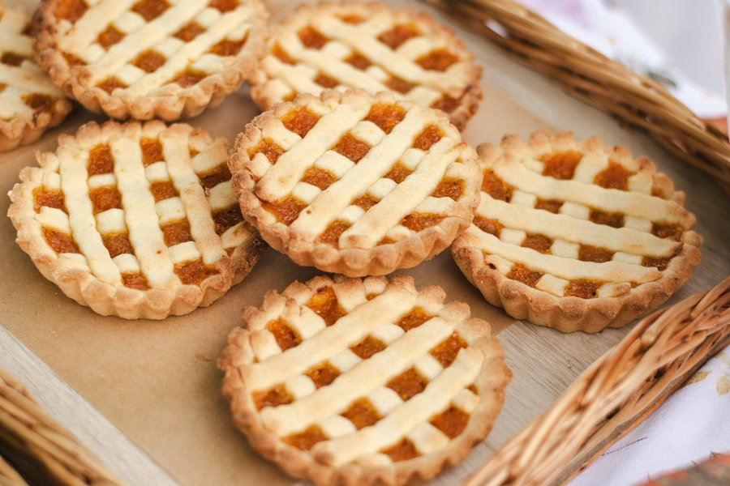

# Gizzada

*Small Jamaican coconut tartlets - shortcrust pastry shells with a pinched, fluted edge, filled with a sticky, spiced coconut mixture cooked down with brown sugar, ginger, nutmeg and vanilla. Sometimes called "pinch-me-round" for the hand-pinched edge. A tea-time classic and a fixture at every Jamaican bakery.*

**Serves:** Makes 12 tarts

**Prep Time:** 30 minutes (plus 30 minutes pastry chilling)

**Cook Time:** 30 minutes

## Overview
A short, biscuity pastry shell, hand-rolled into discs and pinched around the edges to form a free-form cup (no tart tin needed, though a muffin tin makes it easier). Filled with desiccated coconut simmered with dark brown sugar, water, fresh ginger, nutmeg, vanilla and a touch of butter until thick and sticky. Baked until the coconut filling is set and lightly caramelised and the pastry is pale gold.

## Ingredients

### Pastry
- 250 g plain flour
- 50 g caster sugar
- ¼ teaspoon fine salt
- 125 g cold unsalted butter, cubed
- 1 large egg yolk
- 3-4 tablespoons cold water

### Filling
- 200 g desiccated coconut (unsweetened)
- 150 g soft dark brown sugar
- 150 ml water
- 30 g unsalted butter
- 1 tablespoon finely grated fresh ginger
- ¾ teaspoon ground nutmeg
- ½ teaspoon ground cinnamon
- 1 teaspoon vanilla extract
- Pinch of fine salt

## Method

### Stage 1 - Make the pastry
1. In a large bowl, whisk together the flour, sugar and salt.
2. Rub in the cold butter with your fingertips until the mix resembles coarse breadcrumbs.
3. Add the egg yolk and 3 tablespoons of water; mix with a fork until the dough comes together (add the last tablespoon of water only if needed).
4. Knead briefly into a smooth disc; wrap; chill 30 minutes.

### Stage 2 - Make the filling
1. Place the coconut, brown sugar, water, ginger, nutmeg and cinnamon in a saucepan.
2. Bring to a gentle simmer over medium heat, stirring.
3. Cook 8-10 minutes, stirring frequently, until most of the liquid has been absorbed and the mixture is thick, glossy and sticky.
4. Stir in the butter, vanilla and salt; cook 1 more minute.
5. Set aside to cool slightly (it should be warm, not hot, when filling the tarts).

### Stage 3 - Shape the tarts
1. Heat the oven to 180°C (160°C fan).
2. Roll the chilled pastry on a floured surface to about 3 mm thick.
3. Cut out 12 discs, about 10 cm across (use a saucer as a guide).
4. Place each disc into the cup of a non-stick muffin tin (or onto a lined baking tray if shaping free-form).
5. With your thumb and forefinger, pinch the edge upwards all the way around to form a fluted wall about 1.5 cm high; the centre should remain flat.
6. Spoon a heaped tablespoon of the coconut filling into each shell, pressing down gently.

### Stage 4 - Bake
1. Bake on the middle shelf 18-22 minutes, until the pastry is pale golden and the coconut filling is set and lightly browned at the peaks.
2. Cool 10 minutes in the tin (the pastry firms as it cools), then lift out onto a wire rack.
3. Serve at room temperature.

## Notes
- **Pinching the edge:** The signature shape is achieved by hand-pinching the pastry up into a fluted wall. It does not need to be neat - the rustic, uneven edge is part of the look.
- **Don't overcook the filling:** It should be thick but still spreadable. Cook too long and it sets hard like toffee before you can portion it.
- **Fresh ginger:** Gives a sharp, slightly hot note that lifts the sweetness. Don't substitute ground ginger - it's not the same.

## Variations
**Rum gizzada:** Add 1 tablespoon dark rum to the filling at the end.
**Pineapple-coconut:** Stir in 50 g finely chopped pineapple to the filling with the butter.

## Serving
Serve with: Hot Jamaican coffee or tea, or a glass of cold milk. Also lovely with a scoop of vanilla ice cream as a quick dessert.

## Storage
- Keeps 4 days in an airtight tin at room temperature.
- Pastry softens slightly after day 2 - still delicious.
- Freezes 1 month; defrost at room temperature.
