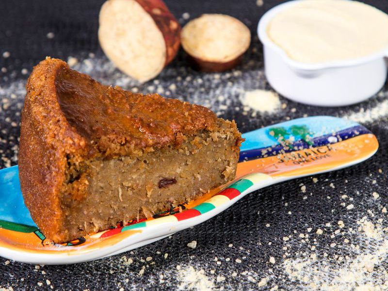

# Sweet Potato Pudding

*Jamaica's dense fudge-like pudding: grated yellow sweet potato bound with coconut milk, brown sugar, raisins, spice and a glug of dark rum. Baked slow.*

**Serves:** 10-12 (one 23 cm square dish)

**Prep Time:** 25 minutes

**Cook Time:** 1 ½ hours

## Overview
Yellow sweet potatoes (boniato or the Caribbean white-fleshed variety if you can find them; otherwise ordinary orange sweet potatoes work) are peeled and finely grated. Combined with coconut milk, brown sugar, plain flour, raisins, mixed peel, vanilla, nutmeg, allspice and a glug of dark rum. Baked low and slow until set but still slightly wobbly in the middle. Cooled completely before slicing, this is essential, as a warm pudding falls apart.

## Ingredients

### Pudding
- 1 kg yellow sweet potato (peeled weight; about 1.2 kg unpeeled)
- 400 ml coconut milk (full-fat tinned)
- 200 g soft dark brown sugar
- 100 g plain flour
- 75 g raisins
- 50 g mixed candied peel (optional but traditional)
- 60 g unsalted butter, melted
- 1 egg (large), beaten
- 2 tablespoons dark rum
- 1 teaspoon vanilla extract
- 1 teaspoon ground nutmeg
- 1 teaspoon ground allspice
- ½ teaspoon ground cinnamon
- ¼ teaspoon fine salt

### Top glaze
- 100 ml coconut milk
- 1 tablespoon dark brown sugar
- ¼ teaspoon ground nutmeg

## Method

### Stage 1 - Prep
1. Heat the oven to 160°C (140°C fan).
2. Grease a 23 cm square baking dish (at least 5 cm deep) and line the base with baking parchment.
3. Peel the sweet potatoes; grate finely on the small holes of a box grater (or pulse in a food processor until very fine - do not puree).

### Stage 2 - Mix the pudding
1. Place the grated sweet potato in a large bowl.
2. Stir in the coconut milk, brown sugar, melted butter, beaten egg, rum and vanilla.
3. Whisk in the flour, nutmeg, allspice, cinnamon and salt until smooth.
4. Fold in the raisins and mixed peel.
5. The mixture should be thick but pourable, like a heavy batter.

### Stage 3 - Bake
1. Pour the mixture into the prepared dish; smooth the top.
2. Bake on the middle shelf for 1 hour.
3. While baking, mix the glaze ingredients (coconut milk, brown sugar, nutmeg) in a small bowl.
4. After 1 hour, the pudding will be set around the edges and slightly wobbly in the centre.
5. Carefully pour the glaze evenly over the top.
6. Return to the oven for a further 25-30 minutes, until the top is set and a glossy crust has formed.
7. A skewer in the centre should come out with thick, moist crumbs (it will not come out clean - the centre should stay soft).

### Stage 4 - Cool and slice
1. Cool completely in the dish on a wire rack (2-3 hours; do not rush this).
2. Once cold, cut into 10 or 12 thick squares.

## Notes
- **The name:** "Hell-a-Top, Hell-a-Bottom, Hallelujah in the Middle" comes from the original cooking method - a heavy iron pot on coals with more coals piled on the lid; both top and bottom turned dark while the middle stayed soft. The modern oven version mimics this with a glossy crust top and bottom and a fudgy middle.
- **Sweet potato variety:** Look for "boniato" or yellow-fleshed Caribbean sweet potato if your local shop stocks it (Asian or Afro-Caribbean grocers usually do). Standard orange UK sweet potato is a perfectly fine substitute - the texture is identical, just slightly sweeter and more orange in colour.
- **Cool fully before slicing:** A warm pudding will collapse. Cold, it slices cleanly into firm, fudgy squares.
- **Grate, don't puree:** Grated texture gives the pudding its characteristic body. Pureed sweet potato makes it gluey.

## Variations
**Cornmeal pudding (variant):** Replace half the sweet potato with cooked yellow cornmeal porridge for a related Jamaican classic.
**Pumpkin pudding:** Replace half the sweet potato with grated pumpkin for a slightly lighter version.

## Serving
Serve with: A cup of hot Jamaican coffee, a glass of sorrel at Christmas, or a small spoon of coconut cream for richness.

## Storage
- Keeps 4 days refrigerated in an airtight container.
- Improves in flavour after 24 hours.
- Freezes 2 months wrapped; defrost in the fridge overnight.
