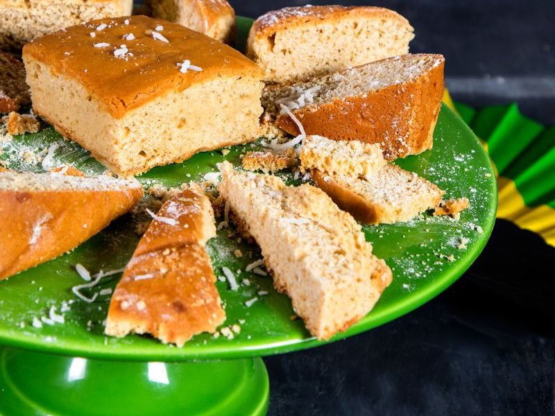

# Toto

*A traditional Jamaican coconut spice cake - dense, moist, deeply flavoured with brown sugar, allspice, cinnamon, nutmeg and grated fresh coconut. Often served in thick squares with afternoon tea or wrapped for school lunches. A simple recipe, no icing, just a glossy crust and a sweet, spiced crumb that keeps for days.*

**Serves:** 9-12 (one 23 cm square cake)

**Prep Time:** 15 minutes

**Cook Time:** 45 minutes

## Overview
A creamed-butter cake enriched with desiccated coconut (or fresh grated coconut) and warmed with allspice, cinnamon, nutmeg and a little vanilla. Brown sugar gives the deep molasses note. Coconut milk replaces some of the liquid for richness. Baked in a square tin, cooled in the tin, and cut into chunky squares.

## Ingredients

### Dry
- 250 g plain flour
- 2 teaspoons baking powder
- 1 teaspoon ground allspice
- 1 teaspoon ground cinnamon
- ½ teaspoon ground nutmeg
- ½ teaspoon fine salt
- 100 g desiccated coconut (unsweetened)

### Wet
- 175 g unsalted butter, softened
- 200 g soft dark brown sugar
- 3 eggs (large), room temperature
- 1 teaspoon vanilla extract
- 150 ml coconut milk (full-fat tinned)
- 2 tablespoons dark rum (optional)

## Method

### Stage 1 - Prep
1. Heat the oven to 175°C (155°C fan).
2. Grease and line a 23 cm square cake tin with baking parchment.
3. In a bowl, whisk together the flour, baking powder, allspice, cinnamon, nutmeg, salt and desiccated coconut.

### Stage 2 - Make the batter
1. In a large bowl, cream the butter and brown sugar with an electric whisk until light and fluffy (4-5 minutes).
2. Add the eggs one at a time, beating well after each.
3. Beat in the vanilla and rum (if using).
4. Fold in a third of the dry mix with a spatula.
5. Fold in half the coconut milk.
6. Repeat, ending with the dry mix; mix until just combined (do not overwork).

### Stage 3 - Bake
1. Scrape the batter into the prepared tin; level the top.
2. Bake on the middle shelf 40-45 minutes, until a skewer inserted in the centre comes out with a few moist crumbs (not raw batter).
3. The top should be deep golden and slightly cracked.
4. Cool in the tin 20 minutes, then lift out using the parchment and cool fully on a wire rack.
5. Cut into 9 or 12 squares.

## Notes
- **Fresh coconut:** If you can get a whole coconut, 120 g freshly grated flesh is exceptional in place of desiccated. Otherwise unsweetened desiccated is the standard.
- **Brown sugar choice:** Soft dark brown sugar gives the proper molasses depth. Light brown works but the cake will be lighter in flavour.
- **Don't overbake:** Toto should be moist, not dry. Pull it from the oven when the skewer is just barely clean.

## Variations
**With raisins:** Stir in 75 g raisins or sultanas soaked in rum overnight.
**Glazed:** Brush the warm cake with a thin glaze of rum and brown sugar (2 tablespoons rum dissolved with 3 tablespoons brown sugar over low heat).

## Serving
Serve with: A cup of hot tea, Jamaican coffee, or a glass of sorrel drink at Christmas. Excellent with a thin slice of mango on the side.

## Storage
- Keeps 5 days in an airtight tin at room temperature - in fact it improves over the first 2 days.
- Freezes 2 months wrapped tightly; defrost at room temperature.
