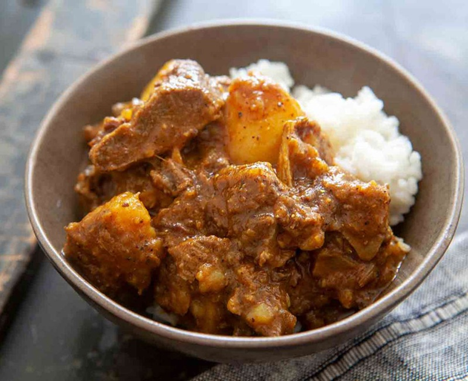

# Jamaican Goat Curry

*Jamaica's Sunday-lunch curry: bone-in goat slow-braised with Caribbean curry powder, Scotch bonnet, thyme and allspice until the meat slips off the bone.*

**Serves:** 4-6

**Prep Time:** 25 minutes (plus 2 hours marinating, ideally overnight)

**Cook Time:** 2 hours 30 minutes

## Overview
A deep, brick-yellow gravy stained with turmeric and allspice (called pimento in Jamaica, confusingly nothing to do with the English pepper of the same name). The taste is layered: the curry powder hits first, then the slow heat of Scotch bonnet, then a sweet-piney back-note from allspice and thyme that's unmistakably Caribbean rather than Indian. Bone-in shoulder or leg, braised till the bones loosen and the connective tissue melts into the gravy and gives it body without any flour or roux. Brown the meat, bloom the curry powder till it darkens, then leave it alone for two hours. The whole pierced Scotch bonnet sits in the pot scenting the gravy and is fished out before it ruptures, so the heat stays controllable. Came to Jamaica via Indian indentured labourers in the 1840s, then got reshaped by what the island already had: thyme, pimento, scotch bonnet, and the Saturday-evening habit of putting a pot on for Sunday lunch. Day-2 goat curry is better than day-1.

## Ingredients

### Goat and marinade
- 1.2 kg bone-in goat shoulder (or leg, cut into 3-4 cm chunks; ask the butcher to chop through the bone)
- 3 tablespoons Caribbean curry powder (Betapac or similar; substitute a Madras + 1 teaspoon ground allspice + 1 teaspoon ground turmeric)
- 1 teaspoon ground allspice (also called pimento)
- 1 teaspoon ground black pepper
- 2 teaspoons sea salt
- 6 sprigs fresh thyme (leaves picked, plus 2 whole sprigs for the pot)
- 4 spring onions (scallions, finely chopped, white and green)
- 6 garlic cloves (minced)
- 30 g fresh ginger (minced)
- 1 Scotch bonnet (deseeded and finely chopped; **keep a second one whole** for the pot)
- 2 tablespoons vegetable oil
- 1 tablespoon white vinegar

### To cook
- 2 tablespoons vegetable oil
- 1 onion (large, sliced)
- 2 tablespoons Caribbean curry powder (extra, for blooming)
- 1 litre chicken stock (or water)
- 2 potatoes (medium, peeled, cut into 3 cm chunks)
- 1 whole Scotch bonnet (left whole, pierced once with a knife - **do not break**)
- 2 sprigs fresh thyme
- Salt and black pepper, to adjust at the end

### To serve
- Rice and peas (see [cuisine/jamaican/side-dishes/rice-and-peas.md](side-dishes/rice-and-peas.md))
- [Fried Plantains](side-dishes/fried-plantains.md)
- Lime wedges
- Cold Red Stripe (or similar)

## Method

### Stage 1 - Marinate the goat
1. Put the goat chunks into a large bowl.
1. Add the curry powder, allspice, black pepper, salt, picked thyme leaves, spring onion, garlic, ginger, **chopped (deseeded)** Scotch bonnet, vegetable oil and vinegar.
1. Massage everything into the meat with your hands. Wear gloves if you've got a cut anywhere - the Scotch bonnet will find it.
1. Cover and refrigerate at least 2 hours; overnight is much better. The marinade penetrates the bone and the curry powder loses its raw edge.

### Stage 2 - Brown the goat
1. Heat the 2 tablespoons of oil in a heavy Dutch oven or large saucepan over high heat.
1. Working in 2 batches so the pot stays hot, lift the goat out of its marinade (reserve the marinade) and brown the chunks on all sides, about 4-5 minutes per batch. Don't overcrowd; you want a dark crust, not a steam-bath.
1. Set the browned goat aside on a plate.

### Stage 3 - Bloom the curry
1. Reduce heat to medium. There should be some fond stuck to the pot - good.
1. Add the sliced onion to the same pot. Stir 5 minutes until softened and golden.
1. Add the **extra 2 tablespoons** of curry powder. Stir constantly for 60-90 seconds, **scraping the fond**. The curry powder should darken from yellow to brown and release a sharp, dusty aroma. Don't let it burn.

### Stage 4 - The long braise
1. Return the goat and any resting juices to the pot.
1. Pour in the reserved marinade scraping the bowl, then the chicken stock until the goat is just covered.
1. Add the whole pierced Scotch bonnet and the 2 remaining thyme sprigs.
1. Bring to a vigorous boil, then reduce to a low simmer.
1. Cover and braise gently for 1 hour 30 minutes.

### Stage 5 - Potatoes and reduce
1. Add the potato chunks. Stir gently. Replace the lid.
1. Continue to simmer 30 minutes more, until the goat is fork-tender (the bones should slip when prodded) and the potato is soft.
1. Remove the lid for the last 10 minutes if the gravy is too thin; the potatoes will help thicken it as they break down a bit.
1. **Fish out the whole Scotch bonnet** before it bursts. Taste; adjust salt and add a few cranks of black pepper.

### Stage 6 - Serve
1. Spoon the goat curry over rice and peas in deep bowls.
1. Add a piece of fried plantain on the side.
1. Squeeze over a wedge of lime.

## Notes
- **Goat is the meat:** lamb is a workable substitute (use shoulder or shank pieces; reduce braise time to 90 minutes total because lamb is softer than goat). Mutton works similarly. Avoid pre-trimmed, boneless: the bones are what make the gravy.
- **Scotch bonnet is the heat:** the whole pierced one in the pot delivers fragrance and gentle heat. The chopped (deseeded) one in the marinade is the real fire. For mild palates, skip the chopped one entirely; the whole one alone is enough flavour.
- **Caribbean curry powder vs Indian:** Caribbean blends are heavier on turmeric and allspice, lighter on cumin. Betapac (yellow tub) is the gold standard. If using an Indian Madras as substitute, the dish is still good but reads as more "curry" and less "Jamaican curry" - close the gap with the extra allspice.
- **The fond is everything:** scrape the bottom of the pot when blooming the curry powder. The browned bits there are flavour.
- **Make a day ahead if you can:** the curry deepens overnight. Day-2 goat curry is what every Jamaican grandmother makes for Sunday lunch from Saturday's prep.

## Storage
- Keeps 4 days refrigerated; reheats beautifully (the gravy thickens, the flavours marry).
- Freezes 3 months. Thaw overnight in the fridge.
- Don't freeze with the rice and peas - cook those fresh.
