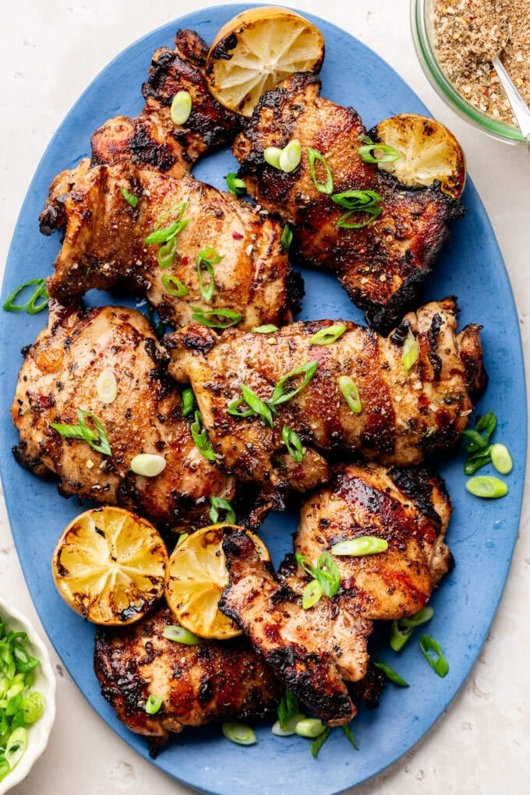

# Grilled Jerk Chicken Thighs

*Boneless jerk thighs marinated in jerk seasoning thinned with coconut milk and lime, then grilled till the surface chars and the inside stays juicy.*

**Serves:** 6

**Prep Time:** 15 minutes (plus 2+ hours marinating)

**Cook Time:** 15 minutes

## Overview
The dish lives or dies on the jerk marinade and on whether the chicken takes a proper char without drying out. The marinade here is jerk seasoning (homemade or Walkerswood, which is the canonical bottled brand) thinned with full-fat coconut milk and brightened with lime; the coconut milk is the technical move, it tames the heat, lubricates the meat, and helps the surface caramelise rather than blacken. Flavour is warm-piney from thyme and allspice, fiery from Scotch bonnet, slightly sweet from the browning sauce, deeply savoury once it hits high heat. Smell is unmistakable jerk: allspice smoke and pepper. Quick to cook once the marinade has done its work overnight, 15 minutes on a hot grill, 5 minutes rest. Originated on the eastern end of Jamaica (Boston Bay in Portland) where the Maroons, descendants of escaped enslaved Africans, developed a dry-rub-and-slow-smoke method over pimento wood; the modern grilled version is the home-kitchen adaptation that doesn't require a pimento-wood pit.

## Ingredients

- 1.1 kg boneless skinless chicken thighs
- 3 tablespoons Jamaican jerk seasoning (homemade or Walkerswood)
- 2 tablespoons olive oil
- 1 can (400 ml) full-fat coconut milk
- 2 tablespoons fresh lime juice
- 1 teaspoon browning sauce (Grace brand)
- Thinly sliced spring onions, to garnish
- Extra jerk seasoning, to finish

## Method

### Stage 1 - Marinate
1. In a wide bowl or zip bag, combine the chicken with jerk seasoning, olive oil, coconut milk, lime juice and browning sauce.
1. Massage to coat thoroughly.
1. Cover; refrigerate at least 2 hours; overnight is much better.
1. Remove from the fridge 30 minutes before cooking.

### Stage 2 - Grill (outdoor)
1. Preheat grill to 400°F / 200°C; lightly grease the grates.
1. With tongs, shake excess marinade off each thigh, then place on hot grates.
1. Close the lid; grill 5-7 minutes per side until 165°F / 75°C internal.

### Stage 3 - Grill pan (stovetop)
1. Preheat a heavy grill pan over medium heat; brush with oil.
1. Working in batches, shake off marinade, pat the thighs dry with paper towel.
1. Cook 5-7 minutes per side until 75°C internal. Wipe and re-oil the pan between batches.

### Stage 4 - Rest and finish
1. Lift onto a board; sprinkle with extra jerk seasoning.
1. Rest 5 minutes.
1. Plate; scatter sliced spring onions over the top.
1. Serve with rice and peas, fried plantain or a green salad.

## Notes
- **Dark meat for juiciness:** boneless thighs stay tender at the higher grilling temperatures jerk needs. Breasts dry out before the surface chars.
- **Browning sauce isn't optional:** Grace-brand Browning is a Caribbean kitchen staple. Kitchen Bouquet substitutes in a pinch. Gives the meat its deep mahogany colour.
- **Pat dry for the stovetop method:** wet marinade steams instead of chars. Drying the surface lets the grill marks form.

## Storage
- Cooled, in an airtight container: 3-4 days refrigerated.
- Reheat in the microwave with a damp paper towel, or in an air fryer 3-4 minutes at 175°C to keep the texture.
