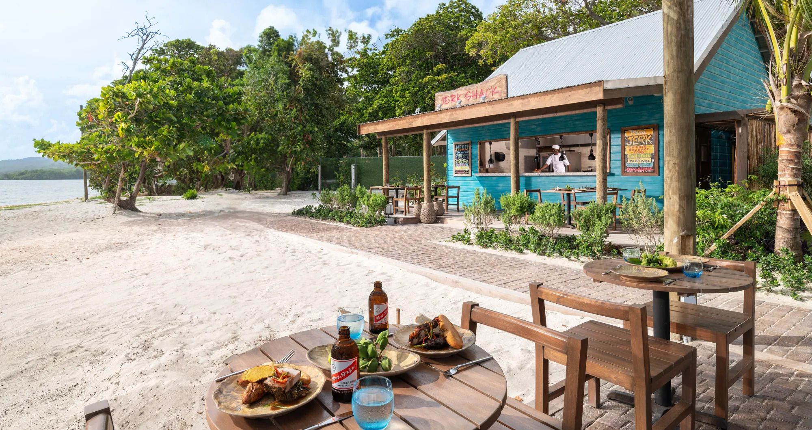

# Jamaican Cuisine

Spicy, smoky cooking, fusing African, Indian and British colonial influences with native ingredients. Allspice, scotch bonnet, thyme, ginger and lime drive jerk marinades; coconut and beans anchor rice and one-pot stews. Slow grilling over pimento wood, escovitch frying and patient simmering of curries and stews carry the flavour.
