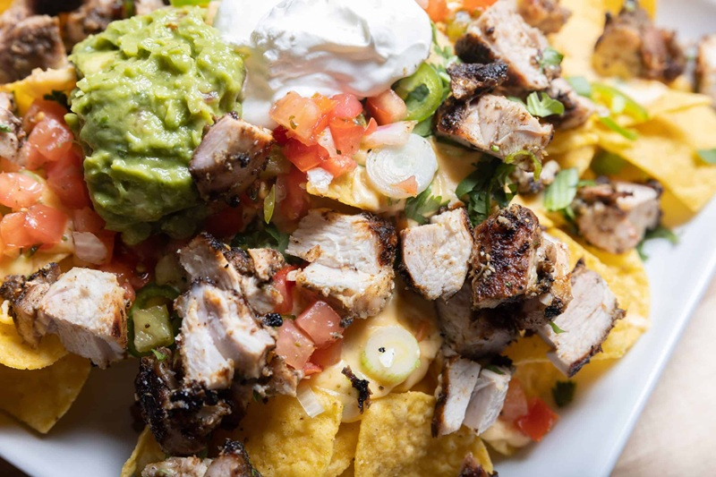

# Cheesy Jerk Chicken Nachos

*Caribbean-meets-Mexican: jerk-marinated chicken thighs (oven-baked, sliced) layered with shredded cheese, black beans and tortilla chips, baked until the cheese melts and bubbles, then topped with a fresh mango-pineapple chow. Built for a tray at the centre of the table.*

**Serves:** 4 (as starter / shared)

**Prep Time:** 30 minutes (plus 4 hours marinating)

**Cook Time:** 1 hour

## Overview
A Caribbean-American fusion that works because both food cultures speak the language of "everything on one tray". The base is American nachos: tortilla chips, melted cheese, black beans. On top sits jerk-marinated chicken thigh, which carries the dish's flavour, allspice, Scotch bonnet, nutmeg, cinnamon, thyme, soy and brown sugar blended into a wet jerk paste, marinated into the meat overnight, then oven-baked and sliced. The fresh element on top is a Trinidadian-style fruit chow: diced mango, pineapple, red bell pepper and red onion dressed with lime juice and cilantro. The chow is what makes this work; without it the nachos are just spicy meat-and-cheese, with it the dish has acid, crunch and sweetness to cut through the richness. Smell is melted cheese hitting jerk seasoning, with a citrus-tropical lift from the chow on top. Not difficult but it's three components running on different timelines, so plan ahead. A modern party-and-Super-Bowl-tray dish rather than something a Kingston grandmother makes, popularised by Caribbean-American food bloggers in the 2010s.

## Ingredients

### Jerk chicken
- 4 boneless skinless chicken thighs
- 7 scallions
- 1 tablespoon fresh thyme leaves
- 2 teaspoons salt
- ½ teaspoon black pepper
- 1 tablespoon brown sugar
- 2 teaspoons ground allspice
- 1 teaspoon ground nutmeg
- 1 teaspoon ground cinnamon
- 2 Scotch bonnet peppers (deseeded for less heat)
- 80 ml soy sauce
- 2 tablespoons vegetable oil
- 60 ml white vinegar
- 1 onion (chopped)
- 60 ml orange juice
- 3 garlic cloves
- 1 teaspoon grated ginger
- 3 tablespoons diced pineapple

### Mango-pineapple chow
- 1 cup diced mango
- 1 cup diced pineapple
- 1 cup diced red bell pepper
- ⅓ cup diced red onion
- 3 tablespoons chopped cilantro
- 60 ml fresh lime juice
- 1 garlic clove (minced)
- 2 teaspoons diced Scotch bonnet (optional)
- Salt and pepper to taste

### Nachos
- 2 cups (~225 g) shredded cheese (Tillamook or similar)
- ½ cup black beans (drained, rinsed)
- 1 bag tortilla chips
- Cherry tomatoes (halved), to garnish
- Sliced spring onions, to garnish

## Method

### Stage 1 - Marinate and bake the chicken
1. Blend all jerk marinade ingredients to a coarse paste.
1. Reserve half the marinade for layering later.
1. Place chicken in a sealable bag with the other half; massage to coat.
1. Marinate 4 hours minimum; overnight for best flavour.
1. Preheat oven to 190°C / 375°F. Bake the chicken on a greased tray 35-45 minutes until 75°C internal.
1. Cool slightly; slice into bite pieces.

### Stage 2 - Chow
1. Combine mango, pineapple, red pepper, red onion, cilantro, garlic and optional Scotch bonnet in a bowl.
1. Dress with lime juice; season with salt and pepper.
1. Refrigerate until needed.

### Stage 3 - Assemble and bake the nachos
1. Preheat oven to 200°C / 400°F.
1. Layer tortilla chips in a cast-iron skillet or oven-safe tray.
1. Scatter cheese, sliced jerk chicken and black beans.
1. Optional: drizzle the reserved marinade over for more heat.
1. Bake 10-15 minutes until the cheese is fully melted.

### Stage 4 - Serve
1. Pull from the oven; top with the chow, halved cherry tomatoes and spring onions.
1. Serve immediately, straight from the pan.

## Notes
- **Reserved marinade is intense:** half goes on the chicken, the other half flavours the nachos layer. Don't use raw marinade that touched the chicken on top of melted cheese.
- **Scotch bonnet gloves:** standard. Two of them deseeded is a moderate burn; one with seeds is fierce.

## Storage
- Best eaten immediately - chips lose crispness in 20 minutes.
- Leftover jerk chicken keeps 3 days; chow keeps 2 days. Re-build nachos fresh.
