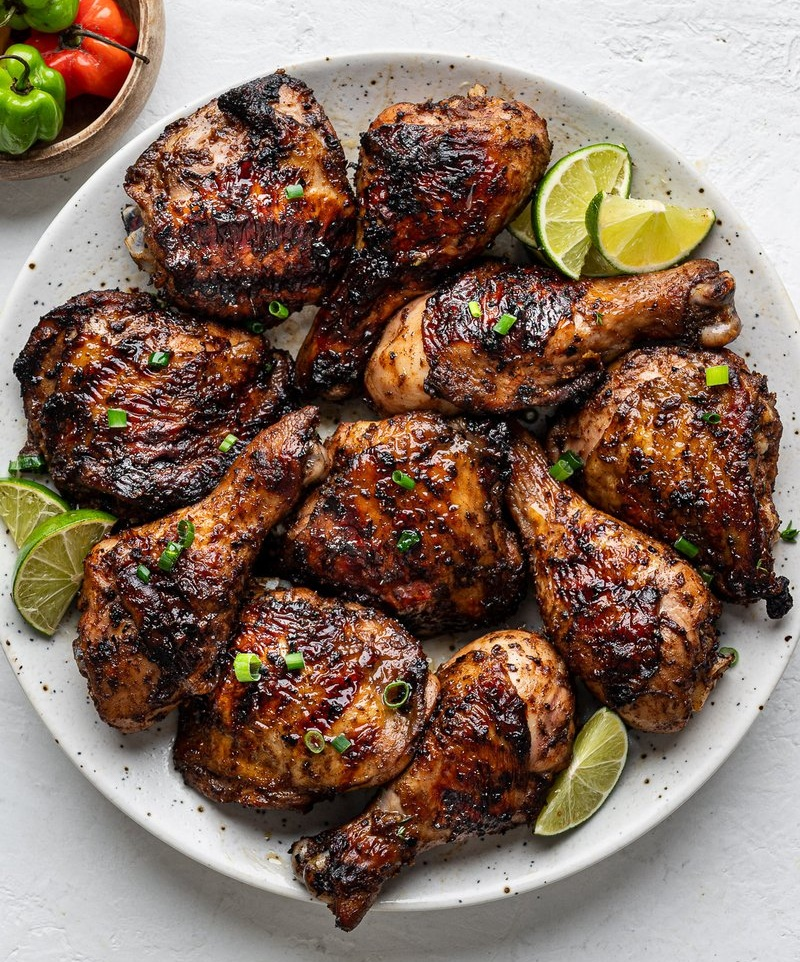

# Jerk Chicken

*Jamaica's national grill: bone-in chicken marinated overnight in a fiery rub of Scotch bonnet, allspice and thyme, slow-grilled over pimento wood.*

**Serves:** 4

**Prep Time:** 25 minutes (plus 12 hours marinating)

**Cook Time:** 40 minutes

## Overview
A wet jerk paste: scotch bonnet chillies, garlic, ginger, spring onions, thyme, allspice (whole or ground), brown sugar, soy sauce, lime, oil, salt and pepper, pureed in a blender. The chicken (bone-in skin-on thighs and drumsticks, or spatchcocked whole bird) marinates for 12 hours minimum. Slow-grilled over indirect heat with a pile of pimento wood chips or allspice berries on the coals for the signature smoke; alternatively, an oven-bake at 180°C with a final blast under the grill, supplemented with allspice in the marinade.

## Ingredients

### Jerk paste
- 4-6 scotch bonnet chillies (de-stemmed; deseed for a tamer version)
- 6 spring onions (chopped)
- 1 onion (small, chopped)
- 6 garlic cloves (peeled)
- 1 large thumb fresh ginger (chopped)
- 1 small bunch fresh thyme (4 tablespoons leaves)
- 2 tablespoons whole allspice berries (or 1 tablespoon ground allspice)
- 1 tablespoon ground black pepper
- 1 teaspoon ground cinnamon
- ½ teaspoon ground nutmeg
- 3 tablespoons soft brown sugar
- 3 tablespoons dark soy sauce
- 2 limes (juice)
- 4 tablespoons vegetable oil
- 1 tablespoon white vinegar
- 1 ½ teaspoons salt

### Chicken
- 1 ½ kg bone-in chicken thighs and drumsticks (or 1 spatchcocked whole chicken)

### To smoke (if outdoor BBQ)
- 200 g pimento (allspice) wood chips, soaked
- Or: 4 tablespoons whole allspice berries scattered on the coals

### To serve
- Rice and peas (Jamaican rice with kidney beans + coconut)
- Lime wedges
- Sliced cucumber
- Hot sauce (if you want more heat)

## Method

### Stage 1 - Jerk paste
1. Toast the allspice berries in a dry pan 1 minute; grind to a powder.
1. Combine ground allspice with all other paste ingredients in a blender; pulse to a thick wet paste.
1. Wear gloves to handle scotch bonnets, and wash your hands before touching your face.

### Stage 2 - Marinate
1. Score each piece of chicken 1 cm deep with a sharp knife (3 cuts per piece).
1. Rub the paste all over, into the cuts and under the skin.
1. Reserve 4 tablespoons of the paste for basting.
1. Cover; refrigerate 12 hours minimum, ideally 24.

### Stage 3 - Cook (outdoor grill, ideal)
1. Set up a charcoal grill for indirect heat (coals on one side, drip tray on the other).
1. Scatter pimento wood chips (or allspice berries) over the coals.
1. Place chicken skin-side up on the cool side; close the lid; vents open.
1. Cook 35-45 minutes, basting with reserved paste every 10 minutes, until the meat is tender and the skin is mahogany-dark.

### Stage 4 - Cook (oven shortcut)
1. Heat oven to 200°C (180°C fan).
1. Lay chicken on a wire rack over a foil-lined tray.
1. Roast 30 minutes.
1. Brush with reserved paste; switch to grill on high; finish 5-8 minutes until skin is darkly bronzed.

### Stage 5 - Rest and serve
1. Rest 5 minutes.
1. Chop into smaller pieces (the Jamaican way is to chop through the bone with a heavy cleaver).
1. Serve with rice and peas, lime wedges, cucumber, and a side of hot sauce.

## Notes
- **Scotch bonnet is the heat:** No substitution captures the right fruity-floral burn. Habanero is the closest if you can't find scotch bonnet.
- **Allspice (pimento) is the soul:** The wood and berries give jerk its identifying smoky-sweet-warm note. Ground allspice works in the paste; pimento wood chips elevate the grill version.
- **Marinate properly:** Less than 12 hours and the flavour stays surface-deep. Overnight is the minimum.

## Storage
- Marinated raw chicken keeps 48 hours.
- Cooked refrigerates 3 days; reheats well.
- Freezes 3 months.
