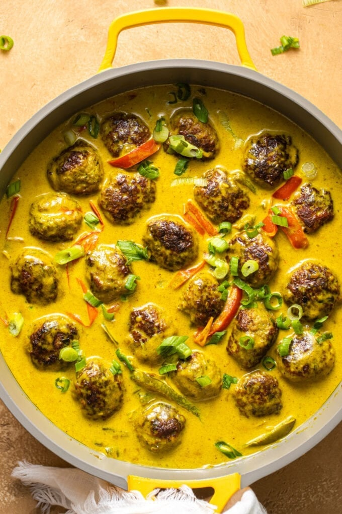

# Jerk Meatballs in Coconut Curry Sauce

*Pork meatballs seasoned with jerk paste, ginger and scallion, seared and then simmered in a coconut-curry sauce built around bell peppers and Jamaican curry powder. Comes together in one pan in under an hour. Serves over plain white rice.*

**Serves:** 4

**Prep Time:** 10 minutes

**Cook Time:** 40 minutes

## Overview
Two strong Caribbean flavours pulled into a single one-pan dinner: jerk on the inside (in the meatballs), curry on the outside (in the sauce). The meatballs are pork rather than the more common beef, which suits jerk better, pork carries the allspice-and-Scotch-bonnet seasoning the way it was historically intended (the Maroons of eastern Jamaica originally jerked wild boar, not chicken). Around them sits a coconut-curry sauce: shallot, garlic, sweet bell peppers, Jamaican curry powder bloomed briefly in butter, then full-fat coconut milk to mellow everything into something almost ice-cream-rich. The two flavours sit alongside each other rather than fighting, the jerk reads spicy-savoury, the curry reads sweet-aromatic, and a bite that includes both is genuinely better than either alone. Smell is curry powder bloomed in coconut milk, deeply Caribbean. One of the easier dishes here, 50 minutes start to finish, all in one pan, and a modern Black-American food-blogger creation rather than a traditional Jamaican dish; the cross-pollination is the point.

## Ingredients

### Meatballs
- 680 g (1 ½ lbs) ground pork
- 1 egg (large)
- ½ cup seasoned panko breadcrumbs
- 4 garlic cloves (finely minced)
- ¼ cup sliced scallions (plus more for garnish)
- 2 tablespoons jerk seasoning (Walkerswood)
- 1 teaspoon ginger paste (or 2 teaspoons grated fresh)
- salt
- pepper
- 2 tablespoons unsalted butter
- 1 tablespoon olive oil

### Coconut curry sauce
- 1 tablespoon unsalted butter
- 1 shallot (finely chopped)
- 3 garlic cloves (minced)
- 1 green bell pepper (small, thinly sliced)
- 1 red bell pepper (small, thinly sliced)
- 3 teaspoons Jamaican curry powder
- 1 can (400 ml) full-fat coconut milk
- Rice and scallions, to serve

## Method

### Stage 1 - Mix the meatballs
1. Combine pork, egg, panko, garlic, scallion, jerk seasoning, ginger paste, salt and pepper in a bowl.
1. Mix gently with the hands until just combined - don't overwork.
1. Shape into 20-22 meatballs using a tablespoon scoop, then roll smooth.

### Stage 2 - Sear
1. Heat 2 tablespoons butter + 1 tablespoon oil in a non-stick skillet over medium heat.
1. Working in batches, brown the meatballs all over - about 3 minutes per side.
1. Set aside on a plate.

### Stage 3 - Sauce
1. Wipe the pan; add the remaining tablespoon of butter.
1. Sauté the shallot 2-3 minutes until tender.
1. Add the garlic; 1 minute until fragrant.
1. Add the bell peppers; cook 2-3 minutes until softened.
1. Sprinkle the curry powder over; toast 1 minute.
1. Pour in the coconut milk; bring to a brief boil.

### Stage 4 - Simmer
1. Reduce heat to low.
1. Return the meatballs to the pan in a single layer; spoon the sauce over each.
1. Cover; simmer 20-25 minutes until 71°C / 160°F internal.

### Stage 5 - Serve
1. Spoon over plain white rice in deep bowls.
1. Scatter scallions and serve.

## Notes
- **Walkerswood jerk paste:** dependable for spice level and flavour. AROY-D coconut milk is the standard for thickness and sweetness.
- **Don't overwork:** kneading the mix makes dense, rubbery meatballs. Mix just to combine.
- **Sear, don't cook through:** the meatballs finish in the sauce. Aim for colour, not done-ness, during the sear.

## Storage
- Keeps 3 days refrigerated; reheats well.
- Freezes 2 months without the rice.
