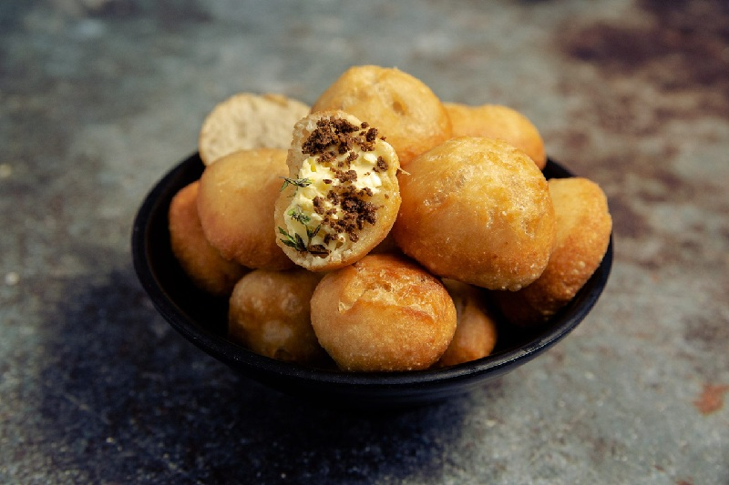

# Fried Dumplings / Johnny Cakes

*Golden, crisp-edged fried bread rounds with a soft, slightly chewy interior. Known as Johnny Cakes in Jamaica (a corruption of "journey cakes", food for travellers), these are the classic breakfast bread for ackee and saltfish, callaloo, or simply split open and stuffed with butter and cheese. Made from flour, baking powder, sugar, salt and water - no yeast, no waiting.*

**Serves:** Makes 8 dumplings (4 servings)

**Prep Time:** 10 minutes

**Cook Time:** 15 minutes

## Overview
A no-yeast quick dough: plain flour, baking powder, a touch of sugar, salt, and just enough water (or milk for richness) to bring it together. Rested briefly so the gluten relaxes, divided into balls, flattened slightly, and shallow-fried in hot oil until each side is deeply golden. The exterior crisps; the interior steams to a soft, pillowy crumb. Eaten with every Jamaican breakfast.

## Ingredients

### Dough
- 300 g plain flour
- 2 teaspoons baking powder
- 1 tablespoon caster sugar
- ½ teaspoon fine salt
- 30 g cold butter (or 2 tablespoons coconut oil), cubed
- 180 ml cold water (or whole milk for a richer dumpling)

### For frying
- 250 ml vegetable oil (enough for shallow-frying)

## Method

### Stage 1 - Mix the dough
1. In a large bowl, whisk together the flour, baking powder, sugar and salt.
2. Rub the butter into the dry mix with your fingertips until it resembles coarse breadcrumbs.
3. Add the water gradually, mixing with a fork, until a shaggy dough comes together.
4. Tip onto a lightly floured surface and knead for 2 minutes until smooth (do not overwork - it should be soft, not tough).
5. Cover with a damp cloth; rest 10 minutes.

### Stage 2 - Shape
1. Divide the dough into 8 equal pieces.
2. Roll each into a smooth ball between your palms.
3. Flatten each slightly to about 1.5 cm thick and 6 cm wide.

### Stage 3 - Fry
1. Heat the oil in a deep frying pan or wide saucepan to 170°C (a small pinch of dough should sizzle steadily on contact, browning in about a minute).
2. Lower 3-4 dumplings into the oil; do not crowd.
3. Fry 3-4 minutes on the first side until deep golden.
4. Turn and fry another 3-4 minutes on the second side.
5. The dumplings should puff slightly and feel hollow-light when lifted.
6. Drain on kitchen paper.
7. Fry the remaining batch.
8. Serve warm.

## Notes
- **Oil temperature matters:** Too hot and the outside browns before the inside cooks; too cool and they absorb oil. Aim for a steady medium sizzle.
- **Don't overknead:** The dough should be soft and pliable. Heavy kneading develops too much gluten and gives tough dumplings.
- **Milk vs water:** Milk gives a richer, more brioche-like result. Water is the traditional, no-frills version.

## Variations
**Boiled dumplings:** Same dough; simmered in salted water 15 minutes instead of frying. Served in soups and brown stews.
**Bammy-style:** Replace some flour with cassava flour for a denser, traditional Maroon-influenced version.

## Serving
Serve with: Ackee and saltfish, callaloo, brown stew chicken, escovitch fish, or split and buttered for breakfast with hot chocolate tea.

## Storage
- Best eaten the day they're made.
- Keeps 1 day in an airtight container; reheat in a 160°C oven for 5 minutes to crisp the outside.
- Does not freeze well once fried.
