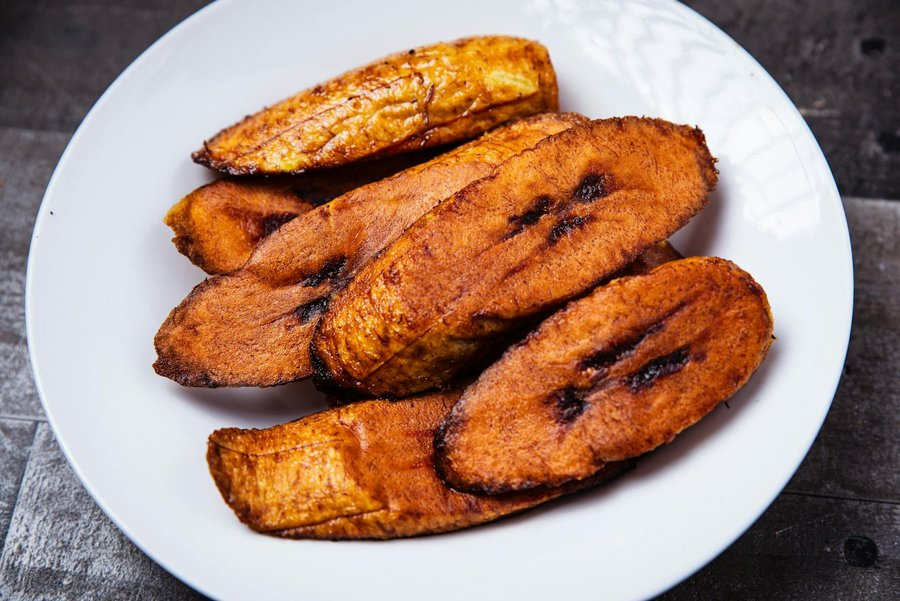

# Fried Plantains

*Jamaica's non-negotiable side: sweet ripe plantains sliced and slow-fried till the edges caramelise to deep mahogany and the centres turn meltingly soft.*

**Serves:** 4 as a side

**Prep Time:** 5 minutes

**Cook Time:** 12 minutes

## Overview
Ripe plantains (not the green ones used for tostones) are peeled, sliced thick on the bias, and fried gently in vegetable oil so the natural sugars caramelise without the outsides burning. The result is sweet, slightly chewy, with a soft interior. A light dusting of salt at the end lifts the sweetness. Don't rush the heat: medium-low is the rule.

## Ingredients

### Plantains
- 3 ripe plantains (large, skins mostly black, soft to the touch)
- 4 tablespoons vegetable oil (or coconut oil for a richer flavour)
- ¼ teaspoon fine salt (to finish)

## Method

### Stage 1 - Prepare the plantains
1. Cut the tops and tails off each plantain.
2. Score the skin lengthways with a sharp knife, just deep enough to cut the skin without slicing the flesh.
3. Peel the skin away in strips (it should come off in 2 or 3 pieces).
4. Slice each plantain on a diagonal into ovals about 1 cm thick.

### Stage 2 - Fry
1. Heat the oil in a wide frying pan over medium-low heat (around 160°C if measuring).
2. Lay the plantain slices flat in a single layer; do not crowd the pan.
3. Fry 3-4 minutes on the first side until deeply golden brown.
4. Turn once with a spatula or tongs; fry 2-3 minutes on the second side.
5. Lift onto a plate lined with kitchen paper.
6. Sprinkle lightly with fine salt while still hot.
7. Serve immediately.

## Notes
- **Ripeness is everything:** Yellow plantains with no black spots will be starchy and bland. Wait until the skin is mostly black and the fruit gives gently when squeezed. Up to a week on the counter from a yellow plantain.
- **Don't fry too hot:** High heat scorches the sugars before the inside softens. Medium-low gives time for caramelisation and a tender middle.
- **Coconut oil option:** Frying in coconut oil adds a subtle island sweetness that complements jerk and curry plates.

## Variations
**Pressed plantains (tostones):** Use green plantains, fry once, smash flat, fry again. A different dish - savoury, crisp, served with garlic-lime dipping sauce.
**Glazed:** Drizzle with a little dark rum and brown sugar in the last 30 seconds of frying for a dessert-leaning version.

## Serving
Serve with: Jerk chicken, brown stew chicken, rice and peas, curry goat, or as part of a Jamaican breakfast with ackee and saltfish.

## Storage
- Best eaten immediately - they soften and lose their edge-crispness within an hour.
- Refrigerates 1 day in an airtight container; reheat in a hot dry pan to revive.
- Does not freeze well.
