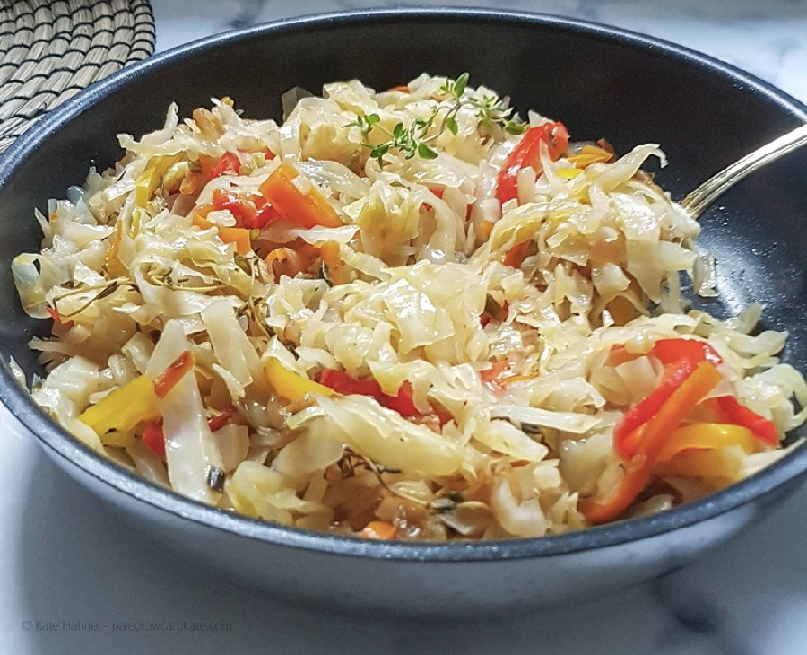

# Steamed Cabbage with Carrot, Thyme and Scotch Bonnet

*A Jamaican weeknight side: shredded green cabbage with carrot, onion and thyme cooked with a whole Scotch bonnet that perfumes without overwhelming.*

**Serves:** 4 as a side

**Prep Time:** 10 minutes

**Cook Time:** 12 minutes

## Overview
A weeknight Jamaican side: shredded green or savoy cabbage with carrot, onion and red pepper, steam-cooked till just tender with thyme and a whole Scotch bonnet on top for fragrance without fire. You soften onion and red pepper in vegetable oil, stir in garlic and stripped thyme leaves with a pinch of allspice, then pile in the cabbage and carrot and toss everything through the aromatics. A whole intact Scotch bonnet sits on the heap, a splash of water goes in, the lid goes on, and four to eight minutes of steam-fry brings the cabbage to bright and tender with the slightest bite still in it. Fish out the chilli (or save it for whoever wants extra heat). Eat it alongside brown stew chicken, jerk pork, fried fish, oxtail and butter beans, or banked next to a mound of rice and peas.

## Ingredients

### Vegetables
- 1 green cabbage (medium, about 800 g), tough core removed, shredded
- 1 carrot (large), peeled and cut into thin matchsticks
- 1 onion (medium), halved and sliced thin
- 1 red pepper, deseeded and thinly sliced
- 3 garlic cloves, finely chopped
- 1 scotch bonnet chilli (whole, left intact)

### Aromatics and fat
- 3 tablespoons vegetable oil (or coconut oil)
- 4 sprigs fresh thyme (leaves stripped, stalks reserved)
- ½ teaspoon ground allspice
- ½ teaspoon black pepper
- 1 teaspoon salt (to taste)
- 4 tablespoons water

## Method

### Stage 1 - Sauté the aromatics
1. Heat the oil in a large, lidded sauté pan or wok over medium heat.
2. Add the onion and red pepper; sauté 3 minutes until softening but not browning.
3. Stir in the garlic, thyme leaves, allspice and black pepper; cook 30 seconds until fragrant.

### Stage 2 - Steam-fry the cabbage
1. Add the cabbage and carrot to the pan; toss to coat in the oil and aromatics.
2. Lay the whole scotch bonnet on top.
3. Add the water; cover with a tight-fitting lid.
4. Cook 4 minutes; lift the lid and toss.
5. Re-cover; cook 3-4 more minutes until the cabbage is just tender but still has bite.

### Stage 3 - Finish
1. Lift out and discard the scotch bonnet (or reserve for someone who wants more heat).
2. Taste; season with salt and more black pepper as needed.
3. Serve hot.

## Notes
- **Scotch bonnet intact:** Leaving it whole gives perfume without scorching heat. If you pierce or chop it, the dish will fly into the very-spicy zone.
- **Substitute:** Habanero is the closest swap; otherwise omit and add a pinch of cayenne separately so heat stays adjustable.
- **Cabbage choice:** Standard hard white or green cabbage holds shape best. Savoy works but softens faster, reduce cooking by 2 minutes.

## Variations
**With saltfish flakes:** Add 100 g cooked, flaked saltfish at the end for a fuller plate.
**Coconut version:** Replace the water with 4 tablespoons coconut milk for a richer, lightly creamy finish.

## Serving
Serve with: Brown stew chicken, jerk pork, fried fish, oxtail and butter beans, or alongside rice and peas.

## Storage
- Keeps 2 days refrigerated.
- Reheat gently in a covered pan with a splash of water.
- Does not freeze well, cabbage loses its texture.
