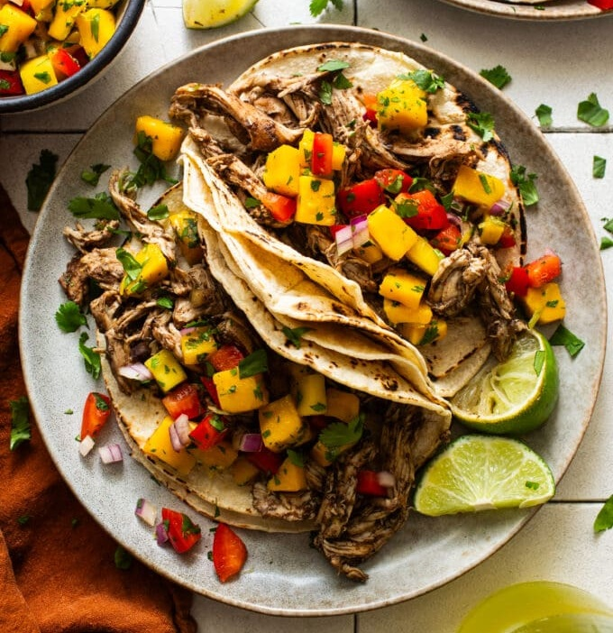

# Slow-Cooker Jerk Chicken Tacos

*Set-and-forget jerk chicken. Boneless breasts go into a slow cooker with chopped onion, fresh thyme, jerk seasoning paste, broth, browning sauce and lime; 6 hours on low. Shred in the pot, pile into warm tortillas, top with a fresh mango salsa. Caribbean-meets-Tex-Mex, made on a workday.*

**Serves:** 8

**Prep Time:** 20 minutes

**Cook Time:** 6 hours (low) or 4 hours (high)

## Overview
A workday cross-cultural dinner that adds the Caribbean to the Tex-Mex format: jerk-marinated chicken (slow-cooked to fall-apart tender) shredded into warm tortillas, topped with a fresh mango salsa. The slow cooker is the technical workaround, traditional jerk wants grilling or smoking, but a 6-hour low-heat braise in Walkerswood jerk paste, browning sauce, allspice and lime gives the meat similar depth without the grill. The Walkerswood paste is the canonical bottled jerk; the mild version is the recommended choice here because the heat would otherwise be overwhelming with so much marinade. The salsa is the second half of the dish; sweet mango, sharp red onion, crunchy bell pepper and cilantro, dressed with lime, it's bright and crisp and cuts through the rich shredded chicken underneath. Genuinely set-and-forget cooking, 20 minutes of prep, 6 hours of nothing, and the result eats like something that took much longer. A modern fusion dish, popularised by American-Caribbean food bloggers in the 2010s, with no claim to traditional authenticity beyond the jerk seasoning itself.

## Ingredients

### Jerk chicken
- 900 g (2 lbs) boneless skinless chicken breasts (about 4)
- ½ medium yellow onion (chopped)
- 6 sprigs fresh thyme (leaves stripped)
- 1 teaspoon garlic powder
- 1 teaspoon ground allspice
- ½ teaspoon smoked paprika
- salt
- pepper
- ⅓ cup Walkerswood Jamaican Jerk seasoning paste (mild)
- 60 ml chicken broth
- 1 teaspoon browning sauce (Grace brand)
- 1 lime (small, zest + juice)
- Flour (or corn tortillas), to serve

### Mango salsa
- 2 cups diced fresh mango
- 1 red bell pepper (medium, finely chopped)
- ½ cup diced red onion
- ¼ cup chopped cilantro
- 1 lime (small, zest + juice)
- Salt to taste

## Method

### Stage 1 - Load the slow cooker
1. Place the chicken breasts in the slow cooker.
1. Add the onion, thyme, garlic powder, allspice, paprika, salt, pepper, jerk seasoning paste, broth, browning sauce and lime zest + juice.
1. Massage everything together with gloved hands (or a spoon).

### Stage 2 - Cook
1. Cover; cook on low 6 hours, or high 4 hours, until the chicken is tender and falls apart easily.

### Stage 3 - Mango salsa
1. Combine the mango, red pepper, red onion, cilantro, lime zest, lime juice and salt in a bowl.
1. Toss; refrigerate covered until the chicken is ready.

### Stage 4 - Shred and assemble
1. Shred the chicken with two forks directly in the slow cooker.
1. Stir to coat with the cooking liquid.
1. Warm the tortillas (lightly in a dry pan or oven).
1. Pile in the jerk chicken; top with mango salsa and a sprinkle of cilantro.
1. Serve immediately.

## Notes
- **Mild Walkerswood for tacos:** the regular Walkerswood is fire-hot. The mild jar lets the dish accommodate any palate.
- **Salsa first, chicken second:** the salsa wants time for the flavours to meld. Make it before the chicken finishes.
- **Versatile filling:** the slow-cooker chicken works in tacos, burritos, nachos, or rice bowls. Make a big pot once.

## Storage
- Chicken keeps 3-4 days refrigerated; freezes 2 months.
- Salsa keeps 3-4 days; best within 24 hours for the freshest crunch.
