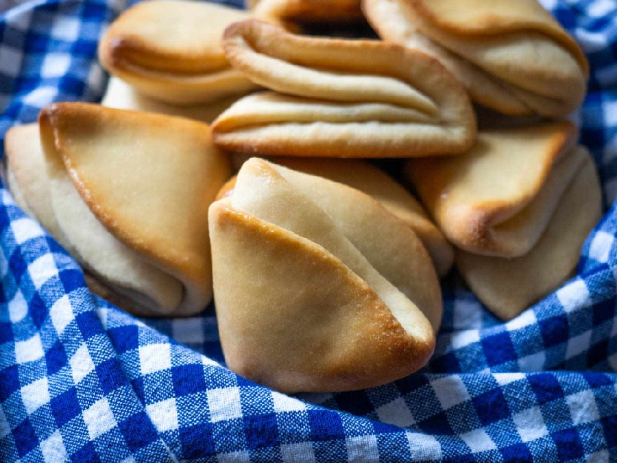

# Coco Bread

*Jamaica's folded coconut-milk roll: soft, slightly sweet and pillowy, with a faint coconut sweetness. The traditional wrap for a Jamaican beef patty.*

**Serves:** Makes 8 rolls

**Prep Time:** 25 minutes (plus 1 ½ hours rising)

**Cook Time:** 20 minutes

## Overview
An enriched yeast dough made with coconut milk, butter, sugar and a little salt. Risen once, divided, rolled into rounds, brushed with butter and folded in half so the baked roll opens like a clamshell. Baked at moderate heat until lightly golden and soft. The folded shape is purposeful: it tears cleanly into two leaves, ideal for stuffing with a beef patty or jerk pork.

## Ingredients

### Dough
- 500 g strong white bread flour
- 7 g instant dried yeast (1 sachet)
- 50 g caster sugar
- 1 teaspoon fine salt
- 240 ml coconut milk (full-fat tinned), gently warmed
- 80 ml whole milk, gently warmed
- 1 egg (large), beaten
- 50 g unsalted butter, softened

### For folding and finishing
- 40 g melted butter (for brushing and folding)
- 2 tablespoons milk (for brushing)

## Method

### Stage 1 - Make the dough
1. In a large bowl, whisk together the flour, yeast, sugar and salt.
2. Make a well; pour in the warm coconut milk, warm milk and beaten egg.
3. Mix with a spoon until a rough dough forms, then turn onto a clean surface.
4. Knead in the softened butter (it will look messy at first - persist).
5. Knead 10 minutes by hand (or 6 minutes in a stand mixer with a dough hook on medium) until smooth, elastic and slightly tacky.
6. Place in an oiled bowl; cover; rise in a warm spot 1 to 1 ½ hours until doubled.

### Stage 2 - Shape
1. Knock the dough back; divide into 8 equal pieces (about 110 g each).
2. Roll each piece into a smooth ball.
3. On a lightly floured surface, roll each ball into a round about 14 cm across and 5 mm thick.
4. Brush the surface generously with melted butter.
5. Fold the round in half to form a half-moon; press lightly around the curved edge to seal (but not too hard - the fold should puff during baking).
6. Lay the folded rolls onto a lined baking tray, leaving 3 cm between each.
7. Cover with a clean cloth; let rest 25 minutes (they should look slightly puffed).

### Stage 3 - Bake
1. Heat the oven to 180°C (160°C fan).
2. Brush the tops of the rolls lightly with milk.
3. Bake 18-20 minutes until pale golden on top (not deeply browned - coco bread should stay soft and light in colour).
4. Brush with the remaining melted butter while still hot.
5. Cool on a wire rack 10 minutes before serving.

## Notes
- **Coconut milk:** Full-fat tinned coconut milk is essential for the right richness and flavour. Light coconut milk leaves the bread bland.
- **Don't overbake:** Coco bread should be soft and pale, not crusty. As soon as it's pale gold and sounds slightly hollow when tapped underneath, it's ready.
- **The fold:** Brushing the inside with butter before folding is what allows the two halves to peel apart cleanly when filled with a patty.

## Variations
**Sweeter (breakfast version):** Bump sugar to 70 g; brush the tops with sugar syrup after baking.
**Garlic-thyme:** Brush the fold with garlic-thyme butter instead of plain butter for a savoury version with jerk.

## Serving
Serve with: Beef patties (the classic patty-in-coco-bread), jerk pork, butter and jam, or fried egg and avocado for breakfast.

## Storage
- Keeps 2 days at room temperature in a paper bag or wrapped in a tea towel.
- Refresh in a warm oven (150°C) for 5 minutes before serving.
- Freezes well 1 month; defrost wrapped, then warm in the oven.
