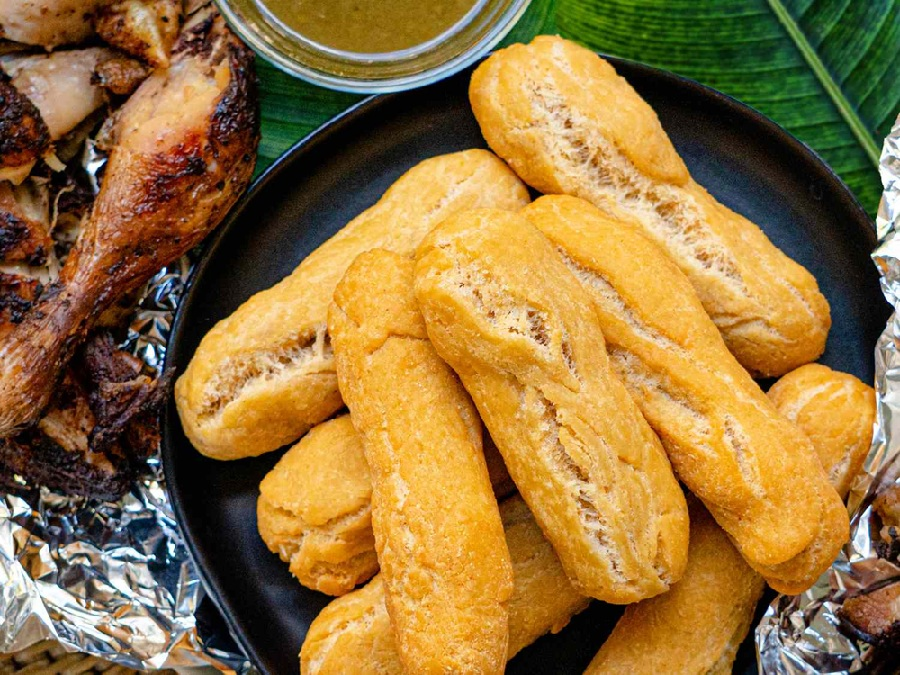

# Festival

*Jamaica's beachside dumpling: sweet fried cornmeal fingers, crisp outside and slightly sweet within, perfumed with vanilla and nutmeg. Served with fried fish.*

**Serves:** Makes 10-12 festivals (4-6 servings)

**Prep Time:** 15 minutes

**Cook Time:** 15 minutes

## Overview
A simple dough of cornmeal, plain flour, sugar, baking powder, salt, vanilla and a hint of nutmeg, brought together with milk or water. Kneaded briefly, rested, then rolled into elongated finger shapes and fried in medium-hot oil until deep golden. The cornmeal gives a crunchy crust and an almost cakey interior. Sweet enough to eat as a snack, but the contrast with salty jerk or fried fish is the point.

## Ingredients

### Dough
- 200 g plain flour
- 150 g fine cornmeal (yellow or white)
- 60 g caster sugar (or to taste - some Jamaicans go up to 90 g)
- 2 teaspoons baking powder
- ½ teaspoon salt
- ¼ teaspoon ground nutmeg
- ½ teaspoon vanilla extract
- 30 g cold butter, cubed
- 180-200 ml whole milk (or coconut milk, or water)

### For frying
- 500 ml vegetable oil

## Method

### Stage 1 - Mix
1. In a large bowl, whisk together the flour, cornmeal, sugar, baking powder, salt and nutmeg.
2. Rub the butter into the dry mix until it resembles coarse breadcrumbs.
3. Add the vanilla to the milk.
4. Pour the milk into the dry mix, mixing with a fork until a soft dough forms (add a splash more milk if dry).
5. Tip onto a lightly floured surface; knead briefly (1-2 minutes) until smooth.
6. Cover with a damp cloth; rest 15 minutes.

### Stage 2 - Shape
1. Divide the dough into 10-12 equal pieces.
2. Roll each piece between your palms into a thick finger about 10 cm long and 2 ½ cm wide, tapering slightly at the ends.

### Stage 3 - Fry
1. Heat the oil to 165°C in a deep pan (a small piece of dough should brown in about 1 minute).
2. Lower 3-4 festivals into the oil at a time; do not crowd.
3. Fry, turning occasionally with a slotted spoon, for 6-8 minutes total until deep golden brown all over.
4. The festivals should float and feel hollow-light when ready.
5. Drain on kitchen paper.
6. Repeat with the remaining dough.
7. Serve warm.

## Notes
- **Oil temperature is key:** Too hot and the outside browns before the centre cooks - you'll get raw, gummy middles. Medium heat with patience is the answer.
- **Cornmeal grind:** Fine or medium cornmeal works best. Coarse polenta gives a grittier texture (still fine, just different).
- **Sweetness:** Tradition runs from "barely sweet" to "almost a doughnut". 60 g is a moderate middle. Bump to 90 g for the sweeter Negril-beach style.

## Variations
**Coconut festival:** Replace milk with coconut milk and add 2 tablespoons desiccated coconut to the dough.
**Spiced:** Add ½ teaspoon ground cinnamon for a warmer flavour.

## Serving
Serve with: Jerk chicken, fried fish, escovitch fish, ackee and saltfish, or a Jamaican fish tea.

## Storage
- Best eaten the day they're fried.
- Keeps 1 day in an airtight container; reheat in a 180°C oven for 5 minutes to re-crisp.
- Raw shaped dough can be refrigerated 12 hours before frying.
