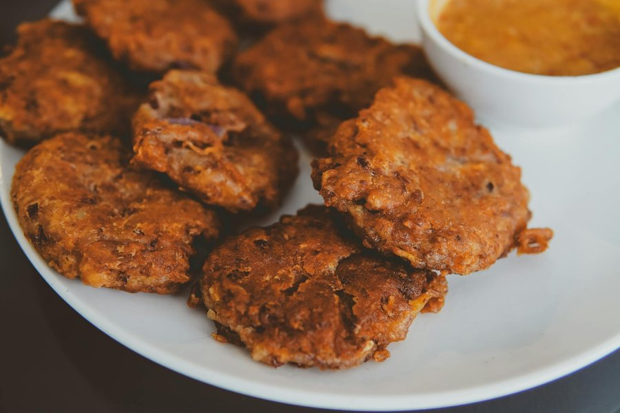

# Saltfish Fritters / Stamp and Go

*Jamaica's 'stamp and go': crisp, golden fritters of salt cod, flour, spring onion, thyme and Scotch bonnet, dropped by the spoonful into hot oil.*

**Serves:** Makes about 16 fritters (4-6 servings)

**Prep Time:** 20 minutes (plus overnight saltfish soak)

**Cook Time:** 15 minutes

## Overview
Salt cod is soaked overnight (or boiled in two changes of water) to draw out the salt, then flaked and folded into a thick batter of flour, baking powder, water, spring onion, garlic, thyme, scotch bonnet, and a little black pepper. Dropped by the heaped tablespoon into hot oil and fried until deep golden. Served hot with a squeeze of lime or a dollop of pepper sauce.

## Ingredients

### Saltfish prep
- 250 g salt cod fillet (boneless)
- Water for soaking and boiling

### Batter
- 250 g plain flour
- 2 teaspoons baking powder
- ¼ teaspoon black pepper
- ½ teaspoon paprika
- 3 spring onions, finely chopped
- 2 garlic cloves, finely chopped
- 1 tomato (small), deseeded and finely chopped
- 1 teaspoon fresh thyme leaves
- ½ scotch bonnet chilli, deseeded and finely chopped (or to taste)
- 280 ml cold water

### For frying
- 500 ml vegetable oil

### To serve
- Lime wedges
- Jamaican pepper sauce (or hot sauce)

## Method

### Stage 1 - Prepare the saltfish
1. Rinse the salt cod under cold water.
2. Place in a bowl, cover with cold water, and soak in the fridge overnight (8-12 hours), changing the water twice if you remember.
3. Drain; place the fish in a small pan, cover with fresh water, and bring to a simmer.
4. Simmer 10 minutes; drain.
5. Cover with fresh water again and simmer 5 more minutes to be sure (taste a small piece; it should be pleasantly savoury, not aggressively salty).
6. Drain and cool.
7. Flake with your fingers, discarding any skin or bones.

### Stage 2 - Make the batter
1. In a large bowl, whisk together the flour, baking powder, black pepper and paprika.
2. Stir in the spring onions, garlic, tomato, thyme and scotch bonnet.
3. Fold in the flaked saltfish.
4. Add water gradually, whisking, until you have a thick batter that drops slowly off a spoon (like a heavy pancake batter).
5. Rest 10 minutes.

### Stage 3 - Fry
1. Heat the oil in a deep pan to 175°C (a drop of batter should sizzle and float to the surface within 5 seconds).
2. Carefully drop heaped tablespoons of batter into the oil; do not crowd (4-5 fritters per batch).
3. Fry 2-3 minutes until the underside is deep golden.
4. Turn with a slotted spoon; fry another 2 minutes until crisp all over.
5. Lift onto kitchen paper.
6. Repeat with the remaining batter.
7. Serve hot with lime wedges and pepper sauce.

## Notes
- **De-salting is critical:** Under-soaked saltfish makes inedible fritters. Soak overnight and finish with two short boils. Taste before flaking.
- **Salt cod substitute:** If unavailable, use 250 g fresh cod loin, heavily salted (4 tablespoons sea salt rubbed all over) and left in the fridge overnight; rinse well and proceed.
- **Scotch bonnet:** Adjust to taste. ¼ for a mild fritter; the full chilli for proper Jamaican heat. Habanero substitutes well.
- **Batter consistency:** Too thin and the fritters will be flat and oily; too thick and they'll be doughy. It should drop slowly, not pour.

## Variations
**Vegetarian "saltfish":** Use jackfruit, drained, shredded, and seasoned with seaweed flakes plus extra salt to mimic the fish.
**With pumpkin:** Fold in 100 g grated pumpkin for sweetness and colour.

## Serving
Serve with: Lime wedges, hot pepper sauce, or as part of a Jamaican breakfast spread alongside ackee, fried plantain and fried dumplings.

## Storage
- Best eaten hot from the oil.
- Keeps 1 day refrigerated; reheat in a 180°C oven for 6-8 minutes to re-crisp.
- Uncooked batter can be refrigerated up to 24 hours.
