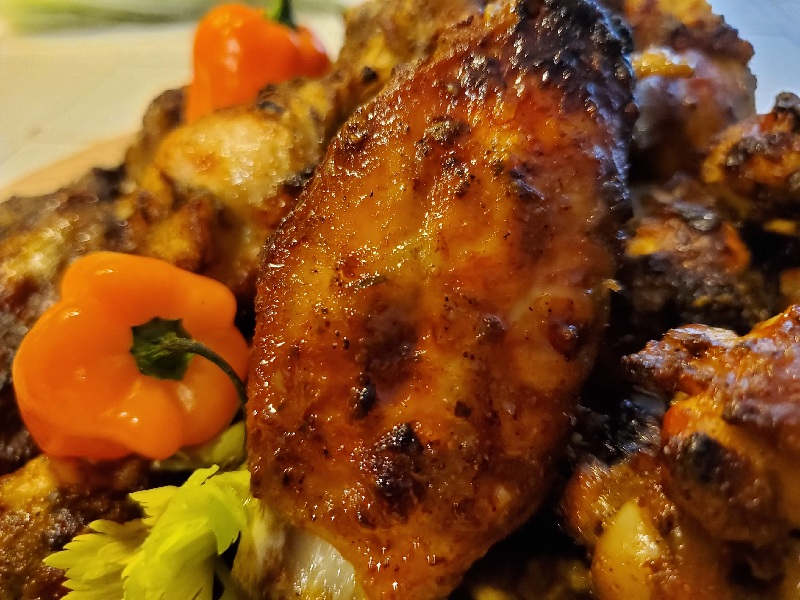

# Spicy Garlic Cookout Wings

*A summer-cookout wing: chicken glazed in a hot-and-buttery garlic sauce of Frank's, butter and fresh-minced garlic. Grilled till the sauce caramelises.*

**Serves:** 4

**Prep Time:** 15 minutes

**Cook Time:** 25 minutes

## Overview
The Black American family-cookout hot wing distilled to its essentials: Frank's RedHot, butter, fresh garlic, time. The Frank's-and-butter pair is the basis of every classic Buffalo wing, and adding finely minced fresh garlic (a lot of it, almost too much) is what makes this version specifically a cookout wing rather than a bar wing. The sauce wants 15-30 minutes of patient simmering uncovered to thicken into a proper glaze; thickening from time, not from any added flour or starch, gives a glossy sauce that clings to grilled skin without going gummy. Wings hit a hot grill, cook a few minutes, get basted, flip, cook, baste again, the sauce caramelises in layers and the skin goes glassy. Flavour is sharp vinegary heat from the Frank's, fat from the butter, and a deep mellow sweet-roasted note from the garlic. Smell is garlic and vinegar hitting fire. Easy enough that this is the wing your grandfather makes at the family barbecue, but the patience on the sauce is what separates good cookout wings from great ones. The dish is a Black American family-gathering classic, sat across cookout tables from Brooklyn to Memphis to Atlanta.

## Ingredients

- 680 g raw chicken wings (about 16 wings)
- 4 tablespoons unsalted butter
- 5 garlic cloves (minced to a paste)
- 700 ml Frank's RedHot sauce (3 cups)
- All-purpose seasoning (low/no salt), optional

## Method

### Stage 1 - Garlic butter sauce
1. Mince the garlic until it's almost a paste - "when you think you're done, do it 5 more times" is the rule.
1. Melt the butter in a medium saucepan over low-medium heat until it's just bubbling.
1. Add the garlic; cook 30-60 seconds until fragrant - don't let it brown.
1. Pour in the hot sauce; whisk to combine.
1. Simmer uncovered on low for 15-35 minutes, stirring occasionally, until the sauce thickens to glaze consistency.

### Stage 2 - Wings
1. Preheat the grill (or oven) to 400°F / 200°C.
1. Pat the wings dry; optionally rub with the no-salt all-purpose seasoning.
1. Place on the hot grill grates with the lid down.
1. Cook 12-15 minutes.
1. Flip the wings; baste generously with the sauce.
1. Cook 5 minutes more with lid down.
1. Flip again; baste again. Cook until the internal temperature reaches 165°F (75°C), about 25 minutes total.

### Stage 3 - Serve
1. Plate hot with extra sauce on the side.
1. Sides: steamed broccoli, potato salad, corn on the cob.

## Notes
- **Fresh garlic, not powder:** powder gives a dusty edge; fresh garlic browned in butter gives sweetness and depth.
- **Don't burn the garlic:** the moment it browns, the sauce is bitter. Pull off heat the moment it's fragrant.
- **Thickness is from time, not flour:** simmer the sauce uncovered until it coats the back of a spoon. No starch needed.

## Storage
- Keeps 3 days refrigerated; reheat in the oven at 325°F for 10-15 minutes.
- Don't microwave - rubbery skin.
