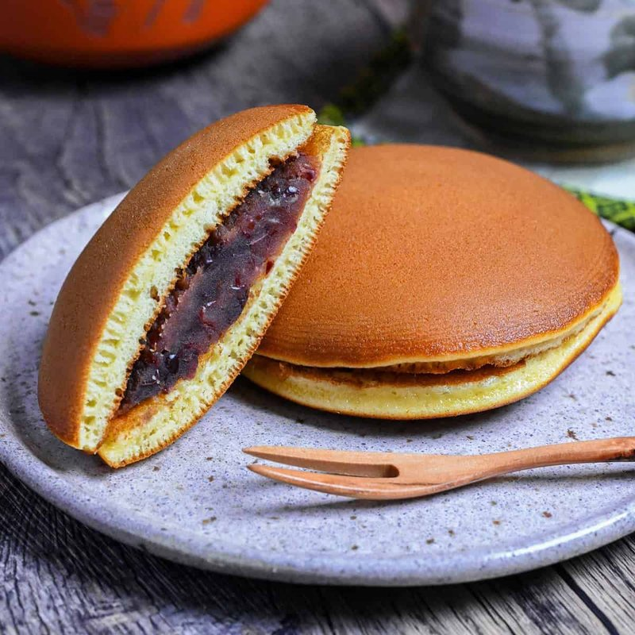

# Dorayaki

*Japan's defining sweet sandwich: two small pancake-discs (similar to American silver-dollar pancakes but sweeter and softer, with honey for the glossy gold colour) pressed together around a generous filling of sweet red bean paste (anko). The name "dorayaki" means "gong-grilled" - supposedly the original was cooked on a samurai's gong. Famous internationally as the favourite snack of the cartoon character Doraemon. Eaten by hand, with green tea, as a 3pm pick-me-up or a child's after-school snack.*

**Serves:** 6 (makes 6 dorayaki - 12 pancake discs)

**Prep Time:** 20 minutes (plus 1 hour batter rest)

**Cook Time:** 15 minutes

## Overview
A batter very similar to American pancake batter but enriched with honey (for the gold colour and slightly chewy texture) and mirin (for fragrance). Eggs whisk with sugar to ribbon stage; honey, milk and mirin whisk in; flour and baking powder fold through; rests at least 1 hour (essential for the right texture - a fresh batter gives pale, less-domed pancakes). Cooked one at a time on a low-medium dry pan to give the characteristic dome-shaped, golden-brown, smooth surface. Cooled briefly. Each finished disc gets a generous spoon of anko (sweet red bean paste) in the centre; a second disc presses on top, edges gently sealed. The shape is meant to be a slightly-flattened sphere with a clean disc-edge.

## Ingredients

### Batter
- 3 large eggs (room temperature)
- 100 g caster sugar
- 2 tablespoons honey
- 1 tablespoon mirin (or substitute 1 teaspoon vanilla extract)
- 60 ml whole milk (more if needed)
- 150 g plain flour
- 1 teaspoon baking powder
- A pinch of salt

### Filling
- 350 g sweet red bean paste (anko - sold ready-made at Japanese / Asian shops in tubs or pouches; the smooth "koshian" or the chunky "tsubuan" both work)

### For cooking
- 1 teaspoon vegetable oil (for wiping the pan)

## Method

### Stage 1 - Batter
1. In a wide bowl, whisk eggs and sugar together until pale, thick and ribbon-y - about 2 minutes (electric beaters help).
1. Whisk in the honey and mirin.
1. Whisk in the milk.
1. Sift in the flour, baking powder and salt; fold gently with a spatula until smooth - don't overwork.
1. The batter should be smooth and thick (slightly thicker than American pancake batter).
1. Cover; rest 1 hour at room temperature (or up to 4 hours).
1. After resting, if the batter is too thick (won't spread when ladled), thin with a tablespoon or two of milk.

### Stage 2 - Heat the pan
1. Place a wide non-stick frying pan over medium-low heat.
1. Once warm, wipe the surface with kitchen paper that's been dampened with vegetable oil - you want a thin oily sheen, not a pool. (Don't add fresh oil for each pancake; the residual film is right.)
1. Let the pan come to temperature: a drop of batter should set within 5 seconds and start to bubble within 30.

### Stage 3 - Cook the pancakes
1. Ladle 3 tablespoons of batter (about 80 g) onto the pan from a height of 5 cm - this helps the pancake spread into a clean disc shape without spreading too far.
1. Don't move the pan or the spoon. Let the pancake spread naturally.
1. After 60-90 seconds the surface should be set, bubbles forming on top, the underside deep golden.
1. Flip carefully (the gold underside should be uniform, no flat-spot near the centre).
1. Cook the second side 30 seconds - slightly paler than the first side. This is normal; serve the gold-side out.
1. Lift onto a tray; cover with a clean cloth to keep moist.
1. Repeat for 12 pancakes (6 sandwiches × 2).

### Stage 4 - Assemble
1. Lay 6 pancakes flat, gold-side DOWN (this becomes the outside of the dorayaki).
1. Spoon a generous mound of anko (about 2 tablespoons / 50 g) onto the centre of each pancake, leaving a 1 cm border.
1. Top with the remaining 6 pancakes, gold-side UP.
1. Press gently; the anko mounds into a dome between the two pancakes.
1. Use your hand to lightly cup and round the edges into a clean disc-sandwich shape.

### Stage 5 - Rest
1. Let stand at room temperature 30 minutes - the pancakes absorb a tiny bit of moisture from the anko and become slightly softer / more uniform.

### Stage 6 - Serve
1. Eat by hand, with green tea or coffee.
1. Excellent for breakfast, afternoon snack, or as part of a Japanese sweet platter.

## Notes
- **Honey for the colour:** The classic dorayaki recipe uses honey instead of (or alongside) regular sugar. The honey gives the deep amber colour and slightly chewy texture that distinguishes dorayaki from a generic pancake. Don't substitute golden syrup or maple syrup; honey is correct.
- **Rest the batter:** A fresh batter gives flat, pale pancakes. The 1-hour rest develops the gluten slightly and lets the baking powder activate properly - the rested batter rises into the characteristic dome shape on the pan.
- **Low heat, no oil bath:** Dorayaki pancakes are cooked dry (just a film of oil from a wipe), at low-medium heat, to give a uniformly golden smooth surface. High heat or an oil pool gives blotchy, dark, uneven discs.

## Storage
- Best within 4 hours of assembly.
- Refrigerate 2 days in an airtight container (the pancakes firm slightly but the texture stays soft).
- Freeze assembled dorayaki, individually wrapped, 1 month. Defrost at room temperature 30 minutes before eating.
