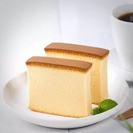

# Kasutera

*Japan's Nagasaki sponge: a dense honey-rich golden cake baked in a tall narrow tin. Brought by Portuguese traders four centuries ago.*

**Serves:** 8 (makes 1 loaf cake, 8 slices)

**Prep Time:** 25 minutes

**Cook Time:** 50 minutes

**Total Time:** Overnight rest (essential for the texture)

## Overview
Eggs whisk with sugar over a warm-water bath to ribbon stage, pale, thick, and tripled in volume. This is the most important step and what gives kasutera its fine crumb without baking powder. Honey-and-water-and-mirin warm together; whisk into the eggs. Bread flour (the higher protein gives the right slightly-chewy texture) sifts in and folds gently, no over-mixing. Poured into a tall narrow loaf tin lined with baking paper; a tray of hot water sits below in the oven for moist heat. Baked for 50 minutes at 160°C. As soon as it's out of the oven, the cake is dropped from a height (a small ritual that prevents collapse) and turned upside down onto cling film, wrapped tightly while still warm, and rested overnight. The next day, sliced into rectangles.

## Ingredients

### Cake batter
- 6 eggs (large, room temperature)
- 200 g caster sugar
- 50 g honey (mild - acacia, orange-blossom, or clover; avoid strong-tasting honeys like manuka)
- 1 tablespoon mirin (or substitute 1 teaspoon vanilla extract)
- 2 tablespoons hot water
- 180 g strong bread flour (NOT plain - bread flour's higher protein is essential)
- A pinch of salt

### Tin prep
- 1 tablespoon caster sugar (granulated/coarse, sprinkled in the bottom of the tin - gives the slightly crunchy sugar layer on the bottom of traditional kasutera)

### Equipment
- A 20 x 10 cm rectangular loaf tin (preferably tall - 10 cm deep - for the classic kasutera shape)
- Baking paper (cut to line the loaf tin completely, with overhang)
- Cling film (for wrapping the hot cake)

## Method

### Stage 1 - Prep tin and oven
1. Heat oven to 160°C (140°C fan).
1. Place a small heatproof dish of hot water on the bottom rack of the oven (the steam keeps the cake moist).
1. Line the loaf tin completely with baking paper (sides and base, with 2 cm overhang above the rim).
1. Sprinkle the 1 tablespoon of caster sugar evenly across the lined base.

### Stage 2 - Honey mixture
1. In a small bowl, combine honey, mirin and 2 tablespoons hot water.
1. Stir until the honey fully dissolves.

### Stage 3 - Whisk the eggs (the critical step)
1. In a wide heatproof bowl, whisk eggs and 200 g caster sugar.
1. Set the bowl over a saucepan of barely simmering water (water shouldn't touch the bowl).
1. Whisk continuously for 4-5 minutes until the mixture is warm to the touch (about 40°C) and the sugar has dissolved.
1. Off heat; continue whisking with electric beaters at high speed for 8-10 minutes. The mixture should triple in volume, pale, and reach a thick ribbon stage - when the whisk is lifted, the trail of mixture holds on the surface for several seconds before sinking.
1. This is the structure of the cake; don't shortcut this step.

### Stage 4 - Add honey mixture
1. Pour the honey mixture into the whisked eggs in a thin stream while continuing to whisk on low speed for 30 seconds.

### Stage 5 - Fold in the flour
1. Sift the bread flour and salt over the egg mixture in 3 additions.
1. Fold each addition very gently with a spatula using a lift-and-fold motion - don't stir flat (deflates the eggs).
1. The batter should be smooth, no flour pockets, but still aerated.

### Stage 6 - Pour and tap
1. Pour the batter into the prepared tin from a height of 20 cm - the height helps break large air bubbles.
1. Gently tap the bottom of the tin on the counter 3-4 times to release more bubbles.
1. Run a chopstick or skewer through the batter in a zigzag pattern (lengthwise then crosswise) to break any remaining large bubbles - this gives kasutera its characteristic fine, even crumb.

### Stage 7 - Bake
1. Place the tin on the middle oven rack (above the steam-dish).
1. Bake 50 minutes.
1. The cake is done when:
   - The top is deep gold (slightly darker than amber)
   - A skewer inserted comes out clean
   - The cake has risen above the rim, with a smooth or slightly cracked surface

### Stage 8 - Drop and wrap
1. Lift the tin out (oven mitts).
1. Drop it firmly onto the counter from a height of 10 cm - this is a traditional Japanese baking technique that prevents collapse by setting the cell structure.
1. Immediately turn the cake out onto a sheet of cling film, top-side down.
1. Wrap tightly in cling film while still hot - the steam trapped inside is what gives kasutera its moist, slightly chewy texture.
1. Cool to room temperature.

### Stage 9 - Overnight rest
1. Refrigerate the wrapped cake overnight. This is non-negotiable - the texture transforms from a fresh-baked sponge into the dense moist kasutera-character over the 12-hour rest.

### Stage 10 - Slice
1. Unwrap; trim the four short ends of the cake to expose clean sides.
1. Slice into 8 thick rectangles (about 2 ½ cm thick each).

### Stage 11 - Serve
1. Plate with green tea, especially sencha or matcha.
1. Eat at room temperature.

## Notes
- **Bread flour, not plain:** The slightly higher protein content of bread flour is what gives kasutera its chewy-tender texture. Plain flour gives a softer, more sponge-cake-like result that's less authentic.
- **The 8-10 minute whisk is the structure:** Kasutera has no baking powder. All the lift and texture comes from the air whisked into the eggs in this step. Under-whisking gives a dense flat cake; the ribbon stage matters.
- **Overnight rest is mandatory:** Fresh-from-the-oven kasutera tastes like a generic sponge. After 12 hours wrapped in cling film, it transforms - the texture becomes denser, the honey flavour deepens, the surface becomes slightly tacky. This is kasutera.

## Storage
- Refrigerate, wrapped, 1 week - the texture is consistent throughout.
- Bring to room temperature before serving (cold kasutera is firmer).
- Freezes 2 months in slices, individually wrapped.
