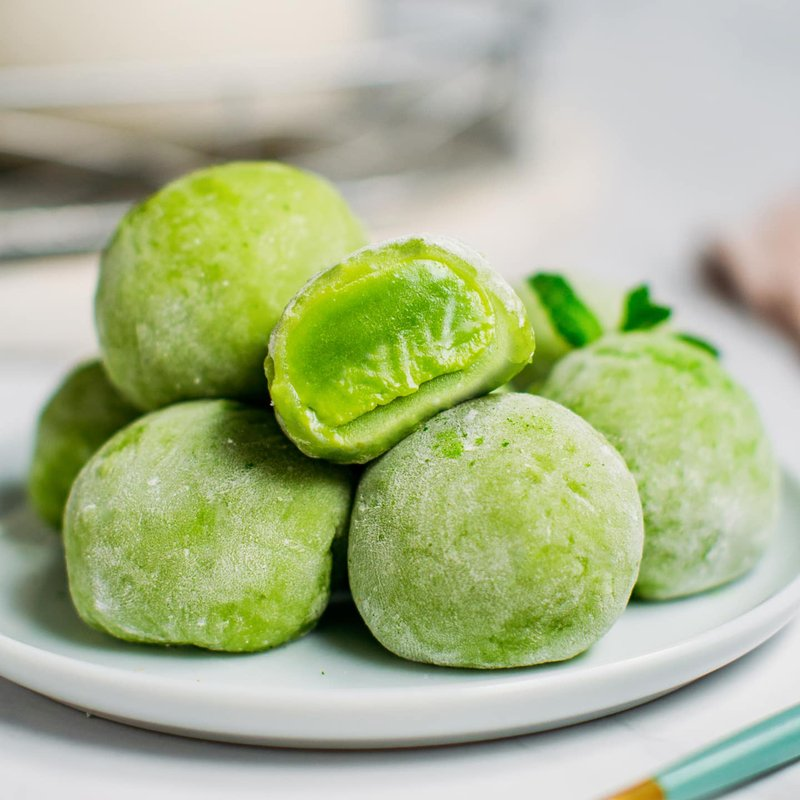

# Matcha Mochi

*Japan's bright-green mochi: chewy glutinous rice cakes flavoured with matcha, sometimes filled with sweet bean paste. Dusted with starch.*

**Serves:** 6 (makes 12 mochi)

**Prep Time:** 30 minutes (plus 30 min mochi rest)

**Cook Time:** 20 minutes

## Overview
Bright-green chewy rice cakes with a soft bean-paste centre, the sweet you reach for with green tea or as a small after-meal treat. The flour must be glutinous rice flour (mochiko or shiratamako, sold at any Asian grocer); regular rice flour gives a crumbly result that is wrong. The batter is steamed or microwaved till it turns thick, glossy, translucent and very elastic, then worked on a starched surface (potato starch and matcha) and wrapped around chilled balls of sweet red bean paste. Speed matters; cold mochi turns firm and won't enclose anything. Served two per person at room temperature with green tea.

## Ingredients

### Mochi dough
- 200 g glutinous rice flour (mochiko / shiratamako / sweet rice flour - sold at Asian / Japanese shops)
- 80 g caster sugar
- 1 tablespoon matcha powder (good quality culinary matcha - bright vibrant green)
- 280 ml water

### Filling (optional)
- 200 g sweet red bean paste (anko - sold at Japanese / Asian shops)

### To prevent sticking
- 100 g potato starch (katakuriko - sold at Asian shops; or substitute cornstarch)
- 1 teaspoon matcha powder (for dusting alongside the starch)

## Method

### Stage 1 - Filling balls
1. Divide the red bean paste into 12 portions (about 17 g each).
1. Roll each into a small ball.
1. Refrigerate 20 minutes (firm balls are easier to enclose).

### Stage 2 - Mix the dough
1. In a microwave-safe bowl, whisk glutinous rice flour, sugar and matcha.
1. Gradually pour in the water, whisking smoothly to avoid lumps.
1. The mixture should be smooth and slightly thick - like double cream.

### Stage 3 - Cook the dough
1. **Microwave method**: cover the bowl loosely with cling film. Microwave on high 1 minute. Stir vigorously with a damp wooden spoon or silicone spatula. Microwave another 1 minute; stir again. Microwave a final 1 minute. The mochi should be thick, glossy, translucent, and very elastic - it pulls away from the bowl in stretchy strands.
1. **Steam method**: cover the bowl with cling film with a few pierced holes. Place in a steamer over boiling water; steam 15 minutes, stirring at the 7-minute mark.
1. The cooked mochi is extremely hot - let it cool 2 minutes before handling, but don't let it cool completely (it gets too firm to shape).

### Stage 4 - Prep the work surface
1. Mix the 100 g potato starch with 1 teaspoon matcha in a wide bowl.
1. Dust a large flat surface (board or tray) heavily with this mixture.
1. Have additional starch nearby for your hands.

### Stage 5 - Shape
1. Tip the hot mochi onto the dusted surface.
1. Dust the top with more starch.
1. With heavily-starched hands, gently shape into a thick log about 30 cm long.
1. Working quickly (mochi firms as it cools), use a sharp knife dusted with starch to cut the log into 12 equal pieces.

### Stage 6 - Fill and form
1. Take one mochi piece; flatten in a heavily-starched palm into a disc 6-7 cm across.
1. Place a chilled bean-paste ball in the centre.
1. Bring the edges of the mochi up and around the filling.
1. Pinch the seam firmly closed at the top.
1. Roll between palms to smooth and form a round ball.
1. Place pinched-side DOWN on a tray (the smooth side becomes the top).
1. Repeat for all 12.

### Stage 7 - Dust and rest
1. Brush off any excess starch from the surface (a small dry pastry brush helps).
1. Optional: dust the tops with extra matcha for a more vivid green finish.
1. Let stand at room temperature 30 minutes - the mochi firms slightly and the flavours settle.

### Stage 8 - Serve
1. Plate 2 per person.
1. Eat at room temperature, with green tea.
1. Bite gently - the mochi is stretchy and the filling sweet.

## Notes
- **Glutinous rice flour, not regular rice flour:** Glutinous (sticky / sweet) rice flour gives the chewy stretch that defines mochi. Regular rice flour gives a brittle, crumbly result. They're sold side-by-side; check the packet says "glutinous", "sweet" or "mochiko/shiratamako".
- **Microwave is genuinely easier than steaming:** Despite being un-traditional, microwave-cooked mochi is the most reliable home method. The texture is identical to steamed when done correctly, and the timing is more controllable.
- **Don't let the mochi cool before shaping:** Hot mochi is pliable; cool mochi is firm and won't enclose filling. Work quickly. If a batch firms before you've finished shaping, microwave the remaining pieces for 10 seconds to soften.

## Storage
- Best within 24 hours of making, at room temperature.
- Don't refrigerate - chilled mochi hardens unappealingly.
- Wrap individually in cling film and freeze 1 month; defrost at room temperature 30 minutes before eating (don't microwave from frozen).
