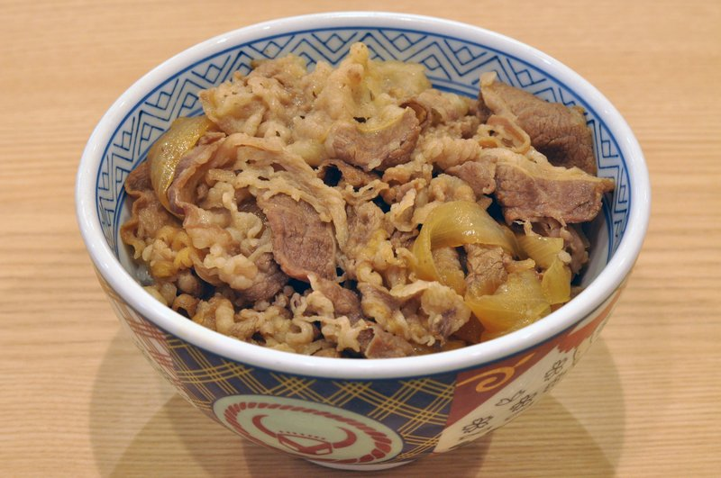

# Gyudon

*Beef and onion simmered in a sweet-savoury dashi-soy broth, served over rice. The Japanese fast-food classic; ten minutes start to finish if your rice is already cooked. The version that fuels Tokyo's lunch rush.*

**Serves:** 2

**Prep Time:** 5 minutes

**Cook Time:** 10 minutes

## Overview
The Japanese fast-food bowl that fuels the Tokyo lunch rush: thinly sliced beef and onion simmered in a sweet-savoury dashi-soy broth, the whole pile spooned over rice with the broth carrying everything through. Ten minutes start to finish if your rice is already on. You bring dashi, soy, mirin, sake and sugar to a simmer in a wide pan, drop in the sliced onion to soften, then stir the paper-thin beef in just till it loses its raw red colour (it firms in seconds beyond that, so you're watching closely). Mound rice in donburi bowls, spoon the beef and onion over with a ladle of broth, scatter spring onion across the top, and add benishōga (red pickled ginger) for sharpness against the sweet. A soft-boiled egg cracked over is the homemade upgrade. Eat with chopsticks while the rice is still steaming and the broth hasn't yet soaked into the bottom.

## Ingredients

### Broth
- 200 ml dashi (or chicken stock + ¼ teaspoon dashi powder)
- 3 tablespoons soy sauce
- 3 tablespoons mirin
- 2 tablespoons sake
- 1 tablespoon caster sugar

### To simmer
- 1 onion (thinly sliced)
- 300 g thinly sliced beef (rib-eye or sirloin; ask the butcher to slice paper-thin, or freeze 30 minutes and slice yourself)

### To serve
- rice
- 1 spring onion (thinly sliced)
- 2 tablespoons benishōga (red pickled ginger)
- 2 soft-boiled eggs (optional)
- Shichimi togarashi (optional)

## Method

### Stage 1 - Build the broth
1. Combine the dashi, soy, mirin, sake and sugar in a wide pan.
1. Bring to a simmer.

### Stage 2 - Simmer the onion and beef
1. Add the sliced onion. Simmer 3-4 minutes until softening.
1. Drop the beef into the broth and stir gently to separate the slices.
1. Simmer 2-3 minutes until just cooked (the beef should still be tender).

### Stage 3 - Plate
1. Mound rice in two donburi bowls.
1. Spoon the beef and onion over, ladle some broth on top.
1. Top with spring onion, pickled ginger, an egg if using, and a pinch of shichimi.

## Notes
- **Thin slices matter:** This is the texture of the dish; thick slices turn it into stew. Butcher-sliced or freeze-and-slice yourself.
- **Don't overcook the beef:** It firms up in seconds. As soon as it loses its raw red colour, it's done.
- **Skip the dashi powder:** Real dashi (kombu + bonito) is dramatically better. Even instant dashi (hondashi) beats stock.

## Storage
- Best eaten immediately; the rice gets soggy under the broth otherwise.
- Beef and broth keep 1 day refrigerated, but cook fresh rice when reheating.
