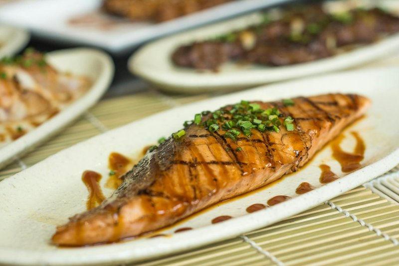

# Honey Soy Salmon (One-Pan)

*Fastest weeknight dinner: salmon fillets pan-roasted in a sticky honey-soy-ginger glaze with broccoli or bok choy on the side. Twenty minutes start to finish; hits the major Japanese-leaning weeknight notes.*

**Serves:** 4

**Prep Time:** 5 minutes

**Cook Time:** 15 minutes

## Overview
A weeknight rescue from someone-doing-Japanese-at-home, twenty minutes start to finish with everything in one pan. You sear skin-on salmon fillets skin-side down so the skin crisps to a near-shatter (four minutes without moving, pressing gently to keep contact), flip briefly, lift onto a plate. Broccoli or bok choy steams in the same pan with a splash of stock, then a quick honey-soy-mirin-ginger glaze bubbles in the empty space till it's sticky and lacquered. Return the salmon skin-side up so the glaze coats the flesh and the crisp stays where you put it, spoon the remaining glaze over each fillet. Pile over short-grain rice with the vegetables alongside, scatter spring onions and toasted sesame seeds, eat right away while the skin still snaps.

## Ingredients

### Salmon
- 4 skin-on salmon fillets (about 150 g each)
- 1 tablespoon vegetable oil
- Salt

### Glaze
- 4 tablespoons soy sauce
- 3 tablespoons honey
- 2 tablespoons mirin (or rice vinegar)
- 1 tablespoon grated fresh ginger
- 2 garlic cloves (crushed)
- 1 teaspoon toasted sesame oil

### Vegetables
- 1 head broccoli (florets) or 4 heads bok choy (halved)
- 50 ml chicken stock (or water)

### To finish
- 2 spring onions (sliced)
- 1 tablespoon toasted sesame seeds
- Cooked rice, to serve

## Method

### Stage 1 - Glaze
1. Whisk all glaze ingredients in a small bowl.

### Stage 2 - Sear the salmon
1. Pat the fillets dry; salt the skin lightly.
1. Heat the oil in a large non-stick or cast-iron pan over medium-high heat.
1. Place the salmon skin-side down; cook 4 minutes without moving, pressing gently to keep skin in contact.
1. Flip; cook 1 minute. Lift onto a plate.

### Stage 3 - Vegetables
1. Add the broccoli or bok choy to the pan with the chicken stock.
1. Cover and steam 3-4 minutes until just tender.
1. Push to one side.

### Stage 4 - Glaze
1. Reduce the pan to medium-low (the sugar in the glaze burns fast in a screaming-hot pan).
1. Pour the glaze into the empty side of the pan.
1. Let it bubble gently and thicken for 1-2 minutes.
1. Return the salmon (skin-side up); spoon the glaze over the top of each fillet.
1. Cook 1 more minute; the glaze should be sticky.

### Stage 5 - Serve
1. Plate the rice; place salmon and vegetables on top.
1. Drizzle any remaining glaze over.
1. Scatter spring onions and sesame seeds.

## Notes
- **Sear skin-side longer:** 4 minutes skin down, 1 minute flipped. Crisp skin is the contrast against the glaze.
- **Don't pour glaze on the fish in the pan:** It washes off the sear. Glaze in the empty space, then spoon over.
- **Adjust honey:** Some prefer it less sweet; reduce to 2 tablespoons. The dish is forgiving.

## Storage
- Eat fresh. Keeps 1 day refrigerated; serve cold on rice or salad rather than reheating (microwave toughens salmon).
