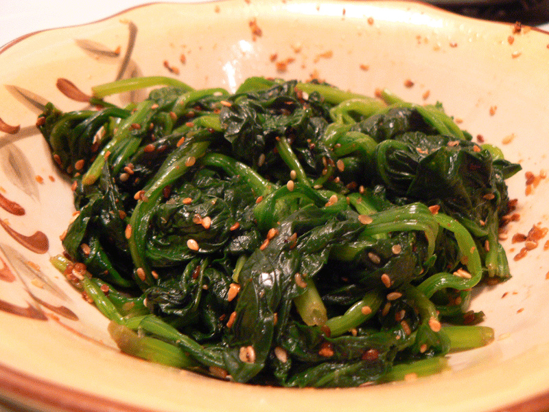

# Goma-Ae

*Japan's sesame side: blanched spinach tossed in a paste of ground toasted sesame, soy, sugar and mirin. Bento-box mainstay.*

**Serves:** 4 (as a side)

**Prep Time:** 10 minutes

**Cook Time:** 5 minutes

## Overview
Spinach (or green beans, asparagus, kale) blanches briefly in salted boiling water; refreshes in cold water; squeezes hard to remove all excess water; cuts into 4 cm pieces. Sesame seeds toast in a dry pan until fragrant and slightly darker. The toasted seeds grind in a suribachi (Japanese mortar) or a small food processor to a coarse paste, not to butter consistency; some texture is wanted. The paste mixes with soy sauce, sugar, mirin and a teaspoon of sake (optional) into a thick dressing. The blanched, squeezed vegetable tosses with the dressing; rests briefly to integrate; served at room temperature.

## Ingredients

### Vegetable (pick one)
- 400 g fresh spinach (washed)
- 400 g fresh green beans (trimmed)
- 500 g fresh asparagus (woody ends snapped off)
- 500 g broccoli (cut into florets)

### Blanching
- 2 teaspoons salt (for the boiling water)

### Sesame dressing
- 4 tablespoons white sesame seeds (or a mix of white and black)
- 1 ½ tablespoons soy sauce (light Japanese soy / shoyu)
- 1 tablespoon sugar
- 1 tablespoon mirin
- 1 teaspoon rice vinegar (optional, brightens)
- 1 teaspoon sake (optional)

### To finish
- 1 teaspoon extra toasted sesame seeds (for scattering on top)
- 1 teaspoon sesame oil (optional drizzle)

## Method

### Stage 1 - Blanch
1. Bring a wide pot of water with 2 teaspoons salt to a boil.
1. **Spinach**: drop in; cook 30-60 seconds until just wilted, still bright green.
1. **Green beans / asparagus**: blanch 3 minutes (beans), 2 minutes (asparagus) until tender-crisp.
1. **Broccoli**: blanch 3-4 minutes.
1. Drain immediately; refresh in ice water 30 seconds; drain.

### Stage 2 - Squeeze and cut
1. For spinach: gather in handfuls; squeeze hard between your palms to remove ALL excess water (Japanese cooks squeeze in a sushi-rolling-bamboo or in a clean tea towel for maximum dryness). Wet spinach dilutes the dressing.
1. Cut into 4 cm pieces.
1. For other vegetables: pat dry; cut into bite-size pieces if needed.

### Stage 3 - Toast the sesame
1. Place sesame seeds in a small dry frying pan.
1. Toast over medium heat 2-3 minutes, shaking constantly, until the seeds are slightly darker and very fragrant (some may pop).
1. Tip onto a plate to cool - they go from gold to burnt very quickly.

### Stage 4 - Grind the dressing
1. Place 3 tablespoons of the toasted seeds (reserve 1 tablespoon for garnish) in a suribachi or mini food processor.
1. Grind until you have a coarse-paste consistency - most seeds are crushed and oily, but some intact seeds for texture are good. Don't over-grind to butter.
1. Stir in soy sauce, sugar, mirin, rice vinegar (if using) and sake (if using).
1. The dressing should be thick but spoonable - like a thick tahini.

### Stage 5 - Toss
1. Tip the squeezed vegetable into a wide bowl.
1. Add the sesame dressing.
1. Toss thoroughly with chopsticks or tongs until every piece is coated.

### Stage 6 - Rest
1. Let stand 5 minutes at room temperature for the dressing to integrate.
1. (Or refrigerate up to 4 hours; bring back to room temperature before serving.)

### Stage 7 - Serve
1. Pile into 4 small bowls (Japanese side dishes are served in their own small bowl, not on a plate).
1. Scatter with the reserved toasted sesame seeds.
1. Drizzle a few drops of sesame oil over (if using).
1. Eat at room temperature, alongside rice and other dishes.

## Notes
- **Squeeze the spinach hard:** This is the single most common goma-ae failure. Wet spinach dilutes the dressing and makes the dish soggy. After draining, take handfuls and squeeze with both hands - you should see a noticeable amount of water come out.
- **Coarse paste, not butter:** The texture is part of the dish. Grinding to butter consistency gives a smooth dressing that lacks character. Aim for "mostly crushed with some seeds intact".
- **Variations:** Goma-ae works with all green vegetables. Spinach is the most common in Japanese homes; green beans (sayaingen no goma-ae) is the most common in restaurants; asparagus and broccoli are Western adaptations that work just as well.

## Storage
- Best within 4 hours of dressing.
- Refrigerate 2 days; the dressing thickens further and the colour darkens but the flavour holds.
- The dressing alone (without vegetable) keeps refrigerated 1 week - use as a salad dressing, drizzle on grilled fish, or stir into rice.
