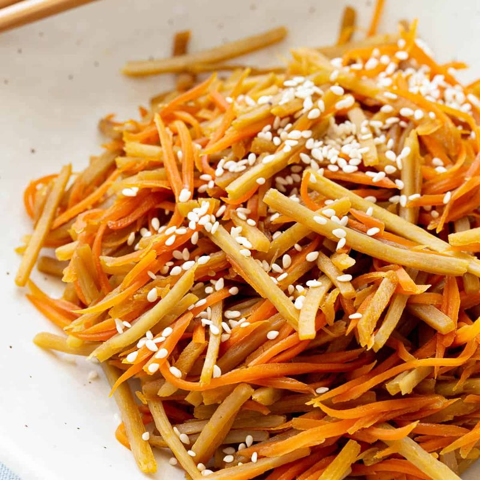

# Kinpira Gobo

*Japan's root-vegetable side: julienned burdock and carrot stir-fried with chilli, then glazed with soy, mirin and sugar till glossy.*

**Serves:** 4 (as a side)

**Prep Time:** 15 minutes (plus 10 min gobo soak)

**Cook Time:** 12 minutes

## Overview
A glossy root-vegetable side from the workaday Japanese repertoire: julienned burdock and carrot stir-fried with chilli, then simmered down till the soy-mirin-sugar glaze clings to every matchstick. Burdock (gobo, a long thin brown root sold at any Japanese or Korean grocer) is the soul of the dish; if you genuinely can't find it, parsnip is the closest substitute. You scrub the burdock under running water with the back of a knife (don't peel it, the thin brown skin holds the earthy depth), cut it into matchsticks, and soak briefly in vinegared water so it doesn't oxidise. Sesame oil and a small dried chilli (or chilli flakes) heat in a pan, the drained gobo goes in first because it needs longer, then the carrot, then the sauce, and everything tosses till the liquid disappears and the vegetables are glazed. Off the heat, scatter toasted white and black sesame seeds and a drizzle of fresh sesame oil. Pile into a small bowl alongside rice, miso soup, and any Japanese main; eat at room temperature or cold from the fridge, both are correct.

## Ingredients

### Vegetables
- 200 g fresh burdock root (or 200 g parsnip)
- 200 g carrots (peeled)
- 2 tablespoons rice vinegar (for the soaking water, gobo only)

### Sauce
- 2 tablespoons light soy sauce (Japanese / shoyu)
- 1 tablespoon mirin
- 1 tablespoon sake (or substitute extra mirin + 1 teaspoon water)
- 1 tablespoon caster sugar
- 1 tablespoon dashi (optional, for extra depth - use instant dashi powder dissolved in 1 tablespoon hot water)

### Stir-fry
- 1 tablespoon sesame oil
- 1 teaspoon dried red chilli flakes (or 1 small dried red chilli, sliced)

### To finish
- 1 teaspoon toasted white sesame seeds
- 1 teaspoon toasted black sesame seeds (optional, for visual contrast)
- 1 teaspoon sesame oil (drizzle)
- 1 spring onion (very thinly sliced, optional)

## Method

### Stage 1 - Prep the gobo
1. Scrub the burdock root under running water with the back of a knife or a stiff brush - gobo has a thin brown skin that's edible and flavourful (don't peel away the skin like a carrot; just scrub clean).
1. Slice the root into 4-5 cm lengths.
1. Cut each length into 3 mm thick slabs.
1. Stack the slabs and cut into 3 mm matchsticks.
1. Place the matchsticks immediately into a bowl of cold water + rice vinegar (the vinegared water prevents the gobo from turning brown).
1. Soak 10 minutes; drain just before cooking.

### Stage 2 - Carrot
1. Peel the carrots; cut into matchsticks of the same size as the gobo (3 mm × 3 mm × 5 cm).

### Stage 3 - Sauce
1. In a small bowl, whisk soy sauce, mirin, sake, sugar and dashi (if using).

### Stage 4 - Stir-fry start
1. Heat 1 tablespoon sesame oil in a wide non-stick pan or wok over medium-high heat.
1. Add the chilli flakes; sizzle 20 seconds (don't burn).

### Stage 5 - Gobo first
1. Add the drained gobo matchsticks.
1. Stir-fry 3-4 minutes, tossing - the gobo softens slightly but should retain a crisp bite.

### Stage 6 - Carrot
1. Add the carrot matchsticks.
1. Stir-fry 2 more minutes.

### Stage 7 - Sauce
1. Pour in the sauce mixture; toss to coat.
1. Cook 4-5 minutes over medium-high heat - the sauce reduces and clings to the vegetables. Stir frequently to prevent burning.
1. The vegetables should be tender-crisp and the pan should be nearly dry of liquid.

### Stage 8 - Finish
1. Off heat; sprinkle with sesame seeds; drizzle a final teaspoon of sesame oil.
1. Toss once.

### Stage 9 - Serve
1. Pile into 4 small bowls.
1. Scatter sliced spring onion (if using).
1. Serve at room temperature OR cold from the fridge (Japanese serve both ways).
1. Pairs well with rice, miso soup and any Japanese main.

## Notes
- **Gobo is the right ingredient:** Burdock root has a unique earthy-nutty flavour that defines kinpira. If you can't find it (try Asian markets), parsnip is the closest substitute. Skip carrot if substituting; just do parsnip-only kinpira.
- **Soak gobo in vinegared water:** Burdock browns quickly on contact with air. The 10-minute soak in vinegared water prevents discolouration and also removes the slight bitterness of raw gobo.
- **Matchsticks of equal size:** All the vegetable matchsticks should be roughly the same size (3 mm) so they cook at the same rate. Uneven cuts give a mix of crunchy and overcooked.

## Storage
- Refrigerate 5 days; bring to room temperature before serving.
- Doesn't freeze well (texture suffers).
- Improves slightly with 1-2 days' rest as the flavours deepen.
