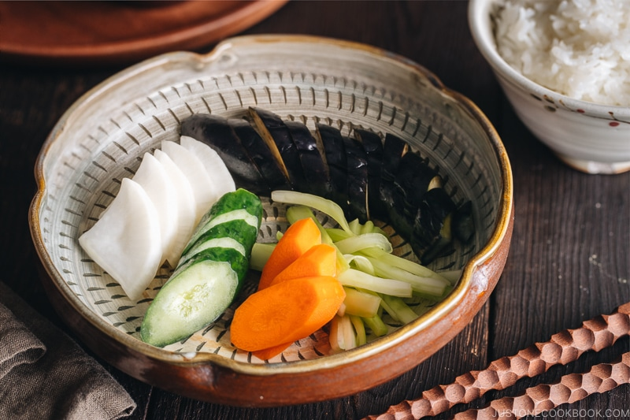

# Tsukemono

*Japanese quick-pickled vegetables: a small bowl of mixed pickles served at every Japanese meal alongside rice and miso soup. The simplest form - asazuke ("shallow pickle") - is a fresh-tasting quick salt-pickle, made same-day. This recipe covers three classics in one batch: cucumber pickled in salt-and-kombu (kyuri no asazuke), daikon pickled in sweet rice vinegar (daikon no amazu-zuke), and Chinese-cabbage with shiso (hakusai no asazuke). Cool, crisp, salty-sour-slightly-sweet; the palate-cleansing companion to rich Japanese mains.*

**Serves:** 6 (makes 3 small pickle bowls)

**Prep Time:** 15 minutes

**Total Time:** 1-2 hours (quick brining)

## Overview
Three asazuke pickles in one batch. Cucumber: salted heavily, weighted for 1 hour, water squeezed out, dressed with rice vinegar, kombu and sesame seeds. Daikon: thinly sliced, salted briefly, then bathed in a sweet rice-vinegar pickle for an hour. Cabbage: salted with shiso (or substitute basil + a pinch of fennel), pressed under a plate weight to wilt for 30 minutes. Served in three small individual bowls.

## Ingredients

### Pickle 1 - Cucumber (kyuri no asazuke)
- 2 small Japanese / Persian cucumbers (or ½ English cucumber, deseeded)
- 1 teaspoon fine salt
- 1 tablespoon rice vinegar
- 1 teaspoon caster sugar
- 1 strip kombu (about 5 cm - sold dried at Japanese / Asian shops; soaked in 1 tablespoon water for 5 minutes)
- 1 teaspoon toasted sesame seeds
- 1 small red chilli (sliced thin, optional)

### Pickle 2 - Daikon (daikon no amazu-zuke)
- 200 g daikon radish (peeled, sliced into 3 mm rounds or julienned)
- ½ teaspoon fine salt
- 3 tablespoons rice vinegar
- 1 tablespoon sugar
- 1 strip lemon zest (yellow part only)

### Pickle 3 - Chinese cabbage with shiso (hakusai no asazuke)
- 200 g Chinese cabbage / napa cabbage (sliced 5 mm crosswise)
- ½ teaspoon fine salt
- 4 shiso leaves (sold at Japanese / Asian shops - or substitute fresh basil leaves + a pinch of fennel seed)
- 1 small piece kombu (3 cm, optional)
- 1 teaspoon mirin

## Method

### Stage 1 - Cucumber pickle
1. Trim and quarter cucumbers lengthwise; scoop out the very seedy core if any; cut into 5 cm batons.
1. Toss in a bowl with 1 teaspoon salt; massage for 30 seconds.
1. Place a small bowl on top to weight; let stand 1 hour.
1. Drain off the water that's released.
1. In a clean bowl, combine the squeezed cucumber with rice vinegar, sugar, the soaked kombu (chopped into small strips), sesame seeds and (optional) sliced chilli.
1. Toss; refrigerate at least 30 minutes before serving.

### Stage 2 - Daikon pickle
1. Place the sliced daikon in a colander; toss with ½ teaspoon salt; rest 15 minutes.
1. Rinse briefly; squeeze gently to remove excess water.
1. In a small bowl, whisk rice vinegar with sugar until dissolved.
1. Add the daikon and the strip of lemon zest.
1. Toss; refrigerate at least 1 hour.

### Stage 3 - Cabbage pickle
1. In a wide bowl, sprinkle the sliced cabbage with ½ teaspoon salt; massage with hands for 1 minute (the cabbage softens and weeps).
1. Add the shiso leaves (torn into small pieces) and the optional kombu piece.
1. Add the mirin.
1. Place a small plate on top to weight; rest 30 minutes.
1. Drain off excess water; remove the kombu.

### Stage 4 - Serve
1. Tip each pickle into its own small bowl (Japanese tsukemono are served in tiny individual portions).
1. Garnish each as needed.
1. Serve cold alongside rice, miso soup, grilled fish, or as a small side at any Japanese meal.

## Notes
- **Asazuke = shallow pickle:** These are quick same-day pickles, not preserved-for-months sauerkrauts or kimchis. The Japanese tradition has many longer-fermented pickles too (takuan, umeboshi), but asazuke is the everyday-table pickle.
- **Salt-and-weight technique:** Tsukemono depends on salting + weighting + draining. The salt draws out water; the weight pressure compresses; the drain removes the liquid; what's left is concentrated vegetable flavour with the seasonings clinging.
- **Shiso vs substitutes:** Shiso (perilla) has a distinctive minty-basil-citrus flavour that's the heart of Japanese pickling. The closest substitute is basil + a pinch of fennel or mint; neither is the same, but both produce acceptable pickles.

## Storage
- All three pickles refrigerate 3-5 days.
- Asazuke generally taste best on day 1-2; longer keeps shift them toward saltier and more sour.
- Don't freeze - texture suffers.
