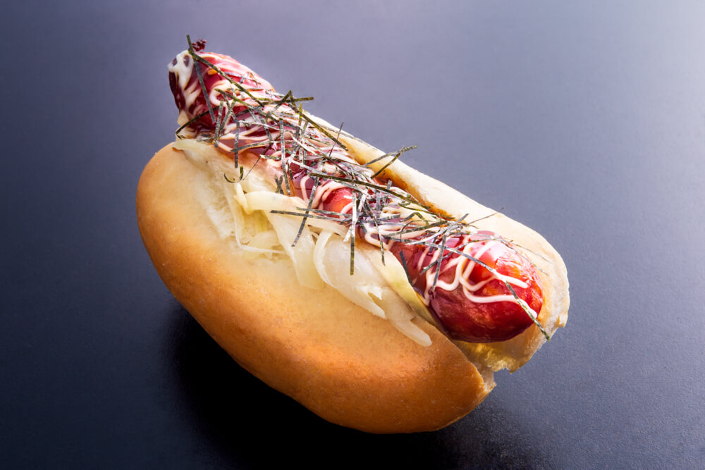

# Japadog

*The Japanese-Canadian fusion hot dog: a frankfurter in a soft bun topped with Japanese pantry staples - teriyaki sauce, shredded nori, bonito flakes, Kewpie mayonnaise, daikon oroshi (grated daikon), and chopped spring onion. The Vancouver-born street food (with Japanese-Canadian heritage) that bridges American comfort food and Japanese flavour vocabulary.*

**Serves:** 4

**Prep Time:** 20 minutes

**Cook Time:** 12 minutes

## Overview
The Japadog is a Japanese-Canadian fusion hot dog that originated in Vancouver in 2005 when Noriki Tamura opened a cart on Burrard Street selling hot dogs topped with Japanese ingredients (the cart is now an institution with multiple locations and a near-cult following): a high-quality pork-or-beef frankfurter in a soft white bun, topped with Japanese flavour notes you'd never put on an American hot dog - teriyaki sauce, shredded nori (seaweed), bonito flakes (katsuobushi; the smoked-tuna shavings that dance in steam), Kewpie Japanese mayonnaise, daikon oroshi (grated white daikon radish), thinly sliced spring onion, and sometimes Japanese pickles. The result: a hot dog that tastes umami-deep, slightly sweet from the teriyaki, fresh-sharp from the daikon, and unmistakably Japanese in its flavour vocabulary. The Vancouver original menu offers many variants (the Terimayo with teriyaki + mayo + nori is the classic flagship; the Oroshi adds the radish on top; the Kurobuta uses Japanese black-pig sausage). This version captures the canonical Terimayo + Oroshi combination. Three details: teriyaki sauce reduced to syrup (not watery), Kewpie mayo (not American mayo), nori + bonito on top in generous sprinkle.

## Ingredients

### Hot dogs
- 8 high-quality frankfurters (pork-and-beef; or all-pork for more authentic kurobuta feel)
- 8 soft hot-dog buns
- 1 tablespoon vegetable oil
- 2 tablespoons butter (for toasting buns)

### Teriyaki sauce
- 80 ml soy sauce
- 80 ml mirin
- 60 ml sake (or extra mirin)
- 4 tablespoons caster sugar
- 1 thumb (3 cm) ginger (grated)
- 4 garlic cloves (crushed)
- 1 tablespoon cornflour mixed with 2 tablespoons cold water

### Toppings
- 8 tablespoons Kewpie Japanese mayonnaise
- 1 small piece daikon radish (about 200 g; grated finely; squeezed gently of excess liquid)
- 4 spring onions (very thinly sliced)
- 2 sheets nori (sushi seaweed; sliced into thin shreds with scissors)
- 4 tablespoons bonito flakes (katsuobushi)
- 1 tablespoon toasted sesame seeds
- Pickled ginger (gari) on the side (optional)
- Japanese 7-spice (shichimi togarashi) for sprinkling

### To serve
- Edamame on the side
- Japanese pickles (tsukemono)
- Cold Japanese beer (Asahi, Sapporo) or sake

## Method

### Stage 1 - Make teriyaki sauce
1. In a small saucepan, combine soy sauce, mirin, sake, sugar, ginger and garlic.
2. Bring to gentle simmer; cook 5 minutes till slightly reduced.
3. Whisk in the cornflour-water slurry; cook 1 minute till glossy and thick.
4. Strain into a small squeeze bottle or jug.

### Stage 2 - Prep toppings
1. Grate the daikon on a fine grater; squeeze gently to drain excess liquid (mound it loosely; don't compress).
2. Slice the spring onions thin.
3. Cut the nori into thin shreds.
4. Have bonito flakes, sesame seeds, Kewpie mayo, pickled ginger ready.

### Stage 3 - Cook hot dogs
1. Heat the oil in a wide pan over medium-high heat.
2. Add hot dogs; cook 6-8 minutes, turning occasionally, till lightly charred and warmed through.
3. (Or grill over a barbecue for slight char marks.)

### Stage 4 - Toast buns
1. Spread butter on cut sides of buns.
2. Toast cut-side-down in a separate pan 60 seconds till golden.

### Stage 5 - Build the Japadog
1. Open the toasted bun.
2. Drizzle a stripe of Kewpie mayo down the inside.
3. Place the hot dog in.
4. Drizzle teriyaki sauce generously over the hot dog (it should pool slightly).
5. Squeeze a zigzag of Kewpie mayo over the teriyaki.
6. A heap of grated daikon on top.
7. A sprinkle of spring onion.
8. A sprinkle of toasted sesame seeds.
9. Top with shredded nori.
10. Crown with a generous heap of bonito flakes - they should be visibly dancing in the warmth of the dog.

### Stage 6 - Serve
1. Sprinkle with shichimi togarashi for heat.
2. Pickled ginger on the side (optional).
3. Edamame and pickles as accompaniments.
4. Cold Japanese beer or sake.

## Notes
- **Teriyaki sauce reduced to syrup:** watery teriyaki slides off and disappears. Syrupy clings to the dog.
- **Kewpie mayo essential:** richer and more umami than American mayo.
- **Bonito flakes on top in volume:** the visual signature of the Japadog. They "dance" in the warmth.
- **Grated daikon, drained:** if you don't squeeze the daikon, the bottom of the bun gets watery.
- **Eat soon after building:** the daikon and nori should still be fresh and lively.

## Variations
**Kurobuta version:** swap the frankfurter for a Japanese black-pig sausage (kurobuta).
**Oroshi-only (no teriyaki):** lots of grated daikon, ponzu, spring onion, sesame; lighter style.
**Tsume (eel sauce) version:** swap teriyaki for tsume (the sweeter sushi-bar sauce).
**Spicy mentaiko:** smear a spoon of mentaiko (spicy cured cod roe) under the mayo.
**Kimchi-Japadog:** add a forkful of kimchi for Korean-Japanese fusion.

## Serving
At a Vancouver street cart. At a Tokyo izakaya. At a backyard barbecue with sake and edamame.

## Storage
- Teriyaki sauce keeps refrigerated 2 weeks.
- Cooked hot dogs refrigerate 3 days.
- Grated daikon: best fresh (loses crispness in fridge after a few hours).
- Don't store assembled; the toppings degrade fast.
