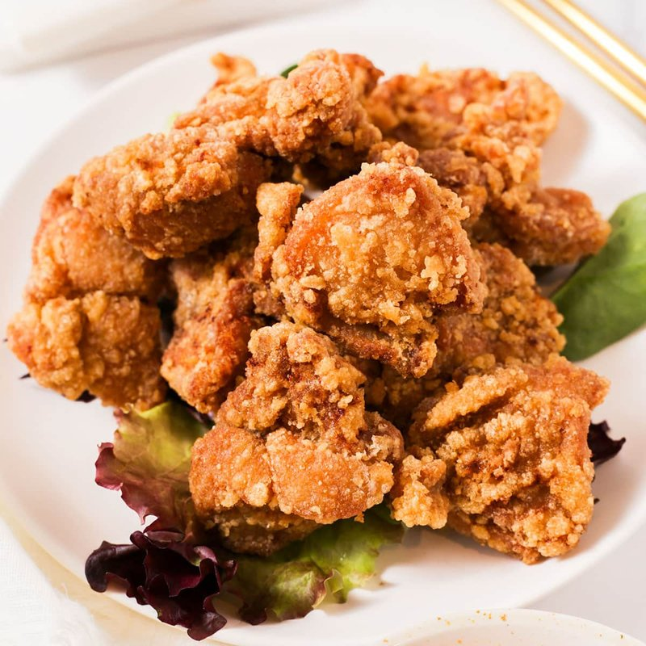

# Karaage

*Japan's izakaya fried chicken: marinated thigh dredged in potato starch and twice-fried for an impossibly crisp shatter-crunchy crust.*

**Serves:** 4 (as a snack)

**Prep Time:** 15 minutes (plus 30 min marinating)

**Cook Time:** 12 minutes

## Overview
Chicken thighs (boneless, skin-on for the best result) are cut into 4 cm pieces and marinated for 30 minutes in a mixture of soy sauce, sake, grated ginger, garlic, mirin and a touch of sesame oil. The marinated chicken pieces are then thoroughly dredged in potato starch (also called katakuriko in Japanese; cornstarch is a workable substitute but not as good). Oil heats to 160°C for the first fry, chicken pieces fry for 4 minutes until just cooked but not deeply coloured. Removed; rested for 5 minutes. Oil temperature increases to 190°C for the second fry, chicken returns for 60-90 seconds until amber-golden, crisp, and the outside shatters when bitten. Seasoned and served immediately.

## Ingredients

### Chicken
- 700 g boneless skin-on chicken thighs (or boneless skinless if preferred)

### Marinade
- 3 tablespoons light soy sauce (Japanese / shoyu)
- 2 tablespoons sake (or substitute dry sherry / vermouth + 1 teaspoon sugar)
- 1 tablespoon mirin
- 1 tablespoon sesame oil
- 3 cm fresh ginger (grated, about 1 tablespoon)
- 3 garlic cloves (grated)
- 1 teaspoon caster sugar
- ½ teaspoon black pepper

### Coating
- 150 g potato starch (katakuriko - sold at Asian shops; or substitute cornstarch)
- A pinch of salt

### For frying
- 1 litre vegetable oil (or sunflower)

### To serve
- 1 lemon (cut into wedges)
- Japanese mayonnaise (Kewpie - the squeezy bottle, sold at Asian shops)
- Shichimi togarashi (Japanese seven-spice - chilli, sesame, orange peel etc.)
- A small bowl of soy sauce + grated daikon (optional, for dipping)

## Method

### Stage 1 - Prep the chicken
1. Cut the chicken thighs into 4 cm chunks.
1. If the skin is loose, leave it on each piece - it crisps spectacularly in the frying.
1. Pat the chunks dry with kitchen paper.

### Stage 2 - Marinate
1. In a wide bowl, whisk soy sauce, sake, mirin, sesame oil, ginger, garlic, sugar and pepper.
1. Add the chicken; massage to coat.
1. Cover; refrigerate 30 minutes (no longer - over-marinating makes the surface mushy).

### Stage 3 - Coat
1. Place potato starch in a wide shallow bowl with a pinch of salt.
1. Lift each piece of chicken out of the marinade, letting excess drip off, and roll thoroughly in potato starch.
1. Press the starch onto the chicken so it forms a thick uneven crust - the visible bumps and craters in the coating are what give karaage its signature texture after frying.
1. Place coated pieces on a wire rack or tray; let rest 5 minutes (the starch absorbs surface moisture).

### Stage 4 - First fry (low temp)
1. Heat oil in a deep heavy pan to 160°C.
1. Fry the chicken in 2-3 batches (don't crowd), 3-4 minutes per batch.
1. The chicken should be pale gold and cooked through (internal temp 70°C); don't aim for deep colour at this stage.
1. Lift onto a wire rack; let rest 5 minutes.

### Stage 5 - Second fry (high temp)
1. Increase oil temperature to 190°C.
1. Return all the chicken pieces to the oil; fry 60-90 seconds.
1. The chicken turns deep amber gold; the crust becomes shatter-crisp.
1. Lift onto a wire rack (NOT kitchen paper - paper traps steam and softens the crust).
1. Sprinkle with a pinch of salt while still hot.

### Stage 6 - Serve
1. Pile onto a warm plate.
1. Plate lemon wedges, a small dish of Kewpie mayo, and shichimi togarashi.
1. Eat immediately, with the fingers or chopsticks.
1. Squeeze lemon over before eating; dip into mayo and shichimi to taste.

## Notes
- **Potato starch is the secret:** Cornstarch works; rice flour works; plain flour gives a different (heavier, more like American-style fried chicken) result. Potato starch (katakuriko) gives the lightest, crispest, most shatteringly Japanese karaage. Worth seeking out at any Asian shop.
- **Two fries, two temperatures:** The first fry at 160°C cooks the chicken through; the second fry at 190°C crisps the crust. Single-frying at high temp gives a dark crust with raw centre; single-frying at low temp gives cooked-but-pale chicken. Two-fry is non-negotiable for proper karaage.
- **Don't crowd the oil:** Adding too much chicken at once drops the oil temperature dramatically and the chicken steams instead of fries. Fry in batches; let the oil come back to temperature between.

## Storage
- Best within 30 minutes of frying.
- Cooked karaage: refrigerate 2 days; reheat at 200°C oven 6 minutes (microwave makes the crust soggy).
- Coated but unfried chicken: freeze on a tray 2 months. Fry from frozen - first fry at 150°C 6 min, then 190°C 90 sec.
