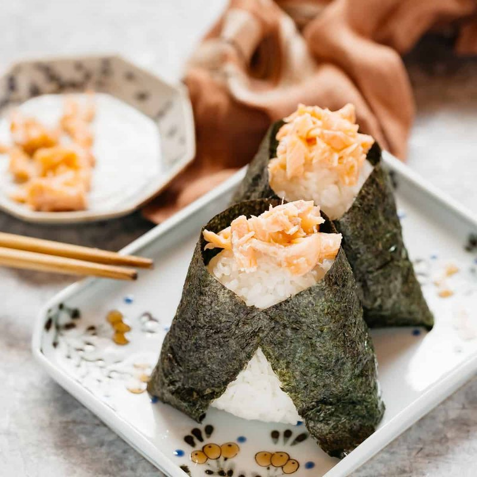

# Onigiri

*Japan's hand-held rice: salted short-grain rice pressed into triangles around a filling of pickled plum or salmon, wrapped in nori.*

**Serves:** 4 (8 onigiri)

**Prep Time:** 15 minutes

**Cook Time:** 20 minutes (for the rice)

## Overview
Short-grain Japanese rice (sushi rice) is rinsed several times until the water runs clear, then cooked with slightly less water than for regular rice (so each grain stays separate-but-sticky). Cooled slightly to warm (not hot, hands burn; not cold, rice doesn't compress). Filling options prepare: umeboshi (sour pickled plum, sold whole or paste); salt-grilled salmon flaked; tinned tuna mixed with mayo and a pinch of soy. Hands wet with water, dust with salt, take a generous handful of rice, press a thumb-dent in the centre, drop a teaspoon of filling, fold the rice over to enclose, press into a triangular shape with the palms. Wrap each ball with a small strip of nori at the base.

## Ingredients

### Rice
- 400 g short-grain Japanese rice (sushi rice - Koshihikari, Calrose, or similar; NOT basmati / jasmine / long-grain)
- 500 ml water (a 1:1 ¼ ratio rice to water)
- 1 teaspoon salt (to fold in after cooking, optional)

### Fillings (pick 1-2; each makes 4 onigiri)
#### Umeboshi (classic)
- 4 umeboshi plums (whole; pitted; or 4 teaspoons umeboshi paste)

#### Salmon flake (yaki shake)
- 200 g fresh salmon fillet + 1 teaspoon salt

#### Tuna mayo (tsuna mayo)
- 110 g tuna in oil (drained)
- 2 tablespoons Japanese mayonnaise (Kewpie)
- 1 teaspoon light soy sauce

#### Kombu (kombu no tsukudani)
- 30 g kombu seaweed simmered in soy sauce, sugar and mirin

### To shape and wrap
- Cold water (for wetting hands)
- 1 teaspoon flaky salt (for the hands)
- 4 sheets of nori (sold at Japanese / Asian shops - sushi-grade)
- 1 teaspoon toasted white sesame seeds (optional, for sprinkling)
- 1 teaspoon furikake (rice seasoning sprinkles, optional)

## Method

### Stage 1 - Cook the rice
1. Place the rice in a sieve.
1. Rinse under cold running water, swirling with your hand, until the water runs nearly clear (about 4-5 rinses).
1. Drain fully; let rest 15 minutes (lets each grain hydrate evenly).
1. Tip into a heavy lidded saucepan; add the 500 ml water.
1. Bring to a boil over medium heat; immediately reduce to the lowest possible setting; cover tightly.
1. Cook 15 minutes - don't peek.
1. Off heat; rest covered another 10 minutes (essential - the residual steam finishes cooking).
1. Fluff with a wooden paddle / spatula; tip onto a wide tray to cool slightly to warm (not hot).

### Stage 2 - Prepare fillings (do whichever you're making)
1. **Umeboshi**: pit the plums; mash slightly with a fork.
1. **Salmon**: sprinkle salmon fillet with 1 teaspoon salt; let stand 10 min; grill / broil / pan-fry skin-side down 4 min, then flip 4 min more until cooked through. Flake the flesh; discard skin and bones.
1. **Tuna mayo**: mix drained tuna with mayo and soy in a bowl.
1. **Kombu**: simmer 30 g kombu strips with 100 ml water, 2 tablespoons soy, 1 tablespoon sugar, 1 tablespoon mirin for 20 min until tender and most liquid is absorbed; chop fine.

### Stage 3 - Wet hands and salt
1. Have a small bowl of cold water at the workstation.
1. Have a small pile of salt on a plate.
1. Wet both palms thoroughly (this prevents rice from sticking).
1. Lightly dip the fingertips of one hand in salt and press the salt into the wet palms (just enough to season).

### Stage 4 - Form the onigiri
1. Scoop about ⅓ cup of warm rice into one palm (about 100 g; enough for a generous handful).
1. Press the rice into a flat-ish disc in the palm.
1. With the thumb of the other hand, make a small dent in the centre.
1. Drop 1 heaped teaspoon of filling into the dent.
1. Fold the rice up and around the filling, enclosing it completely (re-wet and re-salt hands if rice is sticking).
1. With both palms, press the rice into a triangle: cup one palm to form the bottom edge, use the other palm to form the top corners. Aim for a flat triangular tablet shape, with the filling fully hidden inside. Apply firm but not crushing pressure - the rice should hold together but each grain should still be visible (not mashed).
1. Repeat for all 8 onigiri.

### Stage 5 - Wrap with nori
1. Cut each sheet of nori into thirds (long thin strips, about 7 cm wide).
1. Wrap a single strip of nori around the bottom of each onigiri (the long flat side), pressing gently to adhere.
1. Or: keep the nori separate and wrap just before eating (gives a crispier nori; pre-wrapped nori softens within an hour).

### Stage 6 - Garnish (optional)
1. Sprinkle the top with toasted sesame seeds or a small amount of furikake.
1. For salmon onigiri, leave a small visible portion of salmon on top as a decorative cue.

### Stage 7 - Serve
1. Pack into a bento box, eat fresh, or wrap individually in cling film for transport.
1. Eat at room temperature within 4 hours.

## Notes
- **Short-grain Japanese rice only:** Long-grain rice (basmati, jasmine, American long-grain) doesn't stick properly and won't hold the onigiri shape. Sushi rice or Calrose-style short-grain is essential.
- **Warm rice, wet hands:** Hot rice burns; cold rice won't compress. The sweet spot is warm - about 50-60°C. Wet hands prevent the sticky rice from clinging to skin; dry hands give a frustrating mess.
- **Don't over-press:** Onigiri should hold together when picked up, but if you squeeze too hard the rice becomes a paste. Aim for firm-but-not-crushed.

## Storage
- Best within 4 hours of making, at room temperature.
- Wrap individually in cling film; carry in a lunch box.
- Don't refrigerate - short-grain Japanese rice hardens unappealingly in the fridge. If you must, store wrapped in cling film and bring fully to room temperature before eating.
- Freeze cooked rice in portions; defrost and re-warm in a steamer if making future onigiri.
