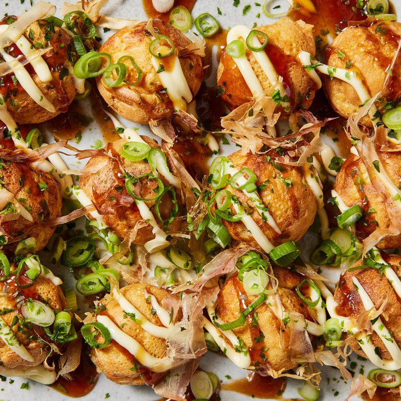

# Takoyaki

*Osaka's defining street food: small spherical fritters made from a thin dashi-spiked batter cooked in a special dimpled pan, each ball stuffed with a piece of cooked octopus, pickled red ginger and spring onion, drizzled with sweet takoyaki sauce, Japanese mayonnaise, and topped with a dance of bonito flakes (which curl in the heat) and aonori seaweed. The Osaka-soul-food classic. Eaten with toothpicks; bite carefully - the centre is volcanic.*

**Serves:** 4 (makes about 30 takoyaki)

**Prep Time:** 20 minutes

**Cook Time:** 25 minutes

## Overview
A thin batter is whisked from plain flour, dashi (Japanese stock), eggs, a touch of soy and mirin, salt - like a thin pancake batter. The takoyaki pan (cast-iron or non-stick with half-spherical dimples) heats; each dimple oils with vegetable oil. Batter fills each dimple plus the connecting flat surface (overflow is intentional). A small piece of pre-cooked octopus, a pinch of pickled red ginger, a few cubes of tempura crumbs (tenkasu) and a sprinkle of spring onion drop into each dimple. As the bottom sets, a sharp wooden skewer rotates each ball: scrape the overflow from around each, fold it into the bottom, twist 90° to expose the wet top, allow it to set, twist another 90°, eventually achieving a complete sphere. Cooked until golden all around. Plated; drizzled with takoyaki sauce, mayo, scattered with bonito flakes and aonori.

## Ingredients

### Batter
- 200 g plain flour
- 600 ml dashi (from instant dashi powder - 1 tablespoon dissolved in 600 ml hot water - OR homemade)
- 2 large eggs
- 1 tablespoon light soy sauce
- 1 tablespoon mirin
- ½ teaspoon salt
- 1 teaspoon baking powder

### Fillings
- 200 g cooked octopus tentacle (sold pre-cooked at Japanese / Mediterranean shops - cut into 1 ½ cm chunks; about 30 pieces total)
- 4 tablespoons pickled red ginger (beni shoga - sold in jars at Japanese shops; finely chopped)
- 4 spring onions (finely chopped, white and green)
- 4 tablespoons tempura crumbs / tenkasu (sold in packets; or substitute crushed plain rice crackers)

### For cooking
- 4 tablespoons vegetable oil (for greasing the pan)

### Toppings
- 4 tablespoons takoyaki sauce (sold in bottles; or substitute: 3 tablespoons Worcestershire + 1 tablespoon ketchup + 1 tablespoon mirin + 1 teaspoon soy)
- 4 tablespoons Japanese mayonnaise (Kewpie - the squeezy bottle)
- 4 tablespoons bonito flakes / katsuobushi (shaved dried tuna)
- 2 tablespoons aonori (powdered green seaweed) - sold at Japanese shops

### Equipment
- A takoyaki pan (cast iron half-sphere dimpled pan - sold at Japanese shops or online; or as an aebleskiver pan substitute)
- A wooden / bamboo skewer or chopstick for rotating
- A small ladle

## Method

### Stage 1 - Batter
1. In a wide bowl, whisk plain flour, salt and baking powder.
1. In a separate jug, whisk eggs with dashi, soy and mirin.
1. Slowly pour the wet into the dry, whisking smoothly, until you have a thin lump-free batter - the consistency of single cream.
1. Rest 10 minutes.

### Stage 2 - Prep the fillings
1. Cut the cooked octopus into 1 ½ cm chunks (one piece per takoyaki).
1. Finely chop the pickled red ginger.
1. Finely chop the spring onions.
1. Have the tempura crumbs ready.

### Stage 3 - Heat the pan
1. Heat the takoyaki pan over medium heat 2-3 minutes.
1. Generously brush each dimple AND the flat connecting surface with vegetable oil - be generous, not stingy. The pan should glisten.

### Stage 4 - First pour
1. Pour batter from a ladle to overfill EACH dimple AND coat the flat surface in between - this overflow is intentional and gets folded into each ball later.
1. Don't worry about neatness; takoyaki is meant to be a mess that resolves itself.

### Stage 5 - Add fillings
1. Working quickly: drop a chunk of octopus into each dimple.
1. Sprinkle a pinch of pickled ginger, tempura crumbs and spring onion across each.

### Stage 6 - Set the bottoms
1. Cook 2-3 minutes - the bottom of each ball sets while the top is still wet.

### Stage 7 - Begin rotating (the technical part)
1. With a skewer (or chopstick), break the flat batter overflow around each ball at the dimple edges.
1. Use the skewer to push the overflow batter from around each dimple INTO the dimple, then rotate each ball 90° so the un-set top swings down into the dimple. The previously-uncooked batter now sits in the dimple and starts to cook.
1. Wait 1 minute; rotate another 90°. Continue rotating gradually until each ball is round and golden all around.
1. Total cooking time: 8-12 minutes per batch.

### Stage 8 - Final crisp
1. Once spherical, give each ball a final minute in the pan to crisp the surface evenly.

### Stage 9 - Plate
1. Lift the takoyaki out of the pan with the skewer into a plate (10-12 per plate is a typical serving).
1. Don't crowd - the steam softens the surface.

### Stage 10 - Topping
1. Drizzle takoyaki sauce in zigzag lines.
1. Drizzle Japanese mayonnaise in zigzag lines.
1. Scatter a generous handful of bonito flakes - they curl and "dance" in the heat (this is part of the visual spectacle).
1. Sprinkle aonori across.

### Stage 11 - Serve
1. Eat immediately, with toothpicks.
1. Caution: the centres are extremely hot. Bite gently first to test.

## Notes
- **A takoyaki pan is essential:** The half-spherical dimples are the technique. Aebleskiver pans (Danish) are the closest substitute and work fine; plain frying pans cannot make this dish. Pans are widely sold online or at Japanese shops.
- **The skewer rotation is the skill:** It takes 2-3 practice runs to learn the rhythm. The key insight: the overflow batter around each dimple is intentional - it becomes the "new top" when you rotate.
- **Octopus is traditional, but flexible:** Pre-cooked octopus is the classic filling. Substitutes that work: cooked prawn, scallop, mushroom (vegetarian), cheese cubes (modern variations), small pieces of cooked sausage.

## Storage
- Best within 5 minutes of cooking - they go soft fast.
- The batter keeps refrigerated 24 hours.
- Cooked takoyaki: refrigerate 1 day; reheat under a hot grill 2 minutes (microwave makes them soggy).
